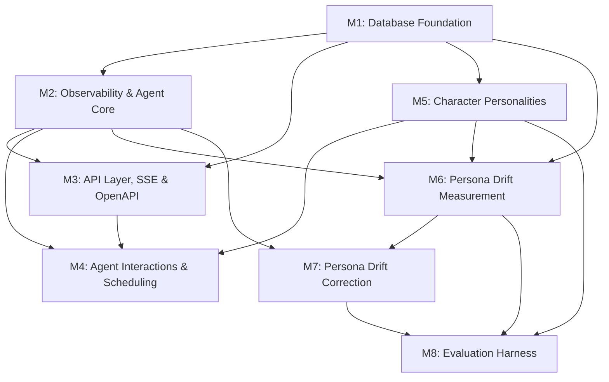

# The Office — Project Instructions

> **Critical Instruction for Agents**: This document is the source of truth for code structure. You MUST NOT deviate from these patterns without updating this document first. "Consistency is better than cleverness."

## Project Overview

AI agent simulation of "The Office" TV show. Each character is an autonomous agent with persistent memory, built on Claude Agent SDK + Neon PostgreSQL + Next.js.

## Commands

- `npm run dev` / `npm run build` / `npm run lint` / `npm run typecheck`
- `npm run test` / `npm run test:coverage` / `npm run test:e2e` / `npm run test:all`
- `npm run db:push` — push schema to Neon (dev)
- `npm run db:seed` — seed all tables from mock data (idempotent)
- `npm run db:generate` — generate migration files
- `npm run db:migrate` — run migrations (production)

**Environment setup:** The `.env.local` file (with `DATABASE_URL_UNPOOLED` and other secrets) is NOT checked into git. `npm run dev` automatically pulls env vars from Vercel and writes `.env.local` before starting the dev server — you do NOT need to create or manage this file manually. If `db:push`, `db:seed`, or other DB commands fail with an empty URL, run `npm run dev` first so it generates `.env.local`.

**Troubleshooting:** If any `npm run` command fails, the very first thing to try is `npm install`.

## Architecture

- **Backend**: TypeScript, Claude Agent SDK for agent orchestration
- **Database**: Neon PostgreSQL + pgvector (via Drizzle ORM)
- **Frontend**: Next.js 16 App Router, SSE for real-time updates
- **No auth** — single-user hackathon project

### Frontend

Read-only Slack clone (The Office theme). Next.js App Router, Tailwind v4, TypeScript. Single-page, state-driven navigation via `src/context/AppContext.tsx`.

**Layout:** `WorkspaceSidebar (68px) | ChannelSidebar (240px) | ChatPanel (flex-1) | ThreadPanel (360px, conditional)` — orchestrated by `WorkspaceShell`.

**Data:** All data flows from Neon PostgreSQL via API routes to the frontend. `src/db/seed.ts` populates the DB with 16 Office characters, 7 channels, 8 DM conversations, ~130 messages, memory blocks, and read cursors (for computed unread counts). `src/data/` retains only `users.ts` (user constants shared by seed + frontend). Channels can be `public`, `private`, or `dm` (private filtered by `memberIds`). Messages use `t(daysAgo, hour, min)` for relative timestamps in the seed script.

**Styling:** Tailwind v4 custom tokens in `globals.css` (`@theme inline`). All colors use `slack-*` prefix. `@/*` maps to `./src/*`.

## Shared Environment

There are multiple instances of Claude Code running in parallel. Each one has multiple node.exe instances (MCP, dev server, etc.) and dev servers running. Each worktree has its own designated port: 3010 for A, 3020 for B, 3030 for C, 3040 for D, 3050 for E, 3060 for F, 3070 for G. The `npm run dev` command is smart to only kill zombie servers associated with your worktree and only start a server in its designated port automatically. DO NOT kill all node.exe or kill by port number. If `npm run dev` fails STOP and ask the user for assistance.

## Key Specs

- Full capability spec: `spec/functional/` (one file per feature area — see `spec/functional/README.md` for index)
- Implementation plan: `spec/plan/` (one file per milestone)

## Implementation Plan

The frontend is a complete, read-only Slack clone with 16 Office characters, 7 channels, 8 DM conversations, and ~160 mock messages. All data is static in `src/data/`. The entire backend needs to be built from scratch: database, agent orchestration via Claude Agent SDK, MCP tools, API routes, SSE real-time streaming, and frontend wiring.

**Goal**: Bring the Office characters to life as autonomous AI agents that respond to messages, talk to each other, and evolve their own memories — all visible in the existing Slack-like UI.

### Milestone Dependency Graph



### Milestones

| Milestone | Stories | Spec |
|-----------|---------|------|
| M1: Database Foundation | S-1.0 – S-1.8 | `spec/plan/milestone-1-database-foundation.md` |
| M2: Observability & Agent Core | S-2.0 – S-2.5 | `spec/plan/milestone-2-observability-agent-core.md` |
| M3: API Layer, SSE & OpenAPI | S-3.0 – S-3.3 | `spec/plan/milestone-3-api-layer-sse.md` |
| M4: Advanced Interactions & Scheduling | S-4.0 – S-4.3 | `spec/plan/milestone-4-advanced-interactions.md` |
| M5: Character Personalities | S-5.0 – S-5.1 | `spec/plan/milestone-5-character-personalities.md` |
| M6: Persona Drift Measurement | S-6.0 – S-6.6 | `spec/plan/milestone-6-persona-drift-measurement.md` |
| M7: Persona Drift Correction | S-7.0 – S-7.3 | `spec/plan/milestone-7-persona-drift-correction.md` |
| M8: Evaluation Harness | S-8.0 – S-8.7 | `spec/plan/milestone-8-evaluation-harness.md` |

### Horizontal Requirements

- **Branch immediately**: The very first thing you do when starting any new work is create a feature branch off `main`: `git checkout -b feature/my-feature main`. Never commit directly to the worktree branch — a pre-commit hook will block it. Each story = one PR on its own feature branch, targeting `main`.
- Each schema story = one DB migration, tested and validated
- Testing is mandatory: unit tests + integration tests + 1-2 E2E tests for user-facing features
- Every story must be demoable with a live demo before claiming completion
- Telemetry is mandatory from M2 onward (Sentry traces/spans/logs)

### Risks & Mitigations

| Risk | Mitigation |
|------|-----------|
| Claude Agent SDK API differs from spec pseudocode | Inspect actual SDK exports after install in S-1.0; adapt orchestrator accordingly |
| Agent responses too slow for good UX | SSE typing indicators give immediate feedback; maxTurns=5 limits processing |
| Runaway agent costs | maxBudgetUsd per invocation, chain depth limit, scheduler rate limit |
| Agent-to-agent infinite loops | MAX_CHAIN_DEPTH=3 hard limit in orchestrator |
| No observability into agent behavior | Sentry telemetry from S-2.0 + runs table provide full visibility |
| Concurrent agent processing causes race conditions | Mailbox queue ensures one run at a time per agent |
| All channel members responding creates too many agents | Sequential processing (S-4.1) keeps ordering stable; `do_nothing` tool lets agents opt out |
| LLM judge scores are non-deterministic | Mock judge mode for CI (pre-recorded scores); live evaluations average multiple samples |
| Evaluation LLM calls are expensive | Claude Haiku (~$0.00003/check); batch 10 propositions/call; mock judge for CI |
| Action correction adds latency to messages | Single Haiku call ~200ms; fail-open on 5s timeout; max 2 retries |
| Action correction reduces self-consistency | Expected trade-off per TinyTroupe research; configurable per agent; monitor both metrics |
| Anti-convergence nudges reduce persona adherence | Nudges are character-aware; configurable; trade-off is acceptable per TinyTroupe findings |
| Golden baselines become stale | `--update-baseline` flag to refresh; regression delta (1.0) allows natural LLM variation |

## Directory Structure

The current codebase is organized by top-level domains and infrastructure folders (type-based for the frontend, domain-based for backend). Keep this structure consistent.

**Target Directory Tree**:
```text
src/
├── api/                # Core API clients (generic)
├── app/                # Next.js App Router (pages + API routes)
├── components/         # UI components
├── context/            # App/data contexts and hooks
├── data/               # Static mock data (frontend only)
├── db/                 # Drizzle schema + migrations + queries
├── messages/           # SSE registry, messaging utilities
├── agents/             # Orchestrator, mailbox, resolver, prompt builder
├── tools/              # MCP tool definitions
├── scheduler/          # Autonomous scheduling
├── evaluation/         # Persona drift measurement + correction
├── lib/                # Third-party wrappers
├── utils/              # Pure utility functions
├── types/              # Shared types
└── tests/              # Test infrastructure (factories, helpers, mocks)
```

## Code Conventions

### TypeScript

- Strict mode. No `any` unless absolutely unavoidable. Use `unknown` if unsure, but prefer defined types.
- Prefer named exports over default exports.
- File naming: `kebab-case.ts` for modules, `PascalCase.tsx` for React components.
- **Keep Codebase Pristine**: This is an unlaunched greenfield project with NO backwards compatibility concerns. Aggressively delete unused code, dead imports, and stale abstractions. Never leave compatibility shims, re-exports, or commented-out code behind.

### Database (Drizzle)

- Schema lives in `src/db/schema/`. One file per domain (agents, memory, messages, etc.).
- Use Drizzle's `$inferSelect` / `$inferInsert` for type derivation — don't duplicate types.
- Migrations via `drizzle-kit push` in dev, `drizzle-kit generate` + `drizzle-kit migrate` for production.

### Agent Tools

- Tools are defined as MCP tools via Claude Agent SDK's `createSdkMcpServer()`.
- Each tool gets its own file in `src/tools/`.
- Tool input schemas use Zod, validated at the tool boundary.

### Skills

- Skills live in `.skills/<skill-name>/SKILL.md` with YAML frontmatter.
- Skills are knowledge (loaded into context), not executable code.

### API Routes

- Next.js App Router API routes in `src/app/api/`.
- SSE endpoints for real-time message streaming.
- REST for CRUD operations.

### Error Handling

- Let errors propagate naturally. Don't wrap everything in try/catch.
- Validate at system boundaries (API inputs, tool inputs). Trust internal code.
- Always handle API errors gracefully in the UI (Error Boundaries or Toast Notifications).

### Component Usage

- **Icons**: Use `lucide-react` for icons. Do not import other icon libraries.

### Environment

- All secrets via environment variables (never committed).
- Use `dotenv` for local dev. Vercel env vars for production.

## Testing

### Exit Criteria

This is a **requirement**:
- **Any changes:** `npm run test:all` must pass.
- **New features (when test framework is added):** Several unit tests + some integration tests + 1-2 new E2E tests + manual testing sanity check.

### Testing Strategy

- **Unit Tests**: Focus on logic in `utils/` and feature stores/hooks. Code coverage goal: 70%.
- **E2E Tests**: One E2E spec per User Story Acceptance Criteria set. Critical flows only.
- **One `describe()` per file** — each test file contains exactly one top-level `test.describe()` block.
- **No `test.skip()` calls** — place tests in their intended directory instead.

### Show That Your Tests Are Working

Tests that have never failed even once are USELESS. You absolutely MUST confirm that the test is actually testing what you intend, either by following TDD and writing your test code before your product code, or by writing your changes, writing your test, temporarily removing your code changes, confirming that the test fails as expected, and then restoring the product code changes. Include the test failure validation in the commit message.

### E2E Test Debugging

#### One second is an ETERNITY for a computer
Tests in this project are finely tuned to run very fast. Each E2E test case MUST run in 5s or less. This is PLENTY. GitHub APIs, Vercel, CI/CD machines, local dev environment, etc. are all extremely fast. This is applicable to old and new tests. The entire test suite runs in 20s. When running E2E tests, enforce a timeout in the Bash tool call of 1 minute.

#### There are no flaky tests only failing tests
Leave the tests better than how you found them. If you notice a flaky test, you are supposed to help investigate what is the issue and if possible come up with a solution for it. Don't dismiss test failures as "unrelated to my changes".

#### Don't guess - Use the Playwright test trace to understand what is happening
When a Playwright E2E test fails, NEVER assume it's a timeout/flakiness issue. You will not get your tests working by adding arbitrary waitForTimeouts. So much so that they are banned via an ESLint rule. You must analyze the test trace before blindly changing test code. The codebase uses an unreleased version of Playwright with a **new feature called playwright-cli that helps with investigations**.

1. Load the playwright-cli skill
2. Run `npx playwright show-trace --port 0 <trace.zip>` - it will start a web server with the trace information
3. Traces have everything you might need to troubleshoot: Step-by-step action timeline with links to exact DOM state before and after of each action, full error details with stack traces, browser console output, HTTP request log, etc.
3. Use Playwright skill **in headed mode** to open the desired snapshot HTML and have full debugging capabilities
4. Look for actual failures: missing elements, wrong content, API errors, auth issues

#### Proper use of `waitFor` methods
 * `waitForSelector`: Best for waiting for elements to appear, disappear, or change state.
 * `waitForFunction`: Ideal for complex conditions involving multiple elements or JavaScript state.
 * `waitForLoadState`: Good for ensuring the page has reached a certain loading stage.
 * `waitForURL`: Perfect for navigation events and redirects.
 * `waitForEvent`: Useful for downloads, dialogs, and other events.
 * `waitForTimeout`: Banned.

#### Prefer locators to selectors
Unlike traditional selectors that perform a one-time query, locators are lazy and resilient references to elements that automatically retry until elements become available, wait implicitly for elements to be actionable, and adapt to DOM changes between queries.

#### E2E tests in this project are rock solid
All E2E tests go through a stress test where they run 10x in parallel and 10x in sequence every new push to main in search of race conditions and flakiness. You may check the stress test health looking at the workflow history of the ci-cd-main workflow on GitHub.

## Manual testing
You have access to Playwright via playwright-cli skill. Make sure to **only use it in headed mode** so the user can see your work and assist you. Use it sparingly in the following situations:
 * You are stuck trying to reproduce a bug through code analysis or test cases. `evaluate` is invaluable to capture runtime information such as computed styles or library side effects.
 * Sanity check your work as you reach a milestone in the implementation of a feature. Once you reach ~200 lines of code changes, the risk that you are compounding errors and don't have working code becomes high. A quick inspection in Playwright gives extra assurance that you are on the right track.
 * Final quality assurance. Don't ask the user to test a feature manually before you did it yourself!

## Agent Workflow Standards

### Parallelism & Agent Swarms

- **Leverage agent swarms whenever possible.** When a story has multiple independent tasks (e.g., schema + tests + API route + frontend wiring), spin up parallel subagents rather than doing everything sequentially.
- **Preferred execution skill**: When using superpowers skills to implement work, prefer `subagent-driven-development` over `executing-plans`. Subagent-driven development maximizes parallelism and throughput by dispatching independent tasks to concurrent agents. The main agent must keep exactly one story or top-level feature in flight at a time, while delegating independent subtasks for that story to parallel subagents.

### Stop and Read Policy

- **Before Coding**: Read the relevant spec and any related source files before starting implementation.
- **Before Modifying**: Always read the existing file content before editing. Blind edits are forbidden.

### Error Recovery Protocol

- **Linter Errors**: If a fix triggers a linter error, DO NOT suppress it with `// eslint-disable` unless absolutely necessary. Fix the root cause.
- **Test Failures**: Analyze the failure output. If the test is wrong (e.g., outdated selector), update the test. If the code is wrong, update the code. Do not delete the test.

### Atomic Task Management

- **One Task at a Time**: Do not try to implement multiple features in a single session.
- **Update Artifacts**: Keep task tracking updated in real-time. If you finish a sub-task, mark it checked immediately.

### Context Optimization

- **Path Aliases**: Use `@/` for imports (e.g., `import { Button } from '@/components'`) instead of relative paths. This reduces cognitive load when moving files.
- **Type Definitions**: Look in `src/types/` first. Prefer feature-specific types only when a dedicated domain module exists.

### Self-Verification

- **Run the Build**: After significant changes, run `npm run build` and `npm run lint`.
- **Visual Check**: You WILL be asked to demo your code changes using Playwright, so before claiming completion you MUST perform a visual check with it.

### Mock Data Standard

- **Factories**: Use `src/tests/factories/` for generating test data. Do not manually construct complex objects in tests. This prevents test brittleness when types change.
- **Example**: `const agent = createMockAgent({ name: 'Michael Scott' });`

## Telemetry

Telemetry is VITAL. **Be liberal — when in doubt, add a span, log, or metric.** The cost of too much telemetry is trivial; the cost of too little is hours of blind debugging.

### What to Instrument

- **Traces**: Every agent invocation, tool execution, API route, and significant async operation must be wrapped in a Sentry span. Nest child spans for sub-operations (e.g., a DB query inside an API handler).
- **Logs**: Structured logs for agent decisions, tool outcomes, state transitions, and errors via `Sentry.logger.*`. Include relevant IDs (agentId, channelId, messageId, runId) as attributes so logs are filterable.
- **Metrics**: Counters for invocations, tool usage, and errors. Distributions for latencies. Don't be stingy — if something is countable or measurable, emit a metric.

### Helpers (`src/lib/telemetry.ts`)

- `withSpan(name, op, fn)` — wrap any function in a traced span
- `logInfo/logWarn/logError(message, attributes)` — structured logs
- `countMetric(name, value, attributes)` — counter metrics
- `distributionMetric(name, value, unit, attributes)` — distribution metrics

### Traced API Responses (`src/lib/api-response.ts`)

All API routes MUST use `jsonResponse()` / `emptyResponse()` from `src/lib/api-response.ts` instead of raw `NextResponse.json()`. These helpers automatically attach the active Sentry trace ID as an `x-sentry-trace-id` response header, linking every HTTP response to its full trace in Sentry.

### Debugging with Sentry Traces

The `x-sentry-trace-id` header is the primary debugging tool for correlating API behavior with traces:

- **E2E test failures**: When an E2E test fails, check the API responses in the Playwright trace's network tab. The `x-sentry-trace-id` header on each response links directly to the Sentry trace containing all spans, logs, and errors for that request. Use the Sentry MCP tool (if available) or go to Sentry UI to look up the trace by ID.
- **Console output**: Sentry logs also appear in the server console. When debugging locally, scan the dev server terminal output for structured log lines that include trace context.
- **Sentry MCP**: If a Sentry MCP server is configured, use it to query traces, look up errors, and inspect spans directly from Claude Code. This is the fastest path to understanding what happened in a failed request.

## Acknowledgements

The persona drift evaluation and correction system (M6–M8) is informed by:

> Paulo Salem, Robert Sim, Christopher Olsen, Prerit Saxena, Rafael Barcelos, Yi Ding. **"TinyTroupe: An LLM-powered Multiagent Persona Simulation Toolkit."** Microsoft Corporation, July 2025. arXiv:2507.09788v1. https://github.com/microsoft/tinytroupe

Key concepts adopted from this work: proposition-based evaluation scored by LLM-as-judge (0–9 scale), four evaluation dimensions (persona adherence, self-consistency, fluency, convergence/divergence), action correction gates with fail-open semantics, and anti-convergence interventions for group conversations. The quantitative trade-offs documented in their Table 1 (e.g., action correction improving adherence at the cost of self-consistency) directly informed the configurable-per-agent design of M7.
