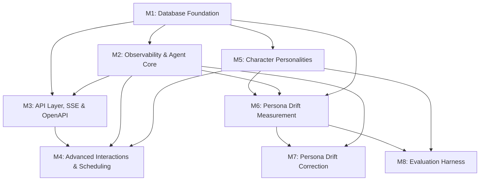

# The Office Agent Platform — Implementation Plan

## Context

The frontend is a complete, read-only Slack clone with 16 Office characters, 7 channels, 8 DM conversations, and ~160 mock messages. All data is static in `src/data/`. The entire backend needs to be built from scratch: database, agent orchestration via Claude Agent SDK, MCP tools, API routes, SSE real-time streaming, and frontend wiring.

**Goal**: Bring the Office characters to life as autonomous AI agents that respond to messages, talk to each other, and evolve their own memories — all visible in the existing Slack-like UI.

**Horizontal Requirements** (all milestones):
- Follow AGENTS.md conventions: strict TypeScript, `type` over `interface`, named exports, kebab-case files
- Validate at system boundaries with Zod
- `npm run test:all` must pass after each story
- **Testing is mandatory**: each story must include unit tests, integration tests where applicable, and 1-2 E2E tests for user-facing features. Vitest + Playwright are already installed. Update AGENTS.md to document the test framework.
- **Every story must be demoable**: the implementer must show a live demo before claiming completion. Include any necessary frontend or backend shims to make this possible. Add cleanup tasks in later stories for shims.
- **Each story = one pull request**: stories are implemented and merged independently.
- **Each schema story = one DB migration**: every schema story produces a Drizzle migration that is tested and validated. The schema must be queryable via PostgreSQL after the migration runs.
- **Telemetry is mandatory** (from M2 onward): every story after S-2.0 must include a telemetry validation AC confirming Sentry traces/spans/logs are emitted for key operations.

## Milestone Overview & Dependency Graph

## Milestones

| Milestone | Description | Stories | File |
|-----------|-------------|---------|------|
| [M1](milestone-1-database-foundation.md) | Database Foundation | S-1.0 through S-1.8 | `milestone-1-database-foundation.md` |
| [M2](milestone-2-observability-agent-core.md) | Observability & Agent Core | S-2.0 through S-2.5 | `milestone-2-observability-agent-core.md` |
| [M3](milestone-3-api-layer-sse.md) | API Layer, SSE & OpenAPI | S-3.0 through S-3.3 | `milestone-3-api-layer-sse.md` |
| [M4](milestone-4-advanced-interactions.md) | Advanced Interactions & Scheduling | S-4.0 through S-4.3 | `milestone-4-advanced-interactions.md` |
| [M5](milestone-5-character-personalities.md) | Character Personalities | S-5.0 through S-5.1 | `milestone-5-character-personalities.md` |
| [M6](milestone-6-persona-drift-measurement.md) | Persona Drift Measurement | S-6.0 through S-6.5 | `milestone-6-persona-drift-measurement.md` |
| [M7](milestone-7-persona-drift-correction.md) | Persona Drift Correction | S-7.0 through S-7.3 | `milestone-7-persona-drift-correction.md` |
| [M8](milestone-8-evaluation-harness.md) | Evaluation Harness | S-8.0 through S-8.3 | `milestone-8-evaluation-harness.md` |

## Verification

After each story:
1. `npm run test:all` passes
3. **Live demo** of the story's functionality (mandatory — user must see it working)
4. Unit tests pass, integration tests pass where applicable, E2E tests for user-facing features

After all milestones:
1. Full loop: type message in UI → agent responds → response appears in UI via SSE
2. Agent-to-agent: agent DMs another agent → auto-response chain
3. Memory: agent updates its own memory block → next invocation reflects the change
4. Scheduler: scheduled message fires → agent posts autonomously
5. All telemetry visible in Sentry
6. Runs table shows full audit trail of all agent invocations with steps and messages

## Risks & Mitigations

| Risk | Mitigation |
|------|-----------|
| Claude Agent SDK API differs from spec pseudocode | Inspect actual SDK exports after install in S-1.0; adapt orchestrator accordingly |
| Agent responses too slow for good UX | SSE typing indicators give immediate feedback; maxTurns=5 limits processing |
| Runaway agent costs | maxBudgetUsd per invocation, chain depth limit, scheduler rate limit |
| Agent-to-agent infinite loops | MAX_CHAIN_DEPTH=3 hard limit in orchestrator |
| No observability into agent behavior | Sentry telemetry from S-2.0 + runs table provide full visibility |
| Concurrent agent processing causes race conditions | Mailbox queue ensures one run at a time per agent |
| All channel members responding creates too many agents | Sequential processing with delays (S-5.1) makes it feel natural; `do_nothing` tool lets agents opt out |
