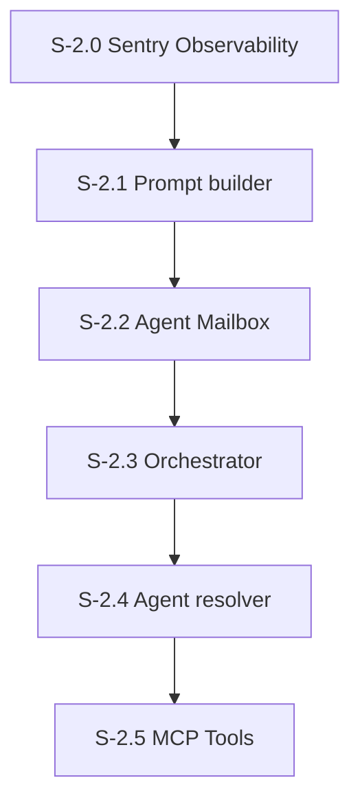

# Milestone 2: Observability & Agent Core

**Goal**: Set up Sentry telemetry, then build the agent orchestration pipeline — prompt builder, mailbox queue, orchestrator, resolver, and MCP tools.



---

## [S-2.0] Sentry Observability

As a developer, I want distributed tracing, logging, and metrics via Sentry so I can observe agent behavior and debug issues in production.

### Description
Set up `@sentry/nextjs` for both frontend and backend. Telemetry is VITAL for this project — every agent invocation, tool call, memory update, and API request must be observable. Emit all 3 types: traces (spans for agent invocations, tool executions), logs (structured logs for agent decisions), and metrics (counters for invocations, tool usage, errors).

Exit criteria: create a dummy API route and a button in the UI. When the user clicks the button, both frontend and backend emit events to Sentry and they are correlated via a single trace. Use Sentry MCP to run queries and verify events appear.

### Files to create
| File | Purpose |
|------|---------|
| `sentry.client.config.ts` | Sentry browser SDK init |
| `sentry.server.config.ts` | Sentry Node SDK init |
| `sentry.edge.config.ts` | Sentry Edge SDK init (if needed for API routes) |
| `src/instrumentation-client.ts` | Next.js client instrumentation hook |
| `src/app/api/telemetry-test/route.ts` | Dummy API route that emits a Sentry span + log + metric |

### Files to modify
| File | Change |
|------|--------|
| `next.config.ts` | Wrap with `withSentryConfig()` |
| `AGENTS.md` | Add section: "Telemetry is VITAL. All agent invocations, tool calls, and API requests must emit Sentry traces, logs, and metrics." |

### Acceptance Criteria
- [ ] [AC-2.0.1] `@sentry/nextjs` configured for both client and server
- [ ] [AC-2.0.2] Dummy button in UI triggers an API call that creates a correlated frontend+backend trace
- [ ] [AC-2.0.3] Sentry MCP query confirms events appear with all 3 telemetry types (traces, logs, metrics)
- [ ] [AC-2.0.4] AGENTS.md updated to document telemetry as a project requirement
- [ ] [AC-2.0.5] Unit tests for telemetry helper functions

### Demo
Click the test button in the UI. Open Sentry dashboard (or use Sentry MCP) to show the correlated trace with frontend span → API span → log + metric.

---

## [S-2.1] System Prompt Builder

As a developer, I want a prompt builder that assembles character personality + core memory + conversation context into a system prompt for Claude.

### Files to create
| File | Purpose |
|------|---------|
| `src/agents/prompt-builder.ts` | `buildSystemPrompt(agent, memory, recentMessages)` — assembles system prompt |
| `src/app/api/agents/[agentId]/prompt/route.ts` | GET: preview the fully assembled prompt for an agent (debug/test endpoint) |

### Description
Constructs the system prompt by combining:
1. Character persona from `agents.systemPrompt` (fully customizable per agent — the DB column IS the persona)
2. Core memory blocks injected as labeled sections
3. Tool usage instructions (use tools to send messages, never raw text)
4. **Last 20 messages from the channel/DM** the agent is being contacted from — provides conversation context
5. Instructions include `do_nothing` as an explicit option

The system prompt varies per invocation because it includes conversation history. The `agents.systemPrompt` column stores the stable persona; everything else is assembled dynamically.

### Acceptance Criteria
- [ ] [AC-2.1.1] Function takes agent row + memory blocks + recent messages, returns string
- [ ] [AC-2.1.2] Each memory block rendered as `### {label}\n{content}`
- [ ] [AC-2.1.3] Last 20 messages from the channel included as conversation context
- [ ] [AC-2.1.4] Instructions tell agent to use `send_message` tool, not raw text
- [ ] [AC-2.1.5] Instructions include `do_nothing` as an explicit option
- [ ] [AC-2.1.6] `agents.systemPrompt` is the customizable persona — different per agent
- [ ] [AC-2.1.7] Unit tests for prompt assembly with various block/message combinations
- [ ] [AC-2.1.8] Sentry span emitted wrapping prompt construction
- [ ] [AC-2.1.9] `GET /api/agents/[agentId]/prompt?channelId=general` returns the fully assembled prompt with section breakdown (persona, memory blocks, recent messages, tool instructions)

### Demo
Call `buildSystemPrompt()` with test data, log the output, show it includes persona + memory + conversation context.

---

## [S-2.2] Agent Mailbox & Run Queue

As a developer, I want each agent to have a mailbox that queues incoming messages and processes them sequentially, backed by the runs table.

### Files to create
| File | Purpose |
|------|---------|
| `src/agents/mailbox.ts` | `enqueueRun(agentId, triggerMessageId, context)`, `processNextRun(agentId)`, `getAgentQueue(agentId)` |
| `src/db/queries/runs.ts` | `createRun()`, `claimNextRun()`, `updateRunStatus()`, `getRunWithSteps()`, `listRuns()`, `cancelRun()` |
| `src/app/api/runs/route.ts` | GET (list runs, filterable by agentId/status) |
| `src/app/api/runs/[runId]/route.ts` | GET (single run with steps + messages hierarchy) |
| `src/app/api/runs/[runId]/cancel/route.ts` | POST (cancel a created/running run) |

### Description
Each agent has a virtual mailbox backed by the `runs` table. When a message arrives for an agent:
1. A new run is created with status `created`
2. If no run is currently `running` for this agent, the new run is immediately claimed and processing begins
3. If a run IS currently `running`, the new run stays `created` (queued) until the current one completes
4. When a run completes, the mailbox checks for the next `created` run and processes it

This ensures agents never process messages concurrently — they handle them one at a time in order.

### Acceptance Criteria
- [ ] [AC-2.2.1] `enqueueRun()` creates a `runs` row with status `created` and returns the run ID
- [ ] [AC-2.2.2] `claimNextRun()` atomically transitions the oldest `created` run to `running`, only if no run is already `running` for that agent (e.g., `UPDATE runs SET status = 'running' WHERE id IN (SELECT id FROM runs WHERE agent_id = $1 AND status = 'created' AND NOT EXISTS (SELECT 1 FROM runs r2 WHERE r2.agent_id = $1 AND r2.status = 'running') ORDER BY created_at FOR UPDATE SKIP LOCKED LIMIT 1) RETURNING *`)
- [ ] [AC-2.2.3] Only one run per agent can be `running` at a time (enforced by query, not unique constraint)
- [ ] [AC-2.2.4] `processNextRun()` calls `claimNextRun()` then invokes the orchestrator (stub for now — real orchestrator in S-2.3)
- [ ] [AC-2.2.5] After a run completes, automatically check and process the next queued run
- [ ] [AC-2.2.6] Run status transitions logged: created → running → completed/failed
- [ ] [AC-2.2.7] Unit tests for queue ordering, concurrent prevention, automatic dequeue
- [ ] [AC-2.2.8] Sentry spans for enqueue and dequeue operations
- [ ] [AC-2.2.9] Runs API: GET list (filterable by `agentId`, `status`), GET single (returns run + steps + messages hierarchy), POST cancel
- [ ] [AC-2.2.10] Cancel only works for `created` or `running` status — returns 409 for completed runs

### Demo
Enqueue 3 runs for the same agent in rapid succession. Show they process sequentially (run 1 completes, then run 2 starts, then run 3). Show the runs table status transitions.

---

## [S-2.3] Agent Orchestrator

As a developer, I want an orchestrator that invokes an agent via Claude Agent SDK given a run.

### Files to create
| File | Purpose |
|------|---------|
| `src/agents/orchestrator.ts` | `executeRun(run)` — core invocation logic for a claimed run |

### Description
The heart of the system. Called by the mailbox when a run is claimed:
1. Load agent config from DB
2. Load core memory blocks
3. **Fetch last 20 messages from the channel/DM** the run is associated with
4. Build system prompt via prompt builder (persona + memory + conversation context)
5. Create in-process MCP server with `createSdkMcpServer()` — tools are a stub/empty for now (S-2.5 adds real tools)
6. Broadcast `agent_typing` SSE event
7. Call `query()` from Claude Agent SDK with prompt, systemPrompt, mcpServers, resume, maxTurns, maxBudgetUsd
8. Record each step and message in `run_steps` / `run_messages` tables for observability
9. On result, update agent's session ID for next interaction
10. Update run status to `completed` (or `failed` on error) with stop reason and token usage
11. Broadcast `agent_done` SSE event
12. **Emit Sentry trace span** wrapping the entire invocation

```typescript
// Key pattern from spec:
for await (const msg of query({
  prompt: formatTriggerMessage(triggerMessage),
  options: {
    systemPrompt: buildSystemPrompt(agent, blocks, recentMessages),
    mcpServers: { 'office-tools': tools },
    resume: agent.sessionId,
    maxTurns: agent.maxTurns,
    maxBudgetUsd: agent.maxBudgetUsd,
  },
})) {
  if (msg.type === 'result') {
    await updateAgentSession(agentId, msg.sessionId);
  }
}
```

**Important**: The orchestrator does NOT create chat messages directly. Agents use the `send_message` MCP tool to speak. This gives agents full control including the option to say nothing. For this story, use a stub tool set — real tools come in S-2.5.

### Files to create (supporting)
| File | Purpose |
|------|---------|
| `src/messages/sse-registry.ts` | `ConnectionRegistry` class — in-memory pub/sub for SSE. Shim: broadcast is a no-op until S-3.0 wires SSE. |
| `src/db/queries/memory.ts` | `getBlocks()`, `updateBlock()`, `storePassage()`, `searchPassages()` |

### Acceptance Criteria
- [ ] [AC-2.3.1] `executeRun()` loads agent + memory + last 20 messages, builds prompt, calls Claude SDK `query()`
- [ ] [AC-2.3.2] MCP tools created via `createSdkMcpServer()` (stub tools for now)
- [ ] [AC-2.3.3] Session ID persisted after each invocation for conversation continuity
- [ ] [AC-2.3.4] SSE typing indicators broadcast before/after (no-op until SSE wired)
- [ ] [AC-2.3.5] Errors logged but do not crash — agent failures are isolated. Run status set to `failed`
- [ ] [AC-2.3.6] Each step and message recorded in `run_steps` / `run_messages` tables
- [ ] [AC-2.3.7] Run status updated with stop reason and token usage on completion
- [ ] [AC-2.3.8] Sentry trace span wraps each invocation with child spans for steps
- [ ] [AC-2.3.9] Unit tests for orchestrator flow (mocking Claude SDK)

### Demo
Run a script that enqueues a run for Michael via the mailbox. Show:
1. The run transitions: created → running → completed
2. `run_steps` and `run_messages` populated — showing the LLM call chain
3. The agent uses tools to build its response (e.g., trigger → tool_call → tool_return → response)
4. Sentry trace appears with the full invocation span

---

## [S-2.4] Agent Resolver

As a developer, I want logic that determines which agents should receive a given message.

### Files to create
| File | Purpose |
|------|---------|
| `src/agents/resolver.ts` | `resolveTargetAgents(message)` — returns agent IDs to invoke |

### Resolution Rules
- **Channel message**: ALL agents who are members of the channel (excluding sender). E.g., a message in #accounting (private) goes to Kevin, Oscar, Angela only.
- **DM message**: The other participant.
- **Thread reply**: Original message author + previous thread participants.

### Acceptance Criteria
- [ ] [AC-2.4.1] Channel messages: all members of the channel receive the message (excluding sender)
- [ ] [AC-2.4.2] Private channels: only members receive (e.g., #accounting → Kevin, Oscar, Angela)
- [ ] [AC-2.4.3] DM messages: other participant invoked
- [ ] [AC-2.4.4] Thread replies: original author + thread participants
- [ ] [AC-2.4.5] Sender is never included in target agents
- [ ] [AC-2.4.6] Unit tests for each resolution rule, including private channel membership
- [ ] [AC-2.4.7] Sentry span emitted for resolution

### Demo
Call `resolveTargetAgents()` with:
1. A message in #general — show all 16 members minus sender returned
2. A message in #accounting (private) — show only Kevin, Oscar, Angela returned
3. A DM — show only the other participant returned

---

## [S-2.5] MCP Tool Registry & Tools

As a developer, I want all 6 agent tools implemented as MCP tools so agents can interact with the world.

### Files to create
| File | Purpose |
|------|---------|
| `src/tools/registry.ts` | `getTools(agentId)` — returns tool array for an agent |
| `src/tools/send-message.ts` | Post message to any channel (public, private, or DM) |
| `src/tools/react-to-message.ts` | Add emoji reaction |
| `src/tools/do-nothing.ts` | Explicitly choose silence |
| `src/tools/update-memory.ts` | Update own core memory block |
| `src/tools/search-memory.ts` | Keyword search archival memory |
| `src/tools/store-memory.ts` | Store new archival passage |

### Tool Signatures
```
send_message(conversationId: string, text: string) → { messageId }
react_to_message(messageId: string, emoji: string) → { success }
do_nothing() → { action: 'none' }
update_memory(label: string, content: string) → { success }
search_memory(query: string) → { passages: [...] }
store_memory(content: string, tags?: string[]) → { passageId }
```

Each tool:
- Uses `zod` for input validation
- Receives `agentId` via closure (the calling agent's identity)
- Calls query functions from `src/db/queries/`
- Broadcasts SSE events for UI-visible actions (messages, reactions)
- **Emits Sentry span** for each tool execution
- Records tool call and return in `run_messages` table

### Acceptance Criteria
- [ ] [AC-2.5.1] 6 tool files + 1 registry file in `src/tools/`
- [ ] [AC-2.5.2] Each tool validates inputs with Zod
- [ ] [AC-2.5.3] `send_message` creates DB rows (channel or DM) and broadcasts SSE events
- [ ] [AC-2.5.4] `do_nothing` returns immediately without side effects
- [ ] [AC-2.5.5] `update_memory` only allows the agent to modify its own blocks
- [ ] [AC-2.5.6] `search_memory` uses keyword matching (ILIKE) on the agent's own passages
- [ ] [AC-2.5.7] Registry returns all tools scoped to a specific agentId
- [ ] [AC-2.5.8] Orchestrator updated to use real tools instead of stubs
- [ ] [AC-2.5.9] Tool executions recorded in `run_messages` as `tool_call_message` / `tool_return_message`
- [ ] [AC-2.5.10] Sentry spans for tool executions
- [ ] [AC-2.5.11] Unit tests for each tool handler

### Demo
Send a message to an agent via the orchestrator. Show the agent responds using `send_message` tool, the message appears in the DB, `run_messages` shows the tool call/return, and Sentry shows the tool execution span.
