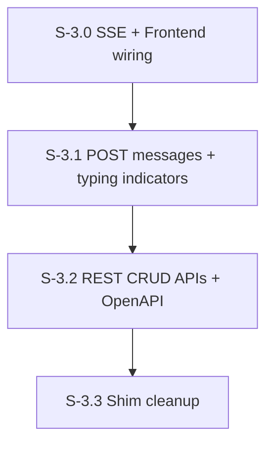

# Milestone 3: API Layer, SSE & Frontend Polish

**Goal**: Expose the POST messages endpoint, SSE real-time streaming, typing indicators, and clean up shims. Wire SSE to the frontend so users see agent responses appear live.



---

## [S-3.0] SSE Infrastructure + Frontend Wiring

As a developer, I want an SSE endpoint that streams real-time events to the frontend, with visible proof that events flow.

### Description
Build the SSE endpoint AND wire it to the frontend in the same story so it's demoable. Add a temporary UI indicator (e.g., connection status badge, or a console log) proving SSE events arrive.

### Files to create
| File | Purpose |
|------|---------|
| `src/app/api/sse/route.ts` | GET SSE endpoint — clients subscribe for real-time events |
| `src/hooks/use-sse.ts` | `useSSE()` — React hook subscribing to `/api/sse`, dispatches events to DataContext |

### Files to modify
| File | Change |
|------|--------|
| `src/messages/sse-registry.ts` | Replace no-op shim with real broadcast implementation |
| `src/context/DataContext.tsx` | Integrate SSE hook: append messages on `message_created`, track typing on `agent_typing`/`agent_done` |

### SSE Event Types
- `message_created` — new message in any channel or DM
- `reaction_added` — reaction added to a message
- `agent_typing` — agent is processing (show typing indicator)
- `agent_done` — agent finished processing

### Acceptance Criteria
- [ ] [AC-3.0.1] `ConnectionRegistry` supports `add()`, `remove()`, `broadcast()` methods (real, not stub)
- [ ] [AC-3.0.2] SSE endpoint returns `text/event-stream` with proper headers
- [ ] [AC-3.0.3] Heartbeat every 30s to keep connections alive
- [ ] [AC-3.0.4] Connections cleaned up on client disconnect (abort signal)
- [ ] [AC-3.0.5] React hook creates `EventSource` on mount, closes on unmount, reconnects on loss
- [ ] [AC-3.0.6] DataContext appends new messages from SSE `message_created` events in real time
- [ ] [AC-3.0.7] Unit tests for ConnectionRegistry, E2E test verifying SSE connection + event delivery
- [ ] [AC-3.0.8] Sentry spans for SSE broadcast events

### Demo
Open the app in a browser. Open a second tab or use curl to POST a test event. Show the message appears in the first tab's UI in real time without page refresh.

---

## [S-3.1] POST Messages Endpoint + Typing Indicators

As a developer, I want a POST endpoint that receives a user message, stores it, triggers agent responses, and shows the full loop in the UI — including typing indicators that show when agents are thinking.

### Files to create
| File | Purpose |
|------|---------|
| `src/app/api/messages/route.ts` | POST: send message → store in DB → broadcast SSE → enqueue agent runs |
| `src/messages/schemas.ts` | Zod schemas for message validation |
| `src/components/chat/TypingIndicator.tsx` | Component showing "{agent name} is typing..." with animated dots |

### Files to modify
| File | Change |
|------|--------|
| `src/components/chat/ComposeBox.tsx` | Remove read-only overlay, add text input + submit handler |
| `src/components/thread/ThreadComposeBox.tsx` | Same — enable for thread replies |
| `src/components/chat/ChatPanel.tsx` | Render TypingIndicator below message list |

### Flow
1. Validate request body with Zod
2. Store human message in DB via `createMessage()`
3. Broadcast `message_created` via SSE
4. Call `resolveTargetAgents()` to determine which agents should receive the message
5. Enqueue runs for each target agent via `enqueueRun()` (non-blocking — mailbox handles processing)
6. Return the stored message (201)

### Acceptance Criteria
- [ ] [AC-3.1.1] POST body validated with Zod: `{ channelId?, dmConversationId?, parentMessageId?, userId, text }`
- [ ] [AC-3.1.2] Human message stored in DB before agent invocation
- [ ] [AC-3.1.3] SSE broadcast of new message happens immediately
- [ ] [AC-3.1.4] Agent runs enqueued via mailbox (non-blocking — POST returns before agents respond)
- [ ] [AC-3.1.5] Returns 400 for validation errors, 201 for success
- [ ] [AC-3.1.6] ComposeBox has a functional text input (no longer disabled/read-only)
- [ ] [AC-3.1.7] Enter key or send button submits the message
- [ ] [AC-3.1.8] Input clears after successful send
- [ ] [AC-3.1.9] ThreadComposeBox sends with `parentMessageId` set
- [ ] [AC-3.1.10] When SSE delivers `agent_typing`, show "{agent name} is typing..." with animated dots
- [ ] [AC-3.1.11] Typing indicator disappears on `agent_done`
- [ ] [AC-3.1.12] Multiple agents typing shown simultaneously
- [ ] [AC-3.1.13] Agent response appears in the UI via SSE (full loop)
- [ ] [AC-3.1.14] Unit tests for validation, integration test for POST flow, unit test for TypingIndicator component, E2E test: type message → see agent response
- [ ] [AC-3.1.15] Sentry trace spans for message creation and agent run enqueuing

### Demo
**This is the first full-loop demo.** Type a message in #general as Michael. Watch the typing indicator appear for responding agents, then see the agent's response materialize in the chat. Typing indicator disappears when response arrives. This proves: ComposeBox → POST API → DB → mailbox → orchestrator → Claude SDK → tool → DB → SSE → TypingIndicator → UI.

---

## [S-3.2] REST CRUD APIs + OpenAPI Documentation

As a developer, I want full CRUD endpoints for all core entities and an auto-generated OpenAPI spec so the API is browsable and self-documenting.

### Description
M1 added read-only GET routes for agents and messages. S-3.1 added POST messages. This story fills in the remaining CRUD operations and adds automatic OpenAPI doc generation. The OpenAPI spec is served at `/api/openapi.json` and a Scalar UI at `/api/docs`.

### Files to create
| File | Purpose |
|------|---------|
| `src/app/api/openapi.json/route.ts` | GET: serves generated OpenAPI 3.1 spec |
| `src/app/api/docs/route.ts` | GET: serves Scalar API reference UI |
| `src/api/openapi.ts` | OpenAPI spec builder — assembles route metadata into a spec object |
| `src/app/api/agents/route.ts` | GET: list agents, POST: create agent |
| `src/app/api/agents/[agentId]/route.ts` | GET: single agent, PUT: update agent, DELETE: delete agent |
| `src/app/api/agents/[agentId]/memory/route.ts` | GET: list memory blocks, POST: create block |
| `src/app/api/agents/[agentId]/memory/[label]/route.ts` | GET: get block by label, PUT: update block, DELETE: delete block |
| `src/app/api/agents/[agentId]/memory/shared/route.ts` | POST: create shared block + attach |
| `src/app/api/agents/[agentId]/passages/route.ts` | GET: list passages, POST: store passage |
| `src/app/api/agents/[agentId]/passages/search/route.ts` | GET: search passages (keyword) |
| `src/app/api/agents/[agentId]/passages/[passageId]/route.ts` | DELETE: delete passage |
| `src/app/api/channels/route.ts` | *(extend)* POST: create channel |
| `src/app/api/channels/[channelId]/route.ts` | GET: single channel, PUT: update channel, DELETE: delete channel |
| `src/app/api/channels/[channelId]/members/route.ts` | GET: list members, POST: add member, DELETE: remove member |
| `src/app/api/dms/route.ts` | *(extend)* POST: create DM conversation |
| `src/app/api/runs/route.ts` | GET: list runs (filterable by agent, status) |
| `src/app/api/runs/[runId]/route.ts` | GET: run details with steps + messages |
| `src/app/api/messages/[messageId]/route.ts` | GET: single message, DELETE: delete message |
| `src/app/api/messages/[messageId]/reactions/route.ts` | GET: list reactions, POST: add reaction, DELETE: remove reaction |

### Files to modify
| File | Change |
|------|--------|
| `src/db/queries/agents.ts` | Add `createAgent()`, `updateAgent()`, `deleteAgent()` |
| `src/db/queries/messages.ts` | Add `getMessage()`, `deleteMessage()`, `createReaction()`, `deleteReaction()` |
| `src/db/queries/memory.ts` | Add `createBlock()`, `deleteBlock()`, `deletePassage()`, `listPassages()` |
| `src/db/queries/runs.ts` | Add `listRuns()` with filters |
| `src/db/queries/channels.ts` | *(new)* `createChannel()`, `updateChannel()`, `deleteChannel()`, `addMember()`, `removeMember()` |

### OpenAPI Spec
The spec is assembled from Zod schemas that already validate each route's input/output. Use `zod-openapi` to derive the spec at build time.

```
GET /api/openapi.json         → OpenAPI 3.1 JSON
GET /api/docs                 → Scalar API reference UI (HTML)
```

The spec MUST include:
- All routes with method, path, summary, request/response schemas
- Zod-derived JSON Schema for request bodies and response payloads
- Error responses (400, 404, 500)
- Tag grouping: `agents`, `memory`, `messages`, `channels`, `dms`, `runs`, `scheduler`

### API Summary

#### Agents
| Method | Endpoint | Purpose |
|--------|----------|---------|
| GET | `/api/agents` | List all agents |
| POST | `/api/agents` | Create agent |
| GET | `/api/agents/[agentId]` | Get agent details (includes system_prompt, model config) |
| PUT | `/api/agents/[agentId]` | Update agent (system_prompt, model_id, max_turns, etc.) |
| DELETE | `/api/agents/[agentId]` | Delete agent + cascade |

#### Memory (Core Blocks)
| Method | Endpoint | Purpose |
|--------|----------|---------|
| GET | `/api/agents/[agentId]/memory` | List all memory blocks for agent |
| POST | `/api/agents/[agentId]/memory` | Create new memory block |
| GET | `/api/agents/[agentId]/memory/[label]` | Get specific block by label |
| PUT | `/api/agents/[agentId]/memory/[label]` | Update block content |
| DELETE | `/api/agents/[agentId]/memory/[label]` | Delete block |
| POST | `/api/agents/[agentId]/memory/shared` | Create shared block + attach to agent |

#### Memory (Archival Passages)
| Method | Endpoint | Purpose |
|--------|----------|---------|
| GET | `/api/agents/[agentId]/passages` | List passages (paginated) |
| POST | `/api/agents/[agentId]/passages` | Store new passage |
| GET | `/api/agents/[agentId]/passages/search?q=...` | Search passages (keyword) |
| DELETE | `/api/agents/[agentId]/passages/[passageId]` | Delete passage |

#### Channels
| Method | Endpoint | Purpose |
|--------|----------|---------|
| GET | `/api/channels` | List channels *(exists from S-1.4)* |
| POST | `/api/channels` | Create channel |
| GET | `/api/channels/[channelId]` | Get channel details |
| PUT | `/api/channels/[channelId]` | Update channel (name, topic, kind) |
| DELETE | `/api/channels/[channelId]` | Delete channel + cascade |
| GET | `/api/channels/[channelId]/members` | List members |
| POST | `/api/channels/[channelId]/members` | Add member |
| DELETE | `/api/channels/[channelId]/members` | Remove member (body: `{ userId }`) |

#### Messages
| Method | Endpoint | Purpose |
|--------|----------|---------|
| POST | `/api/messages` | Send message *(exists from S-3.1)* |
| GET | `/api/messages/[messageId]` | Get single message |
| DELETE | `/api/messages/[messageId]` | Delete message |
| GET | `/api/messages/[messageId]/reactions` | List reactions |
| POST | `/api/messages/[messageId]/reactions` | Add reaction |
| DELETE | `/api/messages/[messageId]/reactions` | Remove reaction (body: `{ userId, emoji }`) |

#### DMs
| Method | Endpoint | Purpose |
|--------|----------|---------|
| GET | `/api/dms` | List DM conversations *(exists from S-1.4)* |
| POST | `/api/dms` | Create DM conversation |

#### Runs (Observability)
| Method | Endpoint | Purpose |
|--------|----------|---------|
| GET | `/api/runs?agentId=&status=&limit=` | List runs (filterable) |
| GET | `/api/runs/[runId]` | Get run with steps + messages |

#### Scheduler
| Method | Endpoint | Purpose |
|--------|----------|---------|
| GET | `/api/scheduled` | List scheduled *(exists from S-4.3)* |
| POST | `/api/scheduled` | Create scheduled *(exists from S-4.3)* |
| DELETE | `/api/scheduled/[id]` | Cancel scheduled *(exists from S-4.3)* |

### Acceptance Criteria
- [ ] [AC-3.2.1] OpenAPI 3.1 spec served at `/api/openapi.json` with all routes documented
- [ ] [AC-3.2.2] Scalar API reference UI served at `/api/docs`
- [ ] [AC-3.2.3] All request/response schemas derived from Zod (single source of truth)
- [ ] [AC-3.2.4] Agent CRUD: create, read, update, delete with proper validation
- [ ] [AC-3.2.5] Memory block CRUD: list, create, get by label, update, delete — scoped to agent
- [ ] [AC-3.2.6] Archival passage CRUD: list (paginated), store, search, delete — scoped to agent
- [ ] [AC-3.2.7] Channel CRUD: create, update, delete, member management
- [ ] [AC-3.2.8] Message read + delete; reaction CRUD
- [ ] [AC-3.2.9] DM conversation creation
- [ ] [AC-3.2.10] Runs list (filterable by agentId, status) + detail (with nested steps/messages)
- [ ] [AC-3.2.11] All endpoints return proper HTTP status codes (200, 201, 204, 400, 404, 500)
- [ ] [AC-3.2.12] Unit tests for each new query function; integration tests for each endpoint
- [ ] [AC-3.2.13] Sentry spans for all write operations

### Demo
1. Open `/api/docs` — browse the full API reference
2. Create an agent via POST, update its system_prompt via PUT, query it back via GET
3. Create a memory block, update it, list blocks, delete it
4. Store an archival passage, search for it, delete it
5. Create a channel, add a member, post a message, add a reaction
6. List runs for an agent, drill into a specific run to see steps + messages

---

## [S-3.3] Shim Cleanup

As a developer, I want all temporary shims from earlier stories removed.

### Description
Review and clean up any temporary code added in M1-M3 to make stories demoable. This includes:
- Remove dummy telemetry test button/route if no longer needed
- Clean up any hardcoded test data
- Remove any `TODO: cleanup` markers

### Acceptance Criteria
- [ ] [AC-3.3.1] No temporary shim code remains
- [ ] [AC-3.3.2] `npm run build` and `npm run lint` pass
- [ ] [AC-3.3.3] All existing tests still pass
