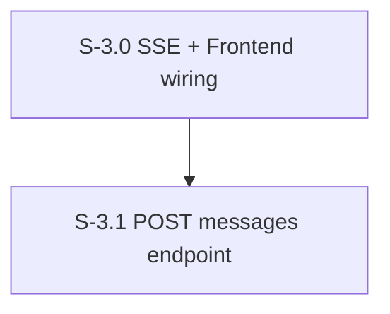

# Milestone 3: API Layer & SSE

**Goal**: Expose the POST messages endpoint and SSE real-time streaming. Wire SSE to the frontend so users see agent responses appear live.

---

## [S-3.0] SSE Infrastructure + Frontend Wiring

As a developer, I want an SSE endpoint that streams real-time events to the frontend, with visible proof that events flow.

### Description
Build the SSE endpoint AND wire it to the frontend in the same story so it's demoable. Add a temporary UI indicator (e.g., connection status badge, or a console log) proving SSE events arrive.

### Files to create
| File | Purpose |
|------|---------|
| `src/app/api/sse/route.ts` | GET SSE endpoint — clients subscribe for real-time events |
| `src/hooks/use-sse.ts` | `useSSE()` — React hook subscribing to `/api/sse`, dispatches events to DataContext |

### Files to modify
| File | Change |
|------|--------|
| `src/messages/sse-registry.ts` | Replace no-op shim with real broadcast implementation |
| `src/context/DataContext.tsx` | Integrate SSE hook: append messages on `message_created`, track typing on `agent_typing`/`agent_done` |

### SSE Event Types
- `message_created` — new message in any channel or DM
- `reaction_added` — reaction added to a message
- `agent_typing` — agent is processing (show typing indicator)
- `agent_done` — agent finished processing

### Acceptance Criteria
- [ ] [AC-3.0.1] `ConnectionRegistry` supports `add()`, `remove()`, `broadcast()` methods (real, not stub)
- [ ] [AC-3.0.2] SSE endpoint returns `text/event-stream` with proper headers
- [ ] [AC-3.0.3] Heartbeat every 30s to keep connections alive
- [ ] [AC-3.0.4] Connections cleaned up on client disconnect (abort signal)
- [ ] [AC-3.0.5] React hook creates `EventSource` on mount, closes on unmount, reconnects on loss
- [ ] [AC-3.0.6] DataContext appends new messages from SSE `message_created` events in real time
- [ ] [AC-3.0.7] Unit tests for ConnectionRegistry, E2E test verifying SSE connection + event delivery
- [ ] [AC-3.0.8] Sentry spans for SSE broadcast events

### Demo
Open the app in a browser. Open a second tab or use curl to POST a test event. Show the message appears in the first tab's UI in real time without page refresh.

---

## [S-3.1] POST Messages Endpoint

As a developer, I want a POST endpoint that receives a user message, stores it, triggers agent responses, and shows the full loop in the UI.

### Files to create
| File | Purpose |
|------|---------|
| `src/app/api/messages/route.ts` | POST: send message → store in DB → broadcast SSE → enqueue agent runs |
| `src/messages/schemas.ts` | Zod schemas for message validation |

### Files to modify
| File | Change |
|------|--------|
| `src/components/chat/ComposeBox.tsx` | Remove read-only overlay, add text input + submit handler |
| `src/components/thread/ThreadComposeBox.tsx` | Same — enable for thread replies |

### Flow
1. Validate request body with Zod
2. Store human message in DB via `createMessage()`
3. Broadcast `message_created` via SSE
4. Call `resolveTargetAgents()` to determine which agents should receive the message
5. Enqueue runs for each target agent via `enqueueRun()` (non-blocking — mailbox handles processing)
6. Return the stored message (201)

### Acceptance Criteria
- [ ] [AC-3.1.1] POST body validated with Zod: `{ channelId?, dmConversationId?, parentMessageId?, userId, text }`
- [ ] [AC-3.1.2] Human message stored in DB before agent invocation
- [ ] [AC-3.1.3] SSE broadcast of new message happens immediately
- [ ] [AC-3.1.4] Agent runs enqueued via mailbox (non-blocking — POST returns before agents respond)
- [ ] [AC-3.1.5] Returns 400 for validation errors, 201 for success
- [ ] [AC-3.1.6] ComposeBox has a functional text input (no longer disabled/read-only)
- [ ] [AC-3.1.7] Enter key or send button submits the message
- [ ] [AC-3.1.8] Input clears after successful send
- [ ] [AC-3.1.9] ThreadComposeBox sends with `parentMessageId` set
- [ ] [AC-3.1.10] Typing indicator appears while agent is processing
- [ ] [AC-3.1.11] Agent response appears in the UI via SSE (full loop)
- [ ] [AC-3.1.12] Unit tests for validation, integration test for POST flow, E2E test: type message → see agent response
- [ ] [AC-3.1.13] Sentry trace spans for message creation and agent run enqueuing

### Demo
**This is the first full-loop demo.** Type a message in #general as Michael. Watch the typing indicator appear, then see the agent's response materialize in the chat. This proves: ComposeBox → POST API → DB → mailbox → orchestrator → Claude SDK → tool → DB → SSE → UI.
