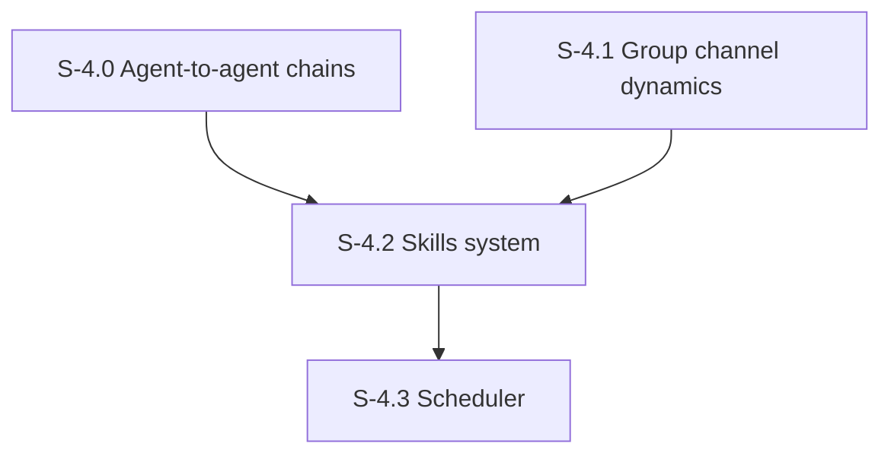

# Milestone 4: Advanced Agent Interactions & Scheduling

**Goal**: Enable agent-to-agent conversations, group channel dynamics, the skills system, and autonomous scheduled behavior.

---

## [S-4.0] Agent-to-Agent DM Chains

As a developer, I want agents to automatically respond when they receive a DM from another agent, creating natural back-and-forth.

### Files to modify
| File | Change |
|------|---------|
| `src/tools/send-message.ts` | After storing DM (channel with `kind = 'dm'`), enqueue run for target agent with chain depth tracking |
| `src/agents/orchestrator.ts` | Accept optional `chainDepth` param, enforce MAX_CHAIN_DEPTH=3 |

### Acceptance Criteria
- [ ] [AC-4.0.1] When Agent A DMs Agent B, a run is enqueued for Agent B to respond
- [ ] [AC-4.0.2] Chain depth tracked in run metadata, max 3 hops to prevent infinite loops
- [ ] [AC-4.0.3] Each agent in the chain sees the full DM history as context
- [ ] [AC-4.0.4] Unit tests for chain depth enforcement, integration test for a 2-agent exchange
- [ ] [AC-4.0.5] Sentry traces show the full chain with linked spans

### Demo
Send a DM to Dwight as Michael. Watch Dwight auto-respond, then Michael auto-responds to that (chain depth 2). Show it stops at depth 3.

---

## [S-4.1] Group Channel Response Ordering

As a developer, I want channel messages to trigger multiple agents with natural timing and ordered responses.

### Files to modify
| File | Change |
|------|---------|
| `src/agents/orchestrator.ts` | Process channel agent runs sequentially with random delay (1-5s), each seeing prior responses |

### Acceptance Criteria
- [ ] [AC-4.1.1] Agents respond one at a time (not in parallel) to avoid message ordering issues
- [ ] [AC-4.1.2] Random delay (1-5s) between agent invocations for natural feel
- [ ] [AC-4.1.3] Each agent sees previous agent responses in their conversation context
- [ ] [AC-4.1.4] Unit test for sequential ordering logic
- [ ] [AC-4.1.5] Sentry traces show sequential processing with delays

### Demo
Post in #general. Watch 2-3 agents respond one after another with natural delays.

---

## [S-4.2] Skills System

As a developer, I want filesystem-based skills that provide character behavior knowledge.

### Files to create
| File | Purpose |
|------|---------|
| `src/agents/skill-loader.ts` | `loadSkill(name)`, `listSkills()` — reads from `.skills/` filesystem |
| `.skills/character-voice/SKILL.md` | Speech patterns and mannerisms guide |
| `.skills/conflict-resolution/SKILL.md` | How characters handle disagreements |
| `.skills/meeting-dynamics/SKILL.md` | Conference room interaction patterns |
| `.skills/scenario-playbook/SKILL.md` | Classic Office scenarios to reference |
| `.skills/personality-drift-check/SKILL.md` | Self-assessment for persona consistency |
| `.skills/chat-etiquette/SKILL.md` | When to DM vs channel, reactions, threading |

### Acceptance Criteria
- [ ] [AC-4.2.1] Each skill file has YAML frontmatter (`name`, `description`) + markdown body
- [ ] [AC-4.2.2] `loadSkill()` reads and returns skill content
- [ ] [AC-4.2.3] `listSkills()` discovers all skills from `.skills/` directory
- [ ] [AC-4.2.4] Skills can be injected into agent prompts on demand
- [ ] [AC-4.2.5] Unit tests for skill loader
- [ ] [AC-4.2.6] Sentry span for skill loading

### Demo
Show an agent invocation where a skill is loaded into the prompt. Compare response quality with and without the skill.

---

## [S-4.3] Message Scheduler

As a developer, I want agents to autonomously initiate conversations on a schedule.

### Files to create
| File | Purpose |
|------|---------|
| `src/scheduler/loop.ts` | Polling loop: check for due scheduled messages, enqueue agent runs |
| `src/db/queries/scheduler.ts` | `getDueMessages()`, `markFired()`, `createScheduled()`, `cancelScheduled()` |
| `src/instrumentation.ts` | Next.js startup hook to launch scheduler |
| `src/app/api/scheduled/route.ts` | GET: list scheduled, POST: create new |
| `src/app/api/scheduled/[id]/route.ts` | DELETE: cancel scheduled message |

### Description
- Polling loop checks every 10 seconds for due scheduled messages
- When a scheduled message fires, a run is enqueued for the agent via the mailbox
- Started via Next.js `instrumentation.ts` (runs on server startup)
- Seed some initial schedules for demo (Michael's morning greeting, Dwight's security check)

### Acceptance Criteria
- [ ] [AC-4.3.1] Scheduler loop runs every 10s, picks up due messages
- [ ] [AC-4.3.2] Fired messages marked as `'fired'` to prevent re-execution
- [ ] [AC-4.3.3] `instrumentation.ts` starts scheduler on Node.js runtime only
- [ ] [AC-4.3.4] Rate limit: max 1 scheduled fire per agent per 5 minutes
- [ ] [AC-4.3.5] Unit tests for scheduler logic, integration test for fire-and-mark flow
- [ ] [AC-4.3.6] Sentry spans for scheduler loop iterations and fires

### Demo
Create a scheduled message for 10 seconds from now. Wait. Show the agent posts autonomously in the UI.
