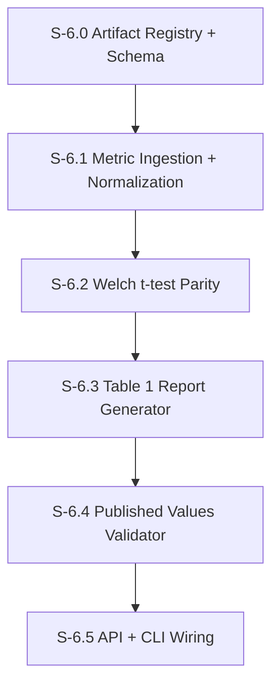

# Milestone 6: TinyTroupe Measurement + Table 1 Dataset

**Goal**: Build TinyTroupe-compatible measurement and data ingestion so we can reproduce Table 1 from the paper using the provided TinyTroupe artifacts (and optionally rerun the experiments).

**Dependencies**: M1 (DB foundation), M2 (telemetry), local TinyTroupe repo at `C:\src\tinytroupe` or `/mnt/c/src/tinytroupe`.

---

## Table 1 Reference (from paper)

These are the published values we must reproduce from the TinyTroupe artifacts.

**Exp. 1: Brainstorming with average customers (Na=200, Ne=40)**
- Treatment: action correction + variety intervention
- Metrics: Persona Adherence, Self-consistency, Fluency, Divergence, Ideas Qty.
- T: 5.81 (1.66), 5.00 (1.79), 6.75 (1.02), 6.15 (1.08), 8.28 (2.34)
- C: 6.72 (1.50), 7.16 (1.15), 7.27 (0.65), 6.63 (1.05), 3.85 (2.01)
- Delta: -0.92, -2.16, -0.52, -0.47, +4.43
- p-values: <0.001, <0.001, <0.001, 0.050, <0.001

**Exp. 2.1: Brainstorming with difficult customers (Na=96, Ne=24)**
- Treatment: action correction + variety intervention
- Metrics: Persona Adherence, Self-consistency, Fluency, Divergence, Ideas Qty.
- T: 4.95 (1.09), 3.54 (1.44), 3.22 (1.45), 4.88 (1.94), 2.45 (1.54)
- C: 4.15 (1.39), 5.60 (1.51), 6.34 (1.35), 6.29 (1.12), 4.17 (2.50)
- Delta: +0.80, -2.06, -3.13, -1.42, -1.72
- p-values: <0.001, <0.001, <0.001, 0.004, 0.008

**Exp. 2.2: Brainstorming with difficult customers (Na=96, Ne=24)**
- Treatment: variety intervention only (no action correction)
- Metrics: Persona Adherence, Self-consistency, Fluency, Divergence, Ideas Qty.
- T: 4.74 (1.55), 4.55 (1.63), 6.11 (1.56), 6.42 (1.10), 9.29 (3.33)
- C: 5.34 (1.48), 5.47 (1.67), 6.45 (1.51), 5.88 (1.33), 3.96 (2.27)
- Delta: -0.60, -0.92, -0.33, +0.54, +5.33
- p-values: 0.006, <0.001, 0.134, 0.131, <0.001

**Exp. 3: Debating controversial themes (Na=120, Ne=24)**
- Treatment: action correction only
- Metrics: Persona Adherence, Self-consistency, Fluency, Divergence
- T: 6.63 (1.34), 6.79 (1.63), 6.38 (1.20), 4.92 (2.24)
- C: 6.16 (1.59), 5.81 (2.37), 6.48 (1.04), 5.04 (2.29)
- Delta: +0.47, +0.98, -0.11, -0.13
- p-values: 0.015, <0.001, 0.454, 0.849

---

## [S-6.0] Artifact Registry + Schema

As a developer, I want a canonical registry of the TinyTroupe paper artifacts and a DB schema so we can ingest experiment outputs and reproduce Table 1 deterministically.

### Description

We will treat the TinyTroupe paper artifacts as the source of truth for Table 1. The registry maps each Table 1 experiment to the corresponding JSON file and notebook in the TinyTroupe repo.

**Artifact mapping**:
- Exp 1: `publications/paper_artifacts_june-2025/brainstorming_and_focus_group_quantitative_experimentation_1c.json`
- Exp 2.1: `publications/paper_artifacts_june-2025/brainstorming_and_focus_group_quantitative_experimentation_2.1c.json`
- Exp 2.2: `publications/paper_artifacts_june-2025/brainstorming_and_focus_group_quantitative_experimentation_2.2b.json`
- Exp 3: `publications/paper_artifacts_june-2025/debating_quantitative_experimentation_1c.json`

### Files to create

| File | Purpose |
|------|---------|
| `src/db/schema/tinytroupe.ts` | Tables: `tt_experiments`, `tt_metric_samples`, `tt_metric_stats` |
| `src/evaluation/tinytroupe/artifact-registry.ts` | Registry mapping experiment ids to JSON and notebook paths |
| `src/evaluation/tinytroupe/types.ts` | Types for experiments, metrics, and table rows |

### Acceptance Criteria
- [ ] [AC-6.0.1] `tt_experiments` stores: `id`, `code` (`exp_1`, `exp_2_1`, `exp_2_2`, `exp_3`), `label`, `na`, `ne`, `treatment`, `control`, `artifact_path`, `notebook_path`
- [ ] [AC-6.0.2] `tt_metric_samples` stores: `experiment_id`, `group` (`control` | `treatment`), `metric`, `values` (float array)
- [ ] [AC-6.0.3] `tt_metric_stats` stores: `experiment_id`, `metric`, `control_mean`, `control_sd`, `treatment_mean`, `treatment_sd`, `delta`, `p_value`, `test_type`
- [ ] [AC-6.0.4] Artifact registry resolves paths using `TINYTROUPE_REPO_DIR` env var (default `/mnt/c/src/tinytroupe`)
- [ ] [AC-6.0.5] Migration generated and applied for TinyTroupe tables

### Demo
1. List registry entries and verify they resolve to the correct JSON files
2. Show empty tables exist in the DB

---

## [S-6.1] Metric Ingestion + Normalization

As a developer, I want to ingest TinyTroupe JSON result files and normalize metric names so downstream steps can compute Table 1 consistently.

### Description

The JSON artifacts contain metric arrays keyed by the proposition names used in the notebooks. We must normalize to a fixed metric set:
- `persona_adherence` (from `Hard Persona Adherence` or `Persona Adherence`)
- `self_consistency`
- `fluency`
- `divergence`
- `ideas_qty` (not present in Exp 3)

### Files to create

| File | Purpose |
|------|---------|
| `src/evaluation/tinytroupe/ingest.ts` | Reads artifact JSON, normalizes metric names, writes to DB |
| `src/evaluation/tinytroupe/normalize.ts` | Metric name mapping + validation |

### Acceptance Criteria
- [ ] [AC-6.1.1] Ingest reads each artifact JSON and loads Control/Treatment arrays into `tt_metric_samples`
- [ ] [AC-6.1.2] `Hard Persona Adherence` and `Persona Adherence` both map to `persona_adherence`
- [ ] [AC-6.1.3] Exp 3 has no `ideas_qty` and ingestion handles missing metrics gracefully
- [ ] [AC-6.1.4] Sample sizes match the paper: Na and Ne per experiment
- [ ] [AC-6.1.5] Unit tests for normalization and sample size checks

### Demo
1. Run ingestion for Exp 1
2. Show `tt_metric_samples` has 200 persona adherence values for each group and 40 ideas_qty values

---

## [S-6.2] Welch t-test Parity

As a developer, I want statistical tests that match TinyTroupe's Welch t-test so that p-values and deltas align with Table 1.

### Description

We must replicate TinyTroupe's `StatisticalTester` behavior (Welch t-test) to compute mean, sd, delta, and p-values. Use Python + TinyTroupe if needed for exact parity.

### Files to create

| File | Purpose |
|------|---------|
| `scripts/tinytroupe/run_welch.py` | Python helper that runs Welch t-test using TinyTroupe or SciPy |
| `src/evaluation/tinytroupe/stats.ts` | Node wrapper that invokes Python helper and records stats |

### Acceptance Criteria
- [ ] [AC-6.2.1] For each experiment + metric, compute control mean/sd and treatment mean/sd
- [ ] [AC-6.2.2] Welch t-test returns p-values matching TinyTroupe within 1e-6
- [ ] [AC-6.2.3] `tt_metric_stats` populated for all metrics in Table 1
- [ ] [AC-6.2.4] Unit tests compare computed stats to known values from Exp 1 JSON
- [ ] [AC-6.2.5] Sentry spans wrap ingestion and stats computation

### Demo
1. Compute stats for Exp 1
2. Show the stored means, sd, and p-values align with Table 1

---

## [S-6.3] Table 1 Report Generator

As a developer, I want a report generator that outputs Table 1 in JSON and Markdown so we can compare against the paper and publish results.

### Files to create

| File | Purpose |
|------|---------|
| `src/evaluation/tinytroupe/table1-report.ts` | Builds Table 1 rows from `tt_metric_stats` |
| `src/evaluation/tinytroupe/table1-format.ts` | Markdown + JSON formatting |

### Acceptance Criteria
- [ ] [AC-6.3.1] Table 1 report includes Exp 1, 2.1, 2.2, 3 with correct metrics
- [ ] [AC-6.3.2] Output fields: `metric`, `t_mean`, `t_sd`, `c_mean`, `c_sd`, `delta`, `p_value`, `na`, `ne`
- [ ] [AC-6.3.3] Markdown output matches the paper order and labeling
- [ ] [AC-6.3.4] JSON output is deterministic and sorted

### Demo
1. Generate Markdown table and compare to PDF values

---

## [S-6.4] Published Values Validator

As a developer, I want a validator that checks our computed Table 1 against the paper values with a tolerance so we can assert reproduction success.

### Files to create

| File | Purpose |
|------|---------|
| `src/evaluation/tinytroupe/table1-reference.ts` | Hard-coded published values from the paper |
| `src/evaluation/tinytroupe/validate.ts` | Compare computed values to reference, report deltas |

### Acceptance Criteria
- [ ] [AC-6.4.1] Validator checks mean, sd, delta, and p-value against reference
- [ ] [AC-6.4.2] Default tolerance: mean/sd/delta within 0.01, p-values within 1e-3
- [ ] [AC-6.4.3] Report includes pass/fail per metric and experiment
- [ ] [AC-6.4.4] Failing any metric returns non-zero exit code

### Demo
1. Run validator on computed Table 1 and show all rows pass

---

## [S-6.5] API + CLI Wiring

As a developer, I want a CLI and API endpoint to run ingestion + stats + report generation in one command.

### Files to create

| File | Purpose |
|------|---------|
| `src/app/api/tinytroupe/table1/route.ts` | GET returns last Table 1 report; POST regenerates it |
| `src/evaluation/tinytroupe/runner.ts` | Orchestrates ingestion, stats, report, validation |

### Files to modify

| File | Change |
|------|--------|
| `package.json` | Add `"tinytroupe:table1": "npx tsx src/evaluation/tinytroupe/runner.ts"` |

### Acceptance Criteria
- [ ] [AC-6.5.1] CLI runs end-to-end and outputs JSON report to stdout
- [ ] [AC-6.5.2] API POST triggers recomputation and stores report artifact
- [ ] [AC-6.5.3] CLI supports `--artifacts-dir` and `--validate` flags
- [ ] [AC-6.5.4] Sentry spans wrap each step

### Demo
1. Run `npm run tinytroupe:table1 -- --validate`
2. Show JSON report and success status
