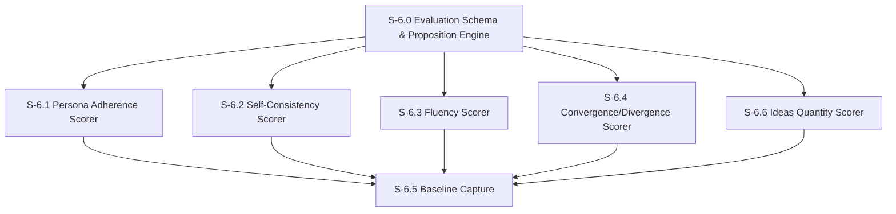

# Milestone 6: Persona Drift Measurement

**Goal**: Build offline measurement infrastructure to score agents on five evaluation dimensions — persona adherence, self-consistency, fluency, convergence/divergence, and ideas quantity — using proposition-based evaluation scored by Claude Haiku as LLM-as-judge. Aligns with TinyTroupe's evaluation methodology (arXiv:2507.09788) to enable reproduction of Table 1 experiments.

**Dependencies**: M5 (need personas to evaluate), M2 (need run tracking data), M1 (need DB)



---

## [S-6.0] Evaluation Schema & Proposition Engine

As a developer, I want a proposition evaluation engine and database schema so that I can define natural language claims about agent behavior and have them scored by an LLM judge.

### Description

This is the foundation for all persona drift measurement. A **proposition** is a natural language statement that can be evaluated against agent output. For example: "Michael Scott would make this conversation about himself" or "Dwight would reference his authority as Assistant Regional Manager." Propositions are defined in YAML definition files, loaded at evaluation time, and scored by Claude Haiku (cheap, fast) as the LLM judge.

The proposition engine:
1. Loads proposition definitions from YAML files in `src/features/evaluation/propositions/`
2. Supports **two evaluation modes** matching TinyTroupe's `Proposition` class:
   - **`score()`**: Quantitative 0–9 integer scoring with detailed rubric (used for offline evaluation and action quality checks)
   - **`check()`**: Boolean true/false evaluation (used for intervention preconditions — "Is X happening?")
3. Evaluates propositions individually (for experiment accuracy) or in batches of up to 10 (for cost efficiency in CI)
4. Scores each proposition 0–9 (integer) using a detailed scoring rubric matching TinyTroupe's exact scale
5. Stores results in an `evaluation_runs` / `evaluation_scores` table
6. Supports template variables in propositions (e.g., `{{agent_name}}`, `{{action}}`) filled at evaluation time via Mustache-style interpolation
7. Supports both **agent-level** and **environment-level** proposition targets (environment = channel/group conversation)
8. Optionally includes agent persona specification in judge context via `include_personas` flag
9. Supports `double_check` mode where the judge reconsiders its evaluation for stricter scoring
10. Supports `precondition` functions that gate when a proposition applies (e.g., only for TALK/send_message actions)
11. Supports `first_n` and `last_n` trajectory windowing — controls how much of the agent's history to include as context (matching TinyTroupe's trajectory window parameters)
12. Supports `recommendations_for_improvement` per proposition — text guidance returned in feedback when the proposition score is below threshold (used by the action correction gate in M7)
13. Supports **hard evaluation mode** (`hard: true`) — applies a 20% score penalty for ANY detected flaw, regardless of severity. Used for stricter persona adherence checks in experiments (matching TinyTroupe's `hard_action_persona_adherence`)

**Scoring rubric** (included in every LLM judge system prompt, matching TinyTroupe's exact rubric from `proposition.py`):
```
Score 0: The proposition is without any doubt completely false.
Score 1-2: The proposition has little support and is mostly false.
Score 3: Weak support — some evidence but mostly contradicted.
Score 4-5: The evidence is mixed — the proposition is equally true and false.
Score 6: Fair support — more true than false, but notable exceptions.
Score 7-8: The proposition is well-supported and mostly true.
Score 9: The proposition is without any doubt completely true.

Scoring principles:
- If the data required to evaluate is not present, assign score 9 (assume true unless contradicted).
- Score 9 only when evidence is the best possible and ALL parts support the claim.
- Score 0 only when evidence is the worst possible and ALL parts contradict the claim.
- Be VERY rigorous. When in doubt, assign the LOWER score.
- Contradictions ALWAYS override positive evidence — don't dismiss as specification errors.
- Evaluate EACH relevant element individually; final score is the average.
```

**Scores are integers (0–9)**, matching TinyTroupe's `MIN_SCORE = 0`, `MAX_SCORE = 9`.

**Proposition YAML format example:**
```yaml
# src/features/evaluation/propositions/adherence/michael.yaml
dimension: adherence
agent_id: michael
include_personas: true        # Include persona spec in judge context (default: true)
target_type: agent            # 'agent' | 'environment' (default: 'agent')
first_n: 5                    # Include first N actions of trajectory as context (default: 10)
last_n: 10                    # Include last N actions of trajectory as context (default: 100)
propositions:
  - id: michael-self-centered
    claim: "{{agent_name}} makes conversations about themselves and their importance as Regional Manager"
    weight: 1.0
    recommendations_for_improvement: "Make sure to reference yourself, your experiences, and your importance as Regional Manager."
  - id: michael-wants-to-be-liked
    claim: "{{agent_name}} desperately seeks approval and friendship from coworkers"
    weight: 1.0
  - id: michael-never-boring
    claim: "{{agent_name}} gives a dry, factual response with no personality"
    weight: 0.8
    inverted: true   # Anti-pattern: high score from LLM = bad. Score is flipped (9 - raw) before aggregation.
```

Each proposition supports an optional `inverted` boolean (default `false`). When `inverted: true`, the proposition describes an anti-pattern — something the character should NOT do. The raw LLM judge score is flipped (`9 - raw`) before aggregation so that anti-patterns integrate naturally with the 0–9 "higher is better" scale.

**Environment-level propositions** target a channel or group conversation rather than an individual agent. The judge receives the full conversation trajectory (all agents' messages) and optionally all agents' persona specs. This is used for convergence/divergence and ideas quantity scoring.

**Trajectory windowing**: Each proposition specifies `first_n` and `last_n` parameters controlling how much of the agent's action history to include as context. For evaluation-level propositions (offline scoring), defaults are `first_n: 10, last_n: 100` (broad context). For action-level propositions (quality gate), defaults are `first_n: 5, last_n: 10` (focused context). This matches TinyTroupe's approach where action-level quality checks use a narrower window.

**Trajectory format**: Agent actions are formatted as `"Agent acts: [MESSAGE]"` and stimuli (incoming messages) as `"--> Agent: [STIMULUS]"`. This matches TinyTroupe's trajectory format and helps the judge distinguish between agent output and input.

**Recommendations for improvement**: Each proposition can optionally include a `recommendations_for_improvement` text. When the proposition score is below threshold (used in M7 action correction gate), this text is included in the feedback returned to the agent. This matches TinyTroupe's `recommendations_for_improvement()` method on propositions.

**Double-check mode**: When enabled, after the initial scoring, the judge is asked "Are you sure? Please revise your evaluation to make it as correct as possible." If the judge revises its score, the new value is used. This is slower but stricter — use for experiments, not CI. Matching TinyTroupe: `enable_reasoning_step=True` enables extended reasoning before scoring.

### Files to create

| File | Purpose |
|------|---------|
| `src/db/schema/evaluations.ts` | `evaluation_runs`, `evaluation_scores` tables |
| `src/features/evaluation/types.ts` | Types: `Proposition`, `PropositionResult`, `EvaluationDimension`, `EvaluationRun`, `EvaluationScore`, `TargetType`, `TrajectoryWindow`, `PreconditionFn` |
| `src/features/evaluation/proposition-engine.ts` | `scoreProposition(prop, context)` (0–9), `checkProposition(prop, context)` (boolean), `scorePropositions(props, context)`, `batchScore(batches)` |
| `src/features/evaluation/proposition-loader.ts` | YAML loader: reads `.yaml` files, validates with Zod, fills template variables |
| `src/features/evaluation/schemas.ts` | Zod schemas for proposition YAML format, evaluation API request/response |
| `src/features/evaluation/propositions/README.md` | Documentation for the proposition YAML format |
| `src/db/queries/evaluations.ts` | `createEvaluationRun()`, `recordScore()`, `getEvaluationRun()`, `listEvaluationRuns()`, `getAgentScoreHistory()` |
| `src/app/api/evaluations/route.ts` | GET (list evaluation runs, filterable by agentId), POST (trigger new evaluation run) |
| `src/app/api/evaluations/[runId]/route.ts` | GET (single evaluation run with all scores) |

### Acceptance Criteria
- [ ] [AC-6.0.1] Two tables defined: `evaluation_runs` (id, agent_id, status, dimensions, window_start, window_end, sample_size, overall_score, token_usage, timestamps), `evaluation_scores` (id, evaluation_run_id, dimension, proposition_id, score 0–9, reasoning, context_snippet)
- [ ] [AC-6.0.2] Proposition YAML loader reads files from `src/features/evaluation/propositions/`, validates with Zod, supports optional `inverted` boolean per proposition
- [ ] [AC-6.0.3] Template variables (`{{agent_name}}`, `{{channel_name}}`, `{{action}}`) filled at evaluation time from agent/context data
- [ ] [AC-6.0.3a] Inverted propositions (anti-patterns) have their raw LLM score flipped (`9 - raw`) before aggregation
- [ ] [AC-6.0.4] Two evaluation modes: `scoreProposition()` returns integer 0–9 with reasoning + confidence; `checkProposition()` returns boolean true/false (used by intervention preconditions in S-7.1). Both share the same LLM judge infrastructure. `scorePropositions()` supports batch mode grouping up to 10 per call.
- [ ] [AC-6.0.5] Scoring rubric (0–9 with band descriptions) included in every judge system prompt
- [ ] [AC-6.0.6] Single LLM judge prompt instructs the model to score each proposition independently and return structured JSON with `reasoning`, `justification`, `value`, `confidence` fields
- [ ] [AC-6.0.7] Evaluation API: GET list runs (filterable by `agentId`), POST trigger new run, GET single run with scores
- [ ] [AC-6.0.8] Migration generated and applied — both tables queryable
- [ ] [AC-6.0.9] `include_personas` flag: when `true` (default), agent persona specification included in judge context; when `false`, persona is omitted (used for self-consistency and fluency where persona should not bias evaluation)
- [ ] [AC-6.0.10] `target_type` support: `agent` targets evaluate a single agent's messages; `environment` targets evaluate the full channel conversation with all agents' trajectories
- [ ] [AC-6.0.11] `double_check` mode: when enabled, judge is asked "Are you sure? Please revise your evaluation to make it as correct as possible." in a follow-up message; revised score used if different
- [ ] [AC-6.0.12] `first_n` and `last_n` trajectory windowing: controls how many actions from the beginning and end of the agent's history are included as context; defaults: `first_n: 10, last_n: 100` for evaluation, `first_n: 5, last_n: 10` for action-level
- [ ] [AC-6.0.13] Trajectory formatted as `"Agent acts: [MESSAGE]"` for agent actions and `"--> Agent: [STIMULUS]"` for incoming messages, matching TinyTroupe's format
- [ ] [AC-6.0.14] Optional `recommendations_for_improvement` per proposition — text guidance returned when score is below threshold
- [ ] [AC-6.0.15] Precondition function support: `precondition(target, additionalContext, claimVariables) => boolean`; if `false`, proposition evaluates as trivially true (score 9)
- [ ] [AC-6.0.16] Hard evaluation mode: when `hard: true` on a proposition, a 20% penalty is applied to the raw score for ANY detected flaw (matching TinyTroupe's `hard_action_persona_adherence` which states "apply a 20% penalty for each detected flaw"). Hard mode is used in experiments for stricter persona checks.
- [ ] [AC-6.0.17] Unit tests for YAML loading, template variable replacement, LLM response parsing, batch grouping logic, scoring rubric presence, double-check flow, trajectory formatting, precondition gating, check() vs score() modes, hard evaluation penalty
- [ ] [AC-6.0.18] Sentry spans for evaluation runs and LLM judge calls

### Demo
1. Create a sample proposition YAML for Michael
2. Feed a sample `send_message` tool call from `run_messages` into the proposition engine
3. Show the LLM judge returns scores (0–9) with reasoning and confidence
4. Show the evaluation run and scores stored in the DB
5. Demonstrate an environment-level proposition scoring a channel conversation

---

## [S-6.1] Persona Adherence Scorer

As a developer, I want to score how well an agent's recent messages match its persona specification so I can detect when characters are drifting off-personality.

### Description

Persona adherence measures whether an agent's behavior matches its system prompt persona. The scorer:
1. Pulls recent `send_message` tool calls from `run_messages` for a given agent within a time window
2. Loads the agent's `system_prompt` from the `agents` table as the persona reference
3. Loads adherence propositions for this agent from YAML
4. For each sampled message, evaluates all adherence propositions with the persona as context
5. Aggregates into a single adherence score (0–9) via weighted average

This scorer always sets `include_personas: true` — the judge must see the persona to evaluate adherence against it. This matches TinyTroupe's `persona_adherence` proposition which evaluates personality traits, style, beliefs, behaviors, and skills with equal weight.

The LLM judge prompt is structured as: "Given this character's persona: [persona]. This character sent the following message: [message]. Score 0–9 how well the following claim holds true: [claim]."

**Hard adherence mode** (optional, for experiments): When `options.hard = true`, uses the hard evaluation variant matching TinyTroupe's `hard_action_persona_adherence`. The judge applies a 20% penalty for ANY detected flaw, regardless of severity. The prompt explicitly instructs: "Each criterion should have equal weight. If any criterion fails, apply a 20% penalty to the overall score for each violation." This produces stricter scores and is the variant used in the Table 1 experiment pipeline (S-8.6/S-8.7). Default mode (non-hard) is used for regular persona drift monitoring.

### Files to create

| File | Purpose |
|------|---------|
| `src/features/evaluation/scorers/adherence.ts` | `scoreAdherence(agentId, timeWindow, options)` — returns dimension score |
| `src/features/evaluation/propositions/adherence/_default.yaml` | Default adherence propositions applicable to all agents |

### Files to modify

| File | Change |
|------|--------|
| `src/db/queries/evaluations.ts` | Add `getRecentAgentMessages(agentId, window)` — pulls `send_message` tool calls from `run_messages` |

### Acceptance Criteria
- [ ] [AC-6.1.1] `scoreAdherence()` pulls recent `send_message` tool calls from `run_messages` for the target agent
- [ ] [AC-6.1.2] Samples up to 20 messages from the time window (random sample if more exist)
- [ ] [AC-6.1.3] Agent's `system_prompt` included as persona context in the judge prompt
- [ ] [AC-6.1.4] Each sampled message evaluated against all adherence propositions for that agent
- [ ] [AC-6.1.5] Propositions from `_default.yaml` merged with agent-specific propositions
- [ ] [AC-6.1.6] Returns a weighted-average score (0–9) with per-proposition breakdowns stored in `evaluation_scores`
- [ ] [AC-6.1.7] `options.hard` enables hard adherence mode: 20% penalty per flaw, each criterion equal weight (matching TinyTroupe's `hard_action_persona_adherence`)
- [ ] [AC-6.1.8] Unit tests with mocked LLM responses verifying score aggregation, message sampling, proposition merging, hard vs. normal mode
- [ ] [AC-6.1.9] Sentry span wraps adherence scoring

### Demo
1. Seed several `run_messages` entries containing `send_message` tool calls for Michael
2. Run `scoreAdherence('michael', { last24Hours })`
3. Show the per-proposition scores and the overall adherence score
4. Show a message that scores low on "makes conversations about themselves" and explain why

---

## [S-6.2] Self-Consistency Scorer

As a developer, I want to measure whether an agent's current behavior is consistent with its own past behavior so I can detect when a character starts acting unlike itself.

### Description

Self-consistency measures temporal coherence — does the agent respond similarly to similar situations over time? The scorer:
1. Pulls recent messages (current window) and older messages (historical window) from `run_messages`
2. Groups messages by channel/context to find comparable situations
3. Uses the LLM judge to compare current vs. historical tone, vocabulary, and behavioral patterns
4. Does NOT use the persona spec — this is purely self-referential (is the agent consistent with its own past, regardless of what the persona says)

This scorer sets `include_personas: false`, matching TinyTroupe's `self_consistency` proposition which explicitly states: "Ignore the agent's persona or general background, the self-consistency concerns ONLY the actions observed."

The key difference from adherence: adherence checks against the spec, consistency checks against the agent's own history. An agent could be consistently wrong (low adherence, high consistency) or inconsistently right (high adherence, low consistency).

**Evaluation approach**: Feed the judge pairs of (historical message, current message) in similar contexts and ask "Are these messages from the same character? Score 0–9."

### Files to create

| File | Purpose |
|------|---------|
| `src/features/evaluation/scorers/consistency.ts` | `scoreConsistency(agentId, currentWindow, historicalWindow)` |
| `src/features/evaluation/propositions/consistency/_default.yaml` | Default consistency propositions (tone, vocabulary, behavioral consistency) |

### Acceptance Criteria
- [ ] [AC-6.2.1] `scoreConsistency()` pulls messages from both current and historical time windows
- [ ] [AC-6.2.2] Groups messages by channel to find comparable contexts (same channel = comparable)
- [ ] [AC-6.2.3] Samples up to 10 message pairs for comparison
- [ ] [AC-6.2.4] LLM judge receives paired messages and scores similarity (0–9) without access to the persona spec (`include_personas: false`)
- [ ] [AC-6.2.5] Returns average consistency score with per-pair breakdowns
- [ ] [AC-6.2.6] Handles the cold-start case: if no historical messages exist, returns null (not evaluable)
- [ ] [AC-6.2.7] Unit tests with mocked messages and LLM responses
- [ ] [AC-6.2.8] Sentry span wraps consistency scoring

### Demo
1. Seed messages for Jim across two time periods — some consistent, some drifted
2. Run `scoreConsistency('jim', currentWindow, historicalWindow)`
3. Show the paired comparisons and scores
4. Demonstrate that deliberate drift (Jim suddenly using Dwight-like language) produces a low score

---

## [S-6.3] Fluency Scorer

As a developer, I want to detect repetitive language patterns and formulaic responses so I can identify when agents fall into step repetition.

### Description

Step repetition is a surprisingly common failure mode in LLM persona agents (TinyTroupe reports fluency scores of 6.3–6.8/9). This scorer uses an **LLM-as-judge primary approach** matching TinyTroupe's methodology, with algorithmic n-gram analysis providing supplementary evidence to the judge.

This scorer sets `include_personas: false` — fluency is evaluated independently of persona.

**Evaluation approach**:
1. Pull the agent's recent messages from `run_messages`
2. Compute n-gram overlap statistics (3-gram and 5-gram) as supplementary evidence
3. Feed the messages + n-gram statistics to the LLM judge with the fluency proposition
4. The judge evaluates whether the agent sounds natural, avoids repetitive patterns, and uses varied language

The default fluency proposition (matching TinyTroupe's `fluency` proposition):
```
THE AGENT IS FLUENT:
- The agent doesn't repeat the same thoughts or words across messages
- The agent doesn't use formulaic or repetitive language patterns
- The agent sounds natural and human-like
- The agent varies sentence structure, vocabulary, and conversational openers
```

The n-gram statistics are provided as structured evidence in the judge prompt, not as the scoring mechanism itself. This ensures the overall score is compatible with TinyTroupe's methodology while benefiting from algorithmic precision.

### Files to create

| File | Purpose |
|------|---------|
| `src/features/evaluation/scorers/fluency.ts` | `scoreFluency(agentId, timeWindow)` |
| `src/features/evaluation/utils/ngram.ts` | `extractNgrams(text, n)`, `computeOverlap(ngramsA, ngramsB)`, `computeCorpusRepetition(messages, n)` |
| `src/features/evaluation/propositions/fluency/_default.yaml` | Fluency propositions (`include_personas: false`) |

### Acceptance Criteria
- [ ] [AC-6.3.1] `extractNgrams()` produces n-grams from text with configurable n (3, 5)
- [ ] [AC-6.3.2] `computeCorpusRepetition()` returns a 0–1 score measuring how repetitive a set of messages is (0 = all unique, 1 = all identical)
- [ ] [AC-6.3.3] `scoreFluency()` pulls recent messages, computes n-gram statistics, then feeds both messages and statistics to the LLM judge
- [ ] [AC-6.3.4] LLM judge evaluates the fluency proposition with messages as context and n-gram statistics as supplementary evidence
- [ ] [AC-6.3.5] Judge prompt explicitly excludes persona specification (`include_personas: false`)
- [ ] [AC-6.3.6] Returns a score (0–9) from the LLM judge with reasoning
- [ ] [AC-6.3.7] N-gram computation is pure TypeScript with no LLM call — only the final evaluation uses the judge
- [ ] [AC-6.3.8] Unit tests for n-gram extraction, overlap computation, and mocked LLM evaluation
- [ ] [AC-6.3.9] Sentry span wraps fluency scoring

### Demo
1. Generate a set of messages with high repetition (copy-paste with minor edits)
2. Generate a set of messages with natural variety
3. Run `scoreFluency()` on both sets
4. Show the repetitive set scores low, the varied set scores high
5. Show the n-gram statistics included in the judge context

---

## [S-6.4] Convergence/Divergence Scorer

As a developer, I want to measure whether agents in group conversations are converging to similar communication styles or maintaining their individual voices.

### Description

In group channels, agents can start sounding alike — using similar vocabulary, agreeing too readily, adopting each other's speech patterns. This scorer uses an **environment-level LLM proposition** matching TinyTroupe's methodology, with algorithmic vocabulary statistics providing supplementary evidence.

This scorer sets `include_personas: false` and `target_type: environment` — divergence is evaluated on the group conversation trajectory, not individual agents, and without reference to persona specs.

**Evaluation approach** (matching TinyTroupe's `divergence` proposition):
1. Pull all agent messages from a channel within the time window
2. Compute per-agent vocabulary statistics as supplementary evidence
3. Feed the full conversation trajectory to the LLM judge with the divergence proposition
4. The judge evaluates whether agents maintain distinct voices, whether topics diversify over time, and whether discussions avoid converging to a single perspective

The default divergence proposition (matching TinyTroupe):
```
AGENTS DIVERGE FROM ONE ANOTHER:
As the conversation progresses, the agents' behaviors diverge from one another,
instead of becoming more similar. Topics discussed become more varied toward the
end of the conversation. Discussions do not converge to a single topic or
perspective at the end.
```

**Scoring direction**: Like all dimensions, higher = better (0–9). A high score means agents maintain **distinct voices** (low convergence / high divergence). The dimension is named `convergence` but the score represents voice divergence.

### Files to create

| File | Purpose |
|------|---------|
| `src/features/evaluation/scorers/convergence.ts` | `scoreConvergence(channelId, timeWindow)` |
| `src/features/evaluation/utils/text-stats.ts` | `computeVocabularyStats(messages)` — unique word ratio, avg sentence length, punctuation density |
| `src/features/evaluation/propositions/convergence/_default.yaml` | Convergence propositions (`include_personas: false`, `target_type: environment`) |

### Acceptance Criteria
- [ ] [AC-6.4.1] `scoreConvergence()` pulls messages from a channel and groups by agent
- [ ] [AC-6.4.2] Per-agent vocabulary stats computed as supplementary evidence: unique word ratio, average sentence length, punctuation density
- [ ] [AC-6.4.3] Pairwise vocabulary similarity computed between all agent pairs in the channel (supplementary)
- [ ] [AC-6.4.4] LLM judge receives the full conversation trajectory (all agents' messages in order) and evaluates the divergence proposition
- [ ] [AC-6.4.5] Judge prompt uses `target_type: environment` — all agents' messages included as a single conversation context
- [ ] [AC-6.4.6] Judge prompt excludes persona specifications (`include_personas: false`)
- [ ] [AC-6.4.7] Vocabulary statistics included as structured supplementary evidence in the judge prompt
- [ ] [AC-6.4.8] Returns a single divergence score (0–9) with reasoning, plus per-agent-pair similarity metrics as metadata
- [ ] [AC-6.4.9] Unit tests for vocabulary stats, pairwise similarity, and mocked LLM evaluation
- [ ] [AC-6.4.10] Sentry span wraps convergence scoring

### Demo
1. Seed a channel with messages from 3 agents — some distinctly different, some converging
2. Run `scoreConvergence('general', timeWindow)`
3. Show the full conversation trajectory sent to the judge
4. Show the divergence score and supplementary vocabulary statistics
5. Show which agent pairs are most similar

---

## [S-6.6] Ideas Quantity Scorer

As a developer, I want to count the number of distinct ideas proposed by agents in a conversation so I can measure the creative output of brainstorming scenarios.

### Description

Ideas Quantity is the fifth metric in TinyTroupe's Table 1. Unlike the other four dimensions (scored 0–9), this metric is an **integer count** of distinct ideas present in a conversation. It is an environment-level metric evaluated on group conversations.

**Evaluation approach**:
1. Pull all agent messages from a channel/environment within the time window
2. Feed the full conversation to the LLM judge
3. The judge enumerates all distinct ideas/proposals/suggestions mentioned
4. Returns the count and a list of the identified ideas

The judge prompt instructs: "Read the following conversation. List every distinct product idea, service idea, proposal, or suggestion made by any participant. Two ideas are distinct if they describe fundamentally different concepts. Minor variations of the same idea count as one. Return a numbered list and the total count."

This metric is only meaningful for brainstorming/creative scenarios. It is optional in the regular evaluation harness and mandatory for Table 1 experiment reproduction.

### Files to create

| File | Purpose |
|------|---------|
| `src/features/evaluation/scorers/ideas-quantity.ts` | `scoreIdeasQuantity(channelId, timeWindow)` |
| `src/features/evaluation/propositions/ideas-quantity/_default.yaml` | Ideas quantity prompt template (`target_type: environment`, `include_personas: false`) |

### Acceptance Criteria
- [ ] [AC-6.6.1] `scoreIdeasQuantity()` pulls all messages from a channel within the time window
- [ ] [AC-6.6.2] LLM judge receives the full conversation trajectory and enumerates distinct ideas
- [ ] [AC-6.6.3] Returns an integer count (not 0–9 score) plus a list of identified ideas with brief descriptions
- [ ] [AC-6.6.4] Duplicate/overlapping ideas collapsed by the judge (prompt instructs to count fundamentally different concepts only)
- [ ] [AC-6.6.5] Uses `target_type: environment` and `include_personas: false`
- [ ] [AC-6.6.6] Unit tests with mocked conversations and LLM responses
- [ ] [AC-6.6.7] Sentry span wraps ideas quantity scoring

### Demo
1. Seed a channel with a brainstorming conversation containing ~10 messages with some repeated ideas
2. Run `scoreIdeasQuantity('brainstorm-channel', timeWindow)`
3. Show the judge's enumerated list and the total count
4. Demonstrate that repeated ideas are correctly collapsed

---

## [S-6.5] Baseline Capture

As a developer, I want to run the full evaluation suite against initial personas and sample conversations to establish baseline scores for each character.

### Description

Before any correction mechanisms are applied, we need baseline scores. This story:
1. Creates a CLI script (`npm run eval:baseline`) that runs all five scorers against each of the 16 agents
2. Uses the existing seeded messages and personas from M5 as input
3. For agents with no real messages yet, generates synthetic sample conversations by invoking the agent with canned prompts
4. Stores baseline scores with an `is_baseline` flag on `evaluation_runs`
5. Provides an API endpoint to retrieve baselines for comparison

### Files to create

| File | Purpose |
|------|---------|
| `src/features/evaluation/scripts/capture-baseline.ts` | CLI script: `npx tsx src/features/evaluation/scripts/capture-baseline.ts` |
| `src/features/evaluation/scripts/sample-prompts.ts` | Canned prompts for synthetic conversations (10 prompts covering various scenarios) |
| `src/features/evaluation/baseline.ts` | `captureBaseline(agentId)`, `getBaseline(agentId)`, `compareToBaseline(agentId, currentScores)` |
| `src/app/api/evaluations/baselines/route.ts` | GET (list all baselines), POST (trigger baseline capture for an agent) |
| `src/app/api/evaluations/baselines/[agentId]/route.ts` | GET (single agent baseline scores) |

### Files to modify

| File | Change |
|------|--------|
| `src/db/schema/evaluations.ts` | Add `is_baseline` boolean column to `evaluation_runs` |
| `package.json` | Add `"eval:baseline": "npx tsx src/features/evaluation/scripts/capture-baseline.ts"` script |

### Acceptance Criteria
- [ ] [AC-6.5.1] `capture-baseline.ts` runs all 5 scorers (adherence, consistency, fluency, convergence, ideas quantity) for a specified agent
- [ ] [AC-6.5.2] For agents with fewer than 10 messages, generates synthetic conversations using sample prompts and the orchestrator
- [ ] [AC-6.5.3] Baseline evaluation runs marked with `is_baseline = true`
- [ ] [AC-6.5.4] `compareToBaseline()` returns a delta object showing score changes per dimension
- [ ] [AC-6.5.5] Baselines API: GET all baselines, GET single agent, POST trigger capture
- [ ] [AC-6.5.6] `npm run eval:baseline` captures baselines for all 16 agents (or a specified subset via `--agents michael,dwight`)
- [ ] [AC-6.5.7] Baseline capture is idempotent — re-running replaces previous baseline for the same agent
- [ ] [AC-6.5.8] Unit tests for `compareToBaseline()` delta computation
- [ ] [AC-6.5.9] Sentry trace wraps the full baseline capture operation

### Demo
1. Run `npm run eval:baseline -- --agents michael,dwight,jim`
2. Show baseline scores for all 5 dimensions for each agent
3. Show the baselines API returns the stored scores
4. Run a regular evaluation and show the delta comparison
