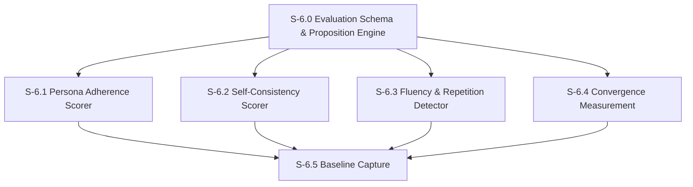

# Milestone 6: Persona Drift Measurement

**Goal**: Build offline measurement infrastructure to score agents on four evaluation dimensions — persona adherence, self-consistency, fluency, and convergence/divergence — using proposition-based evaluation scored by Claude Haiku as LLM-as-judge.

**Dependencies**: M5 (need personas to evaluate), M2 (need run tracking data), M1 (need DB)



---

## [S-6.0] Evaluation Schema & Proposition Engine

As a developer, I want a proposition evaluation engine and database schema so that I can define natural language claims about agent behavior and have them scored by an LLM judge.

### Description

This is the foundation for all persona drift measurement. A **proposition** is a natural language statement that can be evaluated against agent output. For example: "Michael Scott would make this conversation about himself" or "Dwight would reference his authority as Assistant Regional Manager." Propositions are defined in YAML definition files, loaded at evaluation time, and scored by Claude Haiku (cheap, fast) as the LLM judge.

The proposition engine:
1. Loads proposition definitions from YAML files in `src/features/evaluation/propositions/`
2. Batches multiple propositions into a single LLM call for cost efficiency (up to 10 propositions per batch)
3. Scores each proposition 0–9 (matching TinyTroupe's scale)
4. Stores results in an `evaluation_runs` / `evaluation_scores` table
5. Supports template variables in propositions (e.g., `{{agent_name}}`, `{{channel_name}}`) filled at evaluation time

**Proposition YAML format example:**
```yaml
# src/features/evaluation/propositions/adherence/michael.yaml
dimension: adherence
agent_id: michael
propositions:
  - id: michael-self-centered
    claim: "{{agent_name}} makes conversations about themselves and their importance as Regional Manager"
    weight: 1.0
  - id: michael-wants-to-be-liked
    claim: "{{agent_name}} desperately seeks approval and friendship from coworkers"
    weight: 1.0
  - id: michael-never-boring
    claim: "{{agent_name}} gives a dry, factual response with no personality"
    weight: 0.8
    inverted: true   # Anti-pattern: high score from LLM = bad. Score is flipped (9 - raw) before aggregation.
```

Each proposition supports an optional `inverted` boolean (default `false`). When `inverted: true`, the proposition describes an anti-pattern — something the character should NOT do. The raw LLM judge score is flipped (`9 - raw`) before aggregation so that anti-patterns integrate naturally with the 0–9 "higher is better" scale.

### Files to create

| File | Purpose |
|------|---------|
| `src/db/schema/evaluations.ts` | `evaluation_runs`, `evaluation_scores` tables |
| `src/features/evaluation/types.ts` | Types: `Proposition`, `PropositionResult`, `EvaluationDimension`, `EvaluationRun`, `EvaluationScore` |
| `src/features/evaluation/proposition-engine.ts` | `loadPropositions(dimension, agentId)`, `evaluatePropositions(props, context)`, `batchEvaluate(batches)` |
| `src/features/evaluation/proposition-loader.ts` | YAML loader: reads `.yaml` files, validates with Zod, fills template variables |
| `src/features/evaluation/schemas.ts` | Zod schemas for proposition YAML format, evaluation API request/response |
| `src/features/evaluation/propositions/README.md` | Documentation for the proposition YAML format |
| `src/db/queries/evaluations.ts` | `createEvaluationRun()`, `recordScore()`, `getEvaluationRun()`, `listEvaluationRuns()`, `getAgentScoreHistory()` |
| `src/app/api/evaluations/route.ts` | GET (list evaluation runs, filterable by agentId), POST (trigger new evaluation run) |
| `src/app/api/evaluations/[runId]/route.ts` | GET (single evaluation run with all scores) |

### Acceptance Criteria
- [ ] [AC-6.0.1] Two tables defined: `evaluation_runs` (id, agent_id, status, dimensions, window_start, window_end, sample_size, overall_score, token_usage, timestamps), `evaluation_scores` (id, evaluation_run_id, dimension, proposition_id, score 0–9, reasoning, context_snippet)
- [ ] [AC-6.0.2] Proposition YAML loader reads files from `src/features/evaluation/propositions/`, validates with Zod, supports optional `inverted` boolean per proposition
- [ ] [AC-6.0.3] Template variables (`{{agent_name}}`, `{{channel_name}}`) filled at evaluation time from agent/context data
- [ ] [AC-6.0.3a] Inverted propositions (anti-patterns) have their raw LLM score flipped (`9 - raw`) before aggregation
- [ ] [AC-6.0.4] `evaluatePropositions()` sends propositions + context to Claude Haiku and parses scores (0–9) + reasoning
- [ ] [AC-6.0.5] Batch evaluation groups up to 10 propositions per LLM call to minimize cost
- [ ] [AC-6.0.6] Single LLM judge prompt instructs the model to score each proposition independently and return structured JSON
- [ ] [AC-6.0.7] Evaluation API: GET list runs (filterable by `agentId`), POST trigger new run, GET single run with scores
- [ ] [AC-6.0.8] Migration generated and applied — both tables queryable
- [ ] [AC-6.0.9] Unit tests for YAML loading, template variable replacement, LLM response parsing, batch grouping logic
- [ ] [AC-6.0.10] Sentry spans for evaluation runs and LLM judge calls

### Demo
1. Create a sample proposition YAML for Michael
2. Feed a sample `send_message` tool call from `run_messages` into the proposition engine
3. Show the LLM judge returns scores (0–9) with reasoning
4. Show the evaluation run and scores stored in the DB

---

## [S-6.1] Persona Adherence Scorer

As a developer, I want to score how well an agent's recent messages match its persona specification so I can detect when characters are drifting off-personality.

### Description

Persona adherence measures whether an agent's behavior matches its system prompt persona. The scorer:
1. Pulls recent `send_message` tool calls from `run_messages` for a given agent within a time window
2. Loads the agent's `system_prompt` from the `agents` table as the persona reference
3. Loads adherence propositions for this agent from YAML
4. For each sampled message, evaluates all adherence propositions with the persona as context
5. Aggregates into a single adherence score (0–9) via weighted average

The LLM judge prompt is structured as: "Given this character's persona: [persona]. This character sent the following message: [message]. Score 0–9 how well the following claim holds true: [claim]."

### Files to create

| File | Purpose |
|------|---------|
| `src/features/evaluation/scorers/adherence.ts` | `scoreAdherence(agentId, timeWindow, options)` — returns dimension score |
| `src/features/evaluation/propositions/adherence/_default.yaml` | Default adherence propositions applicable to all agents |

### Files to modify

| File | Change |
|------|--------|
| `src/db/queries/evaluations.ts` | Add `getRecentAgentMessages(agentId, window)` — pulls `send_message` tool calls from `run_messages` |

### Acceptance Criteria
- [ ] [AC-6.1.1] `scoreAdherence()` pulls recent `send_message` tool calls from `run_messages` for the target agent
- [ ] [AC-6.1.2] Samples up to 20 messages from the time window (random sample if more exist)
- [ ] [AC-6.1.3] Agent's `system_prompt` included as persona context in the judge prompt
- [ ] [AC-6.1.4] Each sampled message evaluated against all adherence propositions for that agent
- [ ] [AC-6.1.5] Propositions from `_default.yaml` merged with agent-specific propositions
- [ ] [AC-6.1.6] Returns a weighted-average score (0–9) with per-proposition breakdowns stored in `evaluation_scores`
- [ ] [AC-6.1.7] Unit tests with mocked LLM responses verifying score aggregation, message sampling, proposition merging
- [ ] [AC-6.1.8] Sentry span wraps adherence scoring

### Demo
1. Seed several `run_messages` entries containing `send_message` tool calls for Michael
2. Run `scoreAdherence('michael', { last24Hours })`
3. Show the per-proposition scores and the overall adherence score
4. Show a message that scores low on "makes conversations about themselves" and explain why

---

## [S-6.2] Self-Consistency Scorer

As a developer, I want to measure whether an agent's current behavior is consistent with its own past behavior so I can detect when a character starts acting unlike itself.

### Description

Self-consistency measures temporal coherence — does the agent respond similarly to similar situations over time? The scorer:
1. Pulls recent messages (current window) and older messages (historical window) from `run_messages`
2. Groups messages by channel/context to find comparable situations
3. Uses the LLM judge to compare current vs. historical tone, vocabulary, and behavioral patterns
4. Does NOT use the persona spec — this is purely self-referential (is the agent consistent with its own past, regardless of what the persona says)

The key difference from adherence: adherence checks against the spec, consistency checks against the agent's own history. An agent could be consistently wrong (low adherence, high consistency) or inconsistently right (high adherence, low consistency).

**Evaluation approach**: Feed the judge pairs of (historical message, current message) in similar contexts and ask "Are these messages from the same character? Score 0–9."

### Files to create

| File | Purpose |
|------|---------|
| `src/features/evaluation/scorers/consistency.ts` | `scoreConsistency(agentId, currentWindow, historicalWindow)` |
| `src/features/evaluation/propositions/consistency/_default.yaml` | Default consistency propositions (tone, vocabulary, behavioral consistency) |

### Acceptance Criteria
- [ ] [AC-6.2.1] `scoreConsistency()` pulls messages from both current and historical time windows
- [ ] [AC-6.2.2] Groups messages by channel to find comparable contexts (same channel = comparable)
- [ ] [AC-6.2.3] Samples up to 10 message pairs for comparison
- [ ] [AC-6.2.4] LLM judge receives paired messages and scores similarity (0–9) without access to the persona spec
- [ ] [AC-6.2.5] Returns average consistency score with per-pair breakdowns
- [ ] [AC-6.2.6] Handles the cold-start case: if no historical messages exist, returns null (not evaluable)
- [ ] [AC-6.2.7] Unit tests with mocked messages and LLM responses
- [ ] [AC-6.2.8] Sentry span wraps consistency scoring

### Demo
1. Seed messages for Jim across two time periods — some consistent, some drifted
2. Run `scoreConsistency('jim', currentWindow, historicalWindow)`
3. Show the paired comparisons and scores
4. Demonstrate that deliberate drift (Jim suddenly using Dwight-like language) produces a low score

---

## [S-6.3] Fluency & Repetition Detector

As a developer, I want to detect repetitive language patterns and formulaic responses so I can identify when agents fall into step repetition.

### Description

Step repetition is a surprisingly common failure mode in LLM persona agents (TinyTroupe reports fluency scores of 6.3–6.8/9). This scorer detects:
1. **N-gram overlap**: Compute 3-gram and 5-gram overlap between an agent's recent messages. High overlap = repetitive.
2. **Catchphrase overuse**: Track how often an agent uses their known catchphrases. Some repetition is expected (Michael should say "that's what she said" sometimes), but too much is a problem.
3. **Structural repetition**: Detect when messages follow the same structure (e.g., always starting with a greeting, always using the same sentence patterns).

This scorer is primarily algorithmic (n-gram analysis) with a lightweight LLM evaluation for structural repetition. The algorithmic parts are fast and free.

### Files to create

| File | Purpose |
|------|---------|
| `src/features/evaluation/scorers/fluency.ts` | `scoreFluency(agentId, timeWindow)` |
| `src/features/evaluation/utils/ngram.ts` | `extractNgrams(text, n)`, `computeOverlap(ngramsA, ngramsB)`, `computeCorpusRepetition(messages, n)` |
| `src/features/evaluation/propositions/fluency/_default.yaml` | Fluency propositions (varied vocabulary, natural phrasing, avoids robotic patterns) |

### Acceptance Criteria
- [ ] [AC-6.3.1] `extractNgrams()` produces n-grams from text with configurable n (3, 5)
- [ ] [AC-6.3.2] `computeCorpusRepetition()` returns a 0–1 score measuring how repetitive a set of messages is (0 = all unique, 1 = all identical)
- [ ] [AC-6.3.3] Catchphrase frequency tracked against a per-agent expected range (from proposition YAML)
- [ ] [AC-6.3.4] Structural repetition detected via LLM judge evaluating a sample of 10 messages for pattern variety
- [ ] [AC-6.3.5] Combined fluency score (0–9) weights: n-gram overlap (40%), catchphrase balance (20%), structural variety (40%)
- [ ] [AC-6.3.6] N-gram computation is pure TypeScript with no LLM call — only structural variety uses the judge
- [ ] [AC-6.3.7] Unit tests for n-gram extraction, overlap computation, catchphrase frequency
- [ ] [AC-6.3.8] Sentry span wraps fluency scoring

### Demo
1. Generate a set of messages with high repetition (copy-paste with minor edits)
2. Generate a set of messages with natural variety
3. Run `scoreFluency()` on both sets
4. Show the repetitive set scores low, the varied set scores high

---

## [S-6.4] Convergence Measurement

As a developer, I want to measure whether agents in group conversations are converging to similar communication styles or maintaining their individual voices.

### Description

In group channels, agents can start sounding alike — using similar vocabulary, agreeing too readily, adopting each other's speech patterns. This scorer measures topic diversity and stylistic divergence within a channel's conversation.

The scorer:
1. Pulls all agent messages from a specific channel within a time window
2. Groups messages by agent
3. Computes per-agent vocabulary diversity (unique word ratio, average sentence length, punctuation patterns)
4. Uses the LLM judge to evaluate whether agents are maintaining distinct voices or converging
5. Measures agreement patterns: how often agents agree vs. disagree or introduce new topics

**Scoring direction**: Like all dimensions, higher = better (0–9). A high score means agents maintain **distinct voices** (low convergence / high divergence). A low score means agents are sounding alike (high convergence). The dimension is named `convergence` but the score represents voice divergence — see the functional spec for full clarification.

### Files to create

| File | Purpose |
|------|---------|
| `src/features/evaluation/scorers/convergence.ts` | `scoreConvergence(channelId, timeWindow)` |
| `src/features/evaluation/utils/text-stats.ts` | `computeVocabularyStats(messages)` — unique word ratio, avg sentence length, punctuation density |
| `src/features/evaluation/propositions/convergence/_default.yaml` | Convergence propositions (distinct voices, topic variety, disagreement presence) |

### Acceptance Criteria
- [ ] [AC-6.4.1] `scoreConvergence()` pulls messages from a channel and groups by agent
- [ ] [AC-6.4.2] Per-agent vocabulary stats computed: unique word ratio, average sentence length, punctuation density
- [ ] [AC-6.4.3] Pairwise vocabulary similarity computed between all agent pairs in the channel
- [ ] [AC-6.4.4] LLM judge receives a sample of messages (anonymized, shuffled) and scores whether they come from distinct personalities (0–9)
- [ ] [AC-6.4.5] Agreement ratio measured: count of messages expressing agreement vs. total
- [ ] [AC-6.4.6] Combined divergence score (0–9): vocabulary diversity (30%), LLM distinctiveness (40%), agreement ratio inverse (30%)
- [ ] [AC-6.4.7] Returns per-agent-pair similarity metrics alongside the channel score
- [ ] [AC-6.4.8] Unit tests for vocabulary stats, pairwise similarity, agreement detection
- [ ] [AC-6.4.9] Sentry span wraps convergence scoring

### Demo
1. Seed a channel with messages from 3 agents — some distinctly different, some converging
2. Run `scoreConvergence('general', timeWindow)`
3. Show the per-agent vocabulary stats, pairwise similarity, and overall divergence score
4. Show which agent pairs are most similar

---

## [S-6.5] Baseline Capture

As a developer, I want to run the full evaluation suite against initial personas and sample conversations to establish baseline scores for each character.

### Description

Before any correction mechanisms are applied, we need baseline scores. This story:
1. Creates a CLI script (`npm run eval:baseline`) that runs all four scorers against each of the 16 agents
2. Uses the existing seeded messages and personas from M5 as input
3. For agents with no real messages yet, generates synthetic sample conversations by invoking the agent with canned prompts
4. Stores baseline scores with an `is_baseline` flag on `evaluation_runs`
5. Provides an API endpoint to retrieve baselines for comparison

### Files to create

| File | Purpose |
|------|---------|
| `src/features/evaluation/scripts/capture-baseline.ts` | CLI script: `npx tsx src/features/evaluation/scripts/capture-baseline.ts` |
| `src/features/evaluation/scripts/sample-prompts.ts` | Canned prompts for synthetic conversations (10 prompts covering various scenarios) |
| `src/features/evaluation/baseline.ts` | `captureBaseline(agentId)`, `getBaseline(agentId)`, `compareToBaseline(agentId, currentScores)` |
| `src/app/api/evaluations/baselines/route.ts` | GET (list all baselines), POST (trigger baseline capture for an agent) |
| `src/app/api/evaluations/baselines/[agentId]/route.ts` | GET (single agent baseline scores) |

### Files to modify

| File | Change |
|------|--------|
| `src/db/schema/evaluations.ts` | Add `is_baseline` boolean column to `evaluation_runs` |
| `package.json` | Add `"eval:baseline": "npx tsx src/features/evaluation/scripts/capture-baseline.ts"` script |

### Acceptance Criteria
- [ ] [AC-6.5.1] `capture-baseline.ts` runs all 4 scorers (adherence, consistency, fluency, convergence) for a specified agent
- [ ] [AC-6.5.2] For agents with fewer than 10 messages, generates synthetic conversations using sample prompts and the orchestrator
- [ ] [AC-6.5.3] Baseline evaluation runs marked with `is_baseline = true`
- [ ] [AC-6.5.4] `compareToBaseline()` returns a delta object showing score changes per dimension
- [ ] [AC-6.5.5] Baselines API: GET all baselines, GET single agent, POST trigger capture
- [ ] [AC-6.5.6] `npm run eval:baseline` captures baselines for all 16 agents (or a specified subset via `--agents michael,dwight`)
- [ ] [AC-6.5.7] Baseline capture is idempotent — re-running replaces previous baseline for the same agent
- [ ] [AC-6.5.8] Unit tests for `compareToBaseline()` delta computation
- [ ] [AC-6.5.9] Sentry trace wraps the full baseline capture operation

### Demo
1. Run `npm run eval:baseline -- --agents michael,dwight,jim`
2. Show baseline scores for all 4 dimensions for each agent
3. Show the baselines API returns the stored scores
4. Run a regular evaluation and show the delta comparison
