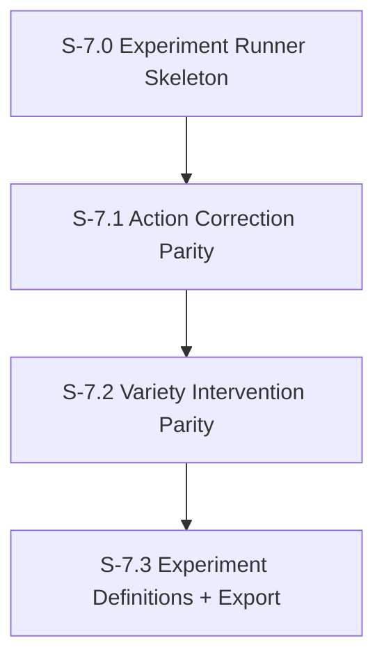

# Milestone 7: TinyTroupe Experiment Runner + Interventions

**Goal**: Provide a reproducible experiment runner that can re-execute the TinyTroupe Table 1 experiments (control vs treatment) using the same populations, interventions, and action correction settings as the paper artifacts.

**Dependencies**: M6 (artifact registry + metrics), TinyTroupe repo at `/mnt/c/src/tinytroupe`.

---

## [S-7.0] Experiment Runner Skeleton

As a developer, I want a non-notebook runner that mirrors the TinyTroupe notebooks so we can re-run experiments without Jupyter.

### Description

Create a Python runner in this repo that imports TinyTroupe from the local repo, sets up the same populations, and runs control/treatment experiments using `InPlaceExperimentRunner`. Output JSON must match the artifact schema in `paper_artifacts_june-2025`.

### Files to create

| File | Purpose |
|------|---------|
| `scripts/tinytroupe/run_experiment.py` | CLI to run one experiment (`exp_1`, `exp_2_1`, `exp_2_2`, `exp_3`) |
| `scripts/tinytroupe/tt_env.py` | Environment setup (import path, config file, seeds) |
| `scripts/tinytroupe/tt_paths.py` | Resolves artifact and population paths from `TINYTROUPE_REPO_DIR` |

### Acceptance Criteria
- [ ] [AC-7.0.1] Runner can execute control and treatment for one experiment and writes JSON output
- [ ] [AC-7.0.2] Output JSON schema matches TinyTroupe artifacts (same keys, same structure)
- [ ] [AC-7.0.3] Runner supports `--full` and `--fast` modes (mirrors notebook `full_mode`)
- [ ] [AC-7.0.4] CLI supports `--out <path>` to save results
- [ ] [AC-7.0.5] Sentry spans wrap each experiment run

### Demo
1. Run `python scripts/tinytroupe/run_experiment.py --exp exp_1 --full --out /tmp/exp1.json`
2. Show JSON has `Control` and `Treatment` results

---

## [S-7.1] Action Correction Parity

As a developer, I want the runner to toggle action correction settings exactly like the notebooks so treatment/control behavior matches the paper.

### Description

The notebooks enable action correction by setting `person.action_generator.enable_quality_checks = True` with specific thresholds. We must replicate these per experiment:
- Exp 1: enable for Treatment only, `quality_threshold=5`, `max_attempts=5`, `enable_regeneration=True`
- Exp 2.1: enable for Treatment only, `quality_threshold=5`, `max_attempts=2`, `enable_regeneration=True`
- Exp 2.2: disabled for both Control and Treatment
- Exp 3: enable for Treatment only, `quality_threshold=5`, `max_attempts=2`, `enable_regeneration=True`

### Files to modify

| File | Change |
|------|--------|
| `scripts/tinytroupe/run_experiment.py` | Apply action correction settings per experiment + group |

### Acceptance Criteria
- [ ] [AC-7.1.1] Action correction toggles match the notebooks for each experiment
- [ ] [AC-7.1.2] Runner logs the action correction settings in output metadata
- [ ] [AC-7.1.3] Unit test verifies settings for Exp 2.2 are disabled in both groups

### Demo
1. Run Exp 2.2 and show logs that quality checks are disabled for both Control and Treatment

---

## [S-7.2] Variety Intervention Parity

As a developer, I want the runner to inject the same variety intervention used in the brainstorming experiments so Ideas Qty and divergence reproduce the paper.

### Description

The notebooks create an `Intervention` that triggers when an agent has not proposed a new idea in 10 events, then injects a prompt to force a new idea. This intervention is active in Exp 1, 2.1, 2.2 treatment groups only.

### Files to modify

| File | Change |
|------|--------|
| `scripts/tinytroupe/run_experiment.py` | Add the variety intervention for brainstorming experiments |
| `scripts/tinytroupe/interventions.py` | Encapsulate intervention definition (predicate + effect) |

### Acceptance Criteria
- [ ] [AC-7.2.1] Intervention text and precondition match the notebook verbatim
- [ ] [AC-7.2.2] Applied only to Treatment group for Exp 1, 2.1, 2.2
- [ ] [AC-7.2.3] Not used in Exp 3 (debate)
- [ ] [AC-7.2.4] Unit test verifies intervention is attached only in correct experiments

### Demo
1. Run Exp 1 treatment and show the intervention is registered

---

## [S-7.3] Experiment Definitions + Export

As a developer, I want each experiment definition (population, prompts, repetitions, steps) encoded in code so the runner can re-create the paper results.

### Description

We codify the four experiments based on the notebooks:
- Exp 1: population `population/usa_general`, brainstorming proposals, repetitions=2, steps=10, qty_agents=16, qty_proposals=4
- Exp 2.1: population `population/difficult_people` + fragment `fragments/difficult_person.agent.fragment.json`, brainstorming proposals, repetitions=2, steps=10
- Exp 2.2: same as Exp 2.1, but no action correction
- Exp 3: population `population/political_compass`, debating proposals, repetitions=2, steps=10

### Files to create

| File | Purpose |
|------|---------|
| `scripts/tinytroupe/experiments.py` | Experiment definitions and prompts |
| `scripts/tinytroupe/export.py` | Export results in artifact-compatible JSON |

### Acceptance Criteria
- [ ] [AC-7.3.1] All four experiment definitions exist and match notebook parameters
- [ ] [AC-7.3.2] Export JSON matches the artifact format used in `paper_artifacts_june-2025`
- [ ] [AC-7.3.3] Runner can rerun an experiment and produce a JSON file usable by M6 ingestion
- [ ] [AC-7.3.4] Document how to run the experiments in `spec/plan/milestone-7-persona-drift-correction.md`

### Demo
1. Run Exp 3 and confirm output file can be ingested by M6 pipeline
