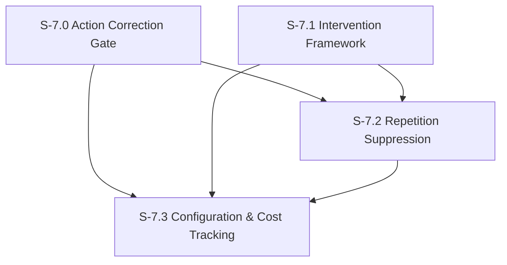

# Milestone 7: Persona Drift Correction

**Goal**: Implement runtime correction mechanisms integrated into the orchestrator pipeline that maintain character consistency during agent operation. All mechanisms are configurable per agent, fail-open, and cost-tracked. Aligns with TinyTroupe's action generation, monitoring, and correction pipeline (Section 3.1) and intervention system (Section 3.6.2).

**Dependencies**: M6 (need measurement before correction), M2 (need orchestrator to integrate into)



---

## [S-7.0] Action Correction Gate

As a developer, I want a pre-commit multi-dimension quality check on agent messages so that off-character, inconsistent, or repetitive responses are caught and regenerated before they reach the chat.

### Description

After the agent generates a `send_message` tool call but before it is committed to the database, a lightweight LLM call evaluates the message on multiple quality dimensions. If any enabled dimension scores below its threshold, the message is discarded and the agent is re-prompted with detailed feedback about the violation.

This matches TinyTroupe's `ActionGenerator` which independently checks persona adherence, self-consistency, fluency, and suitability, with per-dimension enable/disable toggles and a configurable quality threshold.

**Integration point**: Hooks into the `send_message` tool handler. After the agent produces a message text but before `createMessage()` is called, the gate runs.

**Flow**:
1. Agent calls `send_message(channelId, text)`
2. Gate intercepts: evaluates the message on all enabled quality dimensions
3. Each dimension scored independently via its action-level proposition:
   - **Persona adherence** (`include_personas: true`): "The agent's next action is consistent with the agent's persona specification"
   - **Self-consistency** (`include_personas: false`): "The agent's next action is consistent with the agent's prior behavior in this conversation"
   - **Fluency** (`include_personas: false`): "The agent's next action is fluent — not repetitive or formulaic"
4. If all enabled dimensions score >= their threshold: proceed normally, commit message
5. If any dimension scores < threshold: discard the tool call, return feedback to the agent including which dimensions failed and why
6. Agent retries with the feedback context
7. Max 2 correction attempts. After 2 failures, commit the best-scoring attempt (fail-open — prefer response over silence)
8. Track statistics: regeneration failure rate, original success rate, per-dimension failure rates

**Regeneration feedback** (matching TinyTroupe's approach): When an action fails quality checks, the feedback message includes:
- Which dimensions failed and their scores
- The judge's reasoning for each failure
- An escalating instruction: "Each time your message fails a quality check, you should be MORE RADICAL in your changes. It is better to stop acting than to act poorly."

**Cost**: Each check is 1–3 Claude Haiku calls (one per enabled dimension). At ~$0.25/1M input tokens, approximately $0.00003–$0.00009 per check.

**Trade-offs (from TinyTroupe Table 1)**: Action correction improves persona adherence (+0.80 for difficult personas, +0.47 in debates) but can reduce self-consistency (-2.06 in brainstorming). In debates (Exp. 3), action correction improved BOTH adherence and self-consistency with no significant costs. The effectiveness varies by scenario — hence per-agent and per-dimension configurability.

### Files to create

| File | Purpose |
|------|---------|
| `src/features/evaluation/gates/action-correction.ts` | `checkActionQuality(agentId, messageText, conversationContext)` — returns per-dimension scores and overall pass/fail |
| `src/features/evaluation/gates/types.ts` | Types: `GateResult`, `DimensionResult`, `CorrectionAttempt`, `CorrectionConfig`, `GateStatistics` |

### Files to modify

| File | Change |
|------|--------|
| `src/tools/send-message.ts` | Add pre-commit gate: call `checkActionQuality()` before `createMessage()`. On failure, return correction feedback. |
| `src/db/schema/evaluations.ts` | Add `correction_logs` table |

### Acceptance Criteria
- [ ] [AC-7.0.1] `checkActionQuality()` evaluates the message on all enabled dimensions independently, each returning a score (0–9) with reasoning
- [ ] [AC-7.0.2] Three quality dimensions supported: `persona_adherence` (include_personas: true), `self_consistency` (include_personas: false), `fluency` (include_personas: false)
- [ ] [AC-7.0.3] Each dimension individually enabled/disabled via agent config (see S-7.3)
- [ ] [AC-7.0.4] Each dimension has its own score threshold (default 5.0 for all, configurable per agent)
- [ ] [AC-7.0.5] `send_message` tool handler calls the gate before committing, when any quality check is enabled for the agent
- [ ] [AC-7.0.6] Messages failing any enabled dimension are not committed; detailed per-dimension feedback returned to the agent for retry
- [ ] [AC-7.0.7] Feedback includes per-dimension reasoning and an escalating "be more radical" instruction matching TinyTroupe
- [ ] [AC-7.0.8] Maximum 2 correction attempts per message; after 2 failures, the best-scoring attempt is committed (fail-open)
- [ ] [AC-7.0.9] "Best-scoring" = attempt with highest sum of all dimension scores
- [ ] [AC-7.0.10] `correction_logs` table records every gate invocation with: original text, per-dimension scores, per-dimension reasoning, attempt number, and outcome (`passed` | `corrected` | `passed_after_retry` | `forced_through` | `timeout_passed`)
- [ ] [AC-7.0.11] Gate is a no-op when all quality checks disabled (configurable per agent — see S-7.3)
- [ ] [AC-7.0.12] LLM judge calls have a 5-second timeout per dimension; on timeout, that dimension passes (fail-open)
- [ ] [AC-7.0.13] Statistics tracked: `total_actions`, `original_pass_count`, `regeneration_count`, `forced_through_count`, per-dimension failure counts, mean scores
- [ ] [AC-7.0.14] `getGateStatistics(agentId, timeWindow)` returns aggregated statistics
- [ ] [AC-7.0.15] Unit tests: all dimensions pass, single dimension fails with retry, multiple dimensions fail, best-scoring selection, forced-through, timeout behavior, statistics
- [ ] [AC-7.0.16] Sentry spans for gate evaluation and each dimension check

### Demo
1. Enable persona adherence + self-consistency gates for Michael (threshold = 5.0)
2. Seed the system so Michael will receive a message
3. Show a normal response passing all enabled checks
4. Temporarily swap Michael's persona to a very specific one and send a message that will produce an off-character response
5. Show the gate catching it per-dimension, the correction feedback with per-dimension reasoning, and the agent retrying
6. Show the `correction_logs` entry with per-dimension scores
7. Show `getGateStatistics()` output

---

## [S-7.1] Intervention Framework

As a developer, I want a general-purpose intervention system with composable preconditions and effects so that I can implement anti-convergence nudges, variety interventions, and other simulation steering mechanisms.

### Description

TinyTroupe's `Intervention` class provides a powerful pattern for modifying running simulations: interventions remain dormant until their preconditions are met, then fire their effects. This story implements a TypeScript equivalent that supports three precondition types and arbitrary effect functions.

**Intervention architecture** (matching TinyTroupe Section 3.6.2):

An intervention consists of:
1. **Preconditions** (all must be true to fire):
   - **Textual precondition**: A natural language claim evaluated by the LLM as a proposition against the current conversation state (e.g., "AGENT IS NOT PROPOSING COMPLETELY NEW IDEAS ANYMORE")
   - **Functional precondition**: A TypeScript function returning boolean (e.g., `(ctx) => ctx.messageCount >= 7`)
   - **Propositional precondition**: A `Proposition` object from the M6 engine, with an optional score threshold
2. **Effect function**: A TypeScript function that modifies the agent's prompt context (e.g., inject a thought, append guidance, modify system prompt)

**Built-in intervention types**:

1. **Anti-convergence intervention**: Detects when agents in group channels agree too much and injects diversity nudges. Precondition: LLM evaluates agreement patterns. Effect: character-aware nudge appended to system prompt.

2. **Variety intervention**: Detects when agents stop proposing new ideas and forces creative divergence. Precondition: functional (message count >= N) AND textual ("agent is not proposing new ideas"). Effect: inject thought instruction to propose completely new and different ideas. This is the "variety intervention" from Table 1.

Nudge types (character-aware):
- "Play devil's advocate" — disagree with the prevailing opinion
- "Change the subject" — introduce a new topic related to the character's interests
- "Share a personal story" — redirect to something from the character's background
- "Ask a challenging question" — push back on what was said
- "Propose completely new ideas" — think of something nobody has mentioned (variety intervention)

Nudges are transient — appended to the system prompt, NOT stored in memory.

**Trade-offs (from TinyTroupe Table 1)**: Variety interventions increase idea quantity (+5.33) but reduce persona adherence (-0.60) and self-consistency (-0.92). Anti-convergence alone had mixed results. Nudges are character-aware to minimize negative impact.

### Files to create

| File | Purpose |
|------|---------|
| `src/features/evaluation/interventions/intervention.ts` | `Intervention` class with preconditions + effect; `InterventionBatch` for group creation |
| `src/features/evaluation/interventions/preconditions.ts` | `TextualPrecondition`, `FunctionalPrecondition`, `PropositionalPrecondition` |
| `src/features/evaluation/interventions/anti-convergence.ts` | `createAntiConvergenceIntervention(agentId, channelId)` — built-in convergence detection + nudge |
| `src/features/evaluation/interventions/variety-intervention.ts` | `createVarietyIntervention(agentId, channelId)` — built-in variety/idea generation intervention |
| `src/features/evaluation/interventions/nudge-templates.ts` | Template nudges categorized by type, parameterized by character |
| `src/features/evaluation/interventions/types.ts` | Types: `InterventionConfig`, `Precondition`, `PreconditionType`, `NudgeType`, `Nudge`, `InterventionContext`, `InterventionResult` |

### Files to modify

| File | Change |
|------|--------|
| `src/agents/prompt-builder.ts` | Accept optional `interventions` parameter; append nudge/guidance text to system prompt when present |
| `src/agents/orchestrator.ts` | Before invoking agent, evaluate all active interventions for this agent+channel; pass any triggered effects to the prompt builder |

### Acceptance Criteria
- [ ] [AC-7.1.1] `Intervention` class supports three precondition types: textual (LLM-evaluated proposition), functional (TypeScript function), propositional (M6 `Proposition` with optional score threshold)
- [ ] [AC-7.1.2] All preconditions must be true for the intervention to fire (AND logic)
- [ ] [AC-7.1.3] Effect function receives `InterventionContext` (agent, channel, recent messages) and returns prompt modifications
- [ ] [AC-7.1.4] `InterventionBatch.createForEach(agents)` creates one intervention per agent with shared preconditions/effect, matching TinyTroupe's `Intervention.create_for_each()`
- [ ] [AC-7.1.5] Textual precondition evaluated via LLM-as-judge: "Given this conversation context, is the following true? [precondition text]"
- [ ] [AC-7.1.6] Anti-convergence intervention: detects agreement patterns (LLM-based textual precondition), injects character-aware disagreement/diversity nudge
- [ ] [AC-7.1.7] Variety intervention: detects idea stagnation (functional precondition: messageCount >= N, textual precondition: "agent is not proposing new ideas"), injects "propose completely new and different ideas" thought
- [ ] [AC-7.1.8] Nudge templates are character-aware (Michael: "tell a story about yourself", Dwight: "assert your authority", Jim: "make a witty observation")
- [ ] [AC-7.1.9] Interventions appended to system prompt as a clearly delimited section: `### Conversation Guidance\n{nudge}`
- [ ] [AC-7.1.10] Nudge is not stored in memory or core blocks — it is a transient prompt modification
- [ ] [AC-7.1.11] Interventions only fire for channel messages (not DMs) unless explicitly configured otherwise
- [ ] [AC-7.1.12] Each intervention type individually configurable per-agent: enable/disable + thresholds (see S-7.3)
- [ ] [AC-7.1.13] `intervention_logs` table records every intervention evaluation: precondition results, whether it fired, nudge injected
- [ ] [AC-7.1.14] Unit tests for: textual precondition evaluation, functional precondition, propositional precondition, batch creation, anti-convergence detection, variety intervention detection, nudge selection, prompt injection
- [ ] [AC-7.1.15] Sentry spans and logs for intervention evaluation and nudge injection

### Demo
1. Seed a channel conversation where 4 agents all agree with each other
2. Enable anti-convergence intervention for the next agent to respond
3. Show the textual precondition triggering (LLM detects agreement)
4. Show the character-aware nudge being injected into the system prompt
5. Show the agent's response is more diverse than without the intervention
6. Demonstrate a variety intervention with a functional precondition (fires after 7 messages)

---

## [S-7.2] Repetition Suppression

As a developer, I want the system to detect and prevent step repetition by injecting the agent's own recent messages as context, so agents stop using the same phrases repeatedly.

### Description

Step repetition is when an agent keeps using the same phrases, sentence structures, or conversation openers. Before each agent invocation, fetch the agent's last 5 sent messages (across all channels) and compute n-gram overlap with a rolling window. If repetition is detected (overlap above threshold), inject a "variety instruction" into the prompt:

```
### Recent Messages You've Sent
[list of last 5 messages]

IMPORTANT: You've been repeating similar phrases. Vary your language, sentence structure, and conversation starters. Do not reuse the following phrases: [detected repeated n-grams]
```

This leverages the n-gram utilities from S-6.3.

### Files to create

| File | Purpose |
|------|---------|
| `src/features/evaluation/interventions/repetition-suppression.ts` | `checkRepetition(agentId)`, `buildRepetitionContext(agentId, recentMessages)` |

### Files to modify

| File | Change |
|------|--------|
| `src/agents/prompt-builder.ts` | Accept optional `repetitionContext` parameter; inject recent-messages section and variety instruction |
| `src/agents/orchestrator.ts` | Before invoking agent, call `checkRepetition()` and pass context to prompt builder |

### Acceptance Criteria
- [ ] [AC-7.2.1] `checkRepetition()` fetches the agent's last 5 sent messages across all channels from `run_messages`
- [ ] [AC-7.2.2] Computes 3-gram overlap across the message set using utilities from S-6.3
- [ ] [AC-7.2.3] If overlap exceeds threshold (default 0.3), returns the repeated n-grams and triggers suppression
- [ ] [AC-7.2.4] Suppression context injected into system prompt includes the recent messages and a "vary your language" instruction
- [ ] [AC-7.2.5] Repeated n-grams explicitly listed in the prompt as phrases to avoid
- [ ] [AC-7.2.6] Context is purely additive to the system prompt — does not replace or modify existing sections
- [ ] [AC-7.2.7] No LLM call required for detection — purely algorithmic n-gram analysis
- [ ] [AC-7.2.8] Configurable per-agent (see S-7.3)
- [ ] [AC-7.2.9] Unit tests for repetition detection, context building, prompt injection
- [ ] [AC-7.2.10] Sentry spans for repetition checks

### Demo
1. Have an agent send 5 messages that start with "Hey everyone, just wanted to..."
2. Show `checkRepetition()` detecting the repeated 3-gram "just wanted to"
3. Show the suppression context being injected
4. Show the next message the agent sends avoids the repeated pattern

---

## [S-7.3] Correction Configuration & Cost Tracking

As a developer, I want per-agent configuration for all correction mechanisms — including per-dimension action gate toggles — and cost tracking for correction LLM calls.

### Description

All correction mechanisms (multi-dimension action gate, intervention framework, repetition suppression) need:
1. Per-agent enable/disable toggles (including per-dimension toggles for the action gate)
2. Per-agent threshold tuning
3. Cost tracking (how many LLM calls, how many tokens)
4. An API to view and update configuration

Configuration is stored in `agent_evaluation_config` table. Cost is tracked via `correction_logs` token usage plus evaluation LLM calls.

### Files to create

| File | Purpose |
|------|---------|
| `src/db/schema/evaluation-config.ts` | `agent_evaluation_config` table |
| `src/db/queries/evaluation-config.ts` | `getConfig(agentId)`, `updateConfig(agentId, updates)`, `getDefaultConfig()` |
| `src/features/evaluation/config.ts` | `resolveConfig(agentId)` — merges agent-specific config with defaults |
| `src/features/evaluation/cost-tracker.ts` | `trackCorrectionCost(agentId, tokenUsage)`, `getCostSummary(agentId, timeWindow)`, `getTotalCostSummary(timeWindow)` |
| `src/app/api/evaluations/config/route.ts` | GET (list all agent configs), PUT (update defaults) |
| `src/app/api/evaluations/config/[agentId]/route.ts` | GET (single agent config), PATCH (update agent config) |
| `src/app/api/evaluations/costs/route.ts` | GET (cost summary, filterable by agentId and time window) |

### Acceptance Criteria
- [ ] [AC-7.3.1] `agent_evaluation_config` table with per-agent toggles and thresholds:
  - Action gate per-dimension toggles: `gate_adherence_enabled`, `gate_consistency_enabled`, `gate_fluency_enabled`
  - Action gate per-dimension thresholds: `gate_adherence_threshold`, `gate_consistency_threshold`, `gate_fluency_threshold`
  - Action gate general: `max_correction_attempts` (default 2)
  - Interventions: `anti_convergence_enabled`, `convergence_threshold`, `variety_intervention_enabled`, `variety_message_threshold` (default 7)
  - Repetition: `repetition_suppression_enabled`, `repetition_threshold`
- [ ] [AC-7.3.2] Default config used when no agent-specific config exists (all mechanisms disabled by default, matching TinyTroupe's `ENABLE_QUALITY_CHECKS=False` default)
- [ ] [AC-7.3.3] `resolveConfig()` merges agent-specific overrides with defaults
- [ ] [AC-7.3.4] Config API: GET list, GET single, PATCH update — returns resolved config
- [ ] [AC-7.3.5] Cost tracker aggregates token usage from `correction_logs`, `intervention_logs`, and LLM judge calls
- [ ] [AC-7.3.6] Cost API returns per-agent and total costs for a time window, broken down by mechanism and dimension
- [ ] [AC-7.3.7] All correction mechanisms read thresholds from config instead of hardcoded values
- [ ] [AC-7.3.8] Migration generated and applied for `agent_evaluation_config` table
- [ ] [AC-7.3.9] Seed default configs for all 16 agents (all mechanisms disabled by default)
- [ ] [AC-7.3.10] Unit tests for config resolution, cost aggregation
- [ ] [AC-7.3.11] Sentry spans for config loading

### Demo
1. Show all agents have default config (everything disabled)
2. Enable adherence + consistency gates for Michael via PATCH API (threshold = 5.0)
3. Send Michael a message — show the multi-dimension gate activating
4. Disable the gates via PATCH — send another message — show it passes straight through
5. Show the cost summary API returning per-dimension token counts and estimated costs
