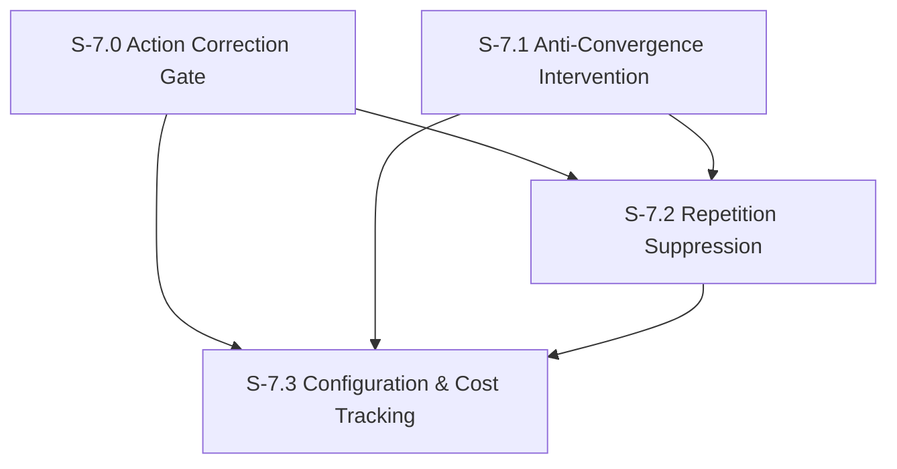

# Milestone 7: Persona Drift Correction

**Goal**: Implement runtime correction mechanisms integrated into the orchestrator pipeline that maintain character consistency during agent operation. All mechanisms are configurable per agent, fail-open, and cost-tracked.

**Dependencies**: M6 (need measurement before correction), M2 (need orchestrator to integrate into)



---

## [S-7.0] Action Correction Gate

As a developer, I want a pre-commit persona adherence check on agent messages so that off-character responses are caught and regenerated before they reach the chat.

### Description

After the agent generates a `send_message` tool call but before it is committed to the database, a lightweight LLM call evaluates whether the message matches the agent's persona. If the score is below a configurable threshold, the message is discarded and the agent is re-prompted with feedback about the violation.

**Integration point**: Hooks into the `send_message` tool handler. After the agent produces a message text but before `createMessage()` is called, the gate runs.

**Flow**:
1. Agent calls `send_message(channelId, text)`
2. Gate intercepts: sends text + persona to Claude Haiku for quick adherence check
3. Score >= threshold (default 5.0): proceed normally, commit message
4. Score < threshold: discard the tool call, return feedback to the agent (e.g., "That response didn't sound like {character}. Reason: {reasoning}. Try again staying in character.")
5. Agent retries with the feedback context
6. Max 2 correction attempts. After 2 failures, commit the message anyway (fail-open — prefer response over silence)

**Cost**: Each correction check is a single Claude Haiku call (~100 input tokens for persona + message + prompt). At ~$0.25/1M input tokens, approximately $0.00003 per check.

**Trade-offs (from TinyTroupe Table 1)**: Action correction improves persona adherence (+0.80) but can reduce self-consistency. This is acceptable for a TV show simulation where character voice matters most.

### Files to create

| File | Purpose |
|------|---------|
| `src/features/evaluation/gates/action-correction.ts` | `checkActionAdherence(agentId, messageText)` — returns `{ pass, score, reasoning }` |
| `src/features/evaluation/gates/types.ts` | Types: `GateResult`, `CorrectionAttempt`, `CorrectionConfig` |

### Files to modify

| File | Change |
|------|--------|
| `src/tools/send-message.ts` | Add pre-commit gate: call `checkActionAdherence()` before `createMessage()`. On failure, return correction feedback instead of tool result. |
| `src/db/schema/evaluations.ts` | Add `correction_logs` table |

### Acceptance Criteria
- [ ] [AC-7.0.1] `checkActionAdherence()` sends message + persona to Claude Haiku and returns a score (0–9) with reasoning
- [ ] [AC-7.0.2] `send_message` tool handler calls the gate before committing, when correction is enabled for the agent
- [ ] [AC-7.0.3] Messages scoring below threshold are not committed; feedback returned to the agent for retry
- [ ] [AC-7.0.4] Maximum 2 correction attempts per message; after 2 failures, message is committed regardless
- [ ] [AC-7.0.5] Correction feedback includes the reasoning and a prompt to stay in character
- [ ] [AC-7.0.6] `correction_logs` table records every gate invocation with original text, score, reasoning, and outcome (`passed` | `corrected` | `passed_after_retry` | `forced_through` | `timeout_passed` — where `timeout_passed` represents the 5-second fail-open behavior in AC-7.0.8)
- [ ] [AC-7.0.7] Gate is a no-op when disabled (configurable per agent — see S-7.3)
- [ ] [AC-7.0.8] LLM judge call has a 5-second timeout; on timeout, the message passes through (fail-open)
- [ ] [AC-7.0.9] Unit tests: gate pass, gate fail with retry, gate fail with forced-through, timeout behavior
- [ ] [AC-7.0.10] Sentry spans for gate evaluation and correction attempts

### Demo
1. Enable the action correction gate for Michael (threshold = 5.0)
2. Seed the system so Michael will receive a message
3. Show a normal response passing the gate (score >= 5.0)
4. Temporarily swap Michael's persona to a very specific one and send a message that will produce an off-character response
5. Show the gate catching it, the correction feedback, and the agent retrying
6. Show the `correction_logs` entry in the DB

---

## [S-7.1] Anti-Convergence Intervention

As a developer, I want the system to detect when agents in group channels are agreeing too much and inject diversity nudges into their prompts so conversations stay interesting.

### Description

When agents in a group channel start converging (too much agreement, similar vocabulary), the system intervenes by injecting a nudge into the next agent's prompt context. This is a **pre-invocation** modification — it happens before the orchestrator calls the Claude SDK, not after.

**Detection**: Before invoking an agent for a channel response, check the last N messages. If the agreement ratio exceeds a threshold (default: 60% of messages contain agreement language), inject a divergence nudge.

**Nudge types** (character-aware):
- "Play devil's advocate" — disagree with the prevailing opinion
- "Change the subject" — introduce a new topic related to the character's interests
- "Share a personal story" — redirect to something from the character's background
- "Ask a challenging question" — push back on what was said

The nudge is appended to the system prompt as a temporary instruction. It is NOT stored in memory — it is a one-time contextual modifier.

**Trade-offs (from TinyTroupe Table 1)**: Variety interventions increase idea quantity (+5.33) but reduce persona adherence (-0.60) and self-consistency (-0.92). Nudges are character-aware to minimize this.

### Files to create

| File | Purpose |
|------|---------|
| `src/features/evaluation/interventions/anti-convergence.ts` | `checkConvergence(channelId, recentMessages)`, `generateNudge(agentId, convergenceData)` |
| `src/features/evaluation/interventions/nudge-templates.ts` | Template nudges categorized by type, parameterized by character |
| `src/features/evaluation/interventions/types.ts` | Types: `InterventionCheck`, `NudgeType`, `Nudge` |

### Files to modify

| File | Change |
|------|--------|
| `src/agents/prompt-builder.ts` | Accept optional `interventions` parameter; append nudge text to system prompt when present |
| `src/agents/orchestrator.ts` | Before invoking agent for a channel message, run `checkConvergence()` and pass any nudge to the prompt builder |

### Acceptance Criteria
- [ ] [AC-7.1.1] `checkConvergence()` analyzes the last 10 channel messages for agreement patterns (keyword matching: "agree", "exactly", "good point", "you're right", etc.)
- [ ] [AC-7.1.2] Returns agreement ratio (0–1) and a recommended nudge type if ratio exceeds threshold
- [ ] [AC-7.1.3] Nudge templates are character-aware (Michael gets "tell a story about yourself", Dwight gets "assert your authority", Jim gets "make a witty observation")
- [ ] [AC-7.1.4] Nudges appended to system prompt as a clearly delimited section: `### Conversation Guidance\n{nudge}`
- [ ] [AC-7.1.5] Nudge is not stored in memory or core blocks — it is a transient prompt modification
- [ ] [AC-7.1.6] Intervention only fires for channel messages (not DMs)
- [ ] [AC-7.1.7] Configurable per-agent: intervention can be enabled/disabled (see S-7.3)
- [ ] [AC-7.1.8] Unit tests for agreement pattern detection, nudge selection, prompt injection
- [ ] [AC-7.1.9] Sentry spans and logs for intervention detection and nudge injection

### Demo
1. Seed a channel conversation where 4 agents all agree with each other
2. Enable anti-convergence for the next agent to respond
3. Show the intervention triggering: agreement ratio exceeds threshold
4. Show the nudge being injected into the system prompt
5. Show the agent's response is more diverse/disagreeing than without the nudge

---

## [S-7.2] Repetition Suppression

As a developer, I want the system to detect and prevent step repetition by injecting the agent's own recent messages as context, so agents stop using the same phrases repeatedly.

### Description

Step repetition is when an agent keeps using the same phrases, sentence structures, or conversation openers. Before each agent invocation, fetch the agent's last 5 sent messages (across all channels) and compute n-gram overlap with a rolling window. If repetition is detected (overlap above threshold), inject a "variety instruction" into the prompt:

```
### Recent Messages You've Sent
[list of last 5 messages]

IMPORTANT: You've been repeating similar phrases. Vary your language, sentence structure, and conversation starters. Do not reuse the following phrases: [detected repeated n-grams]
```

This leverages the n-gram utilities from S-6.3.

### Files to create

| File | Purpose |
|------|---------|
| `src/features/evaluation/interventions/repetition-suppression.ts` | `checkRepetition(agentId)`, `buildRepetitionContext(agentId, recentMessages)` |

### Files to modify

| File | Change |
|------|--------|
| `src/agents/prompt-builder.ts` | Accept optional `repetitionContext` parameter; inject recent-messages section and variety instruction |
| `src/agents/orchestrator.ts` | Before invoking agent, call `checkRepetition()` and pass context to prompt builder |

### Acceptance Criteria
- [ ] [AC-7.2.1] `checkRepetition()` fetches the agent's last 5 sent messages across all channels from `run_messages`
- [ ] [AC-7.2.2] Computes 3-gram overlap across the message set using utilities from S-6.3
- [ ] [AC-7.2.3] If overlap exceeds threshold (default 0.3), returns the repeated n-grams and triggers suppression
- [ ] [AC-7.2.4] Suppression context injected into system prompt includes the recent messages and a "vary your language" instruction
- [ ] [AC-7.2.5] Repeated n-grams explicitly listed in the prompt as phrases to avoid
- [ ] [AC-7.2.6] Context is purely additive to the system prompt — does not replace or modify existing sections
- [ ] [AC-7.2.7] No LLM call required for detection — purely algorithmic n-gram analysis
- [ ] [AC-7.2.8] Configurable per-agent (see S-7.3)
- [ ] [AC-7.2.9] Unit tests for repetition detection, context building, prompt injection
- [ ] [AC-7.2.10] Sentry spans for repetition checks

### Demo
1. Have an agent send 5 messages that start with "Hey everyone, just wanted to..."
2. Show `checkRepetition()` detecting the repeated 3-gram "just wanted to"
3. Show the suppression context being injected
4. Show the next message the agent sends avoids the repeated pattern

---

## [S-7.3] Correction Configuration & Cost Tracking

As a developer, I want per-agent configuration for all correction mechanisms and cost tracking for correction LLM calls.

### Description

All correction mechanisms (action gate, anti-convergence, repetition suppression) need:
1. Per-agent enable/disable toggles
2. Per-agent threshold tuning
3. Cost tracking (how many LLM calls, how many tokens)
4. An API to view and update configuration

Configuration is stored in `agent_evaluation_config` table. Cost is tracked via `correction_logs` token usage plus evaluation LLM calls.

### Files to create

| File | Purpose |
|------|---------|
| `src/db/schema/evaluation-config.ts` | `agent_evaluation_config` table |
| `src/db/queries/evaluation-config.ts` | `getConfig(agentId)`, `updateConfig(agentId, updates)`, `getDefaultConfig()` |
| `src/features/evaluation/config.ts` | `resolveConfig(agentId)` — merges agent-specific config with defaults |
| `src/features/evaluation/cost-tracker.ts` | `trackCorrectionCost(agentId, tokenUsage)`, `getCostSummary(agentId, timeWindow)`, `getTotalCostSummary(timeWindow)` |
| `src/app/api/evaluations/config/route.ts` | GET (list all agent configs), PUT (update defaults) |
| `src/app/api/evaluations/config/[agentId]/route.ts` | GET (single agent config), PATCH (update agent config) |
| `src/app/api/evaluations/costs/route.ts` | GET (cost summary, filterable by agentId and time window) |

### Acceptance Criteria
- [ ] [AC-7.3.1] `agent_evaluation_config` table with per-agent toggles and thresholds: `action_gate_enabled`, `action_gate_threshold`, `anti_convergence_enabled`, `convergence_threshold`, `repetition_suppression_enabled`, `repetition_threshold`, `max_correction_attempts`
- [ ] [AC-7.3.2] Default config used when no agent-specific config exists (all mechanisms disabled by default)
- [ ] [AC-7.3.3] `resolveConfig()` merges agent-specific overrides with defaults
- [ ] [AC-7.3.4] Config API: GET list, GET single, PATCH update — returns resolved config
- [ ] [AC-7.3.5] Cost tracker aggregates token usage from `correction_logs` and LLM judge calls
- [ ] [AC-7.3.6] Cost API returns per-agent and total costs for a time window, broken down by mechanism
- [ ] [AC-7.3.7] All correction mechanisms read thresholds from config instead of hardcoded values
- [ ] [AC-7.3.8] Migration generated and applied for `agent_evaluation_config` table
- [ ] [AC-7.3.9] Seed default configs for all 16 agents (all mechanisms disabled by default)
- [ ] [AC-7.3.10] Unit tests for config resolution, cost aggregation
- [ ] [AC-7.3.11] Sentry spans for config loading

### Demo
1. Show all agents have default config (everything disabled)
2. Enable action gate for Michael via PATCH API
3. Send Michael a message — show the gate activating
4. Disable the gate via PATCH — send another message — show it passes straight through
5. Show the cost summary API returning token counts and estimated costs
