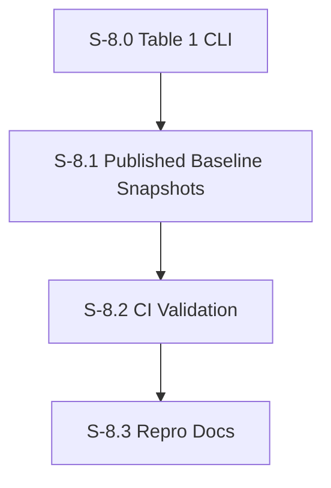

# Milestone 8: Table 1 Reproduction Harness

**Goal**: Provide a deterministic, CI-friendly harness that reproduces Table 1 from TinyTroupe artifacts (and optionally from reruns), and validates results against the published values.

**Dependencies**: M6 (ingestion + stats + report), M7 (experiment runner for reruns)

---

## [S-8.0] Table 1 CLI

As a developer, I want a single CLI that reproduces Table 1 either from artifacts or by rerunning experiments so I can verify the paper in one command.

### Description

The CLI should support two modes:
- `--from-artifacts` (default): read JSON artifacts and compute Table 1
- `--rerun`: execute TinyTroupe experiments (M7), then compute Table 1 from fresh outputs

### Files to create

| File | Purpose |
|------|---------|
| `src/evaluation/tinytroupe/cli.ts` | Entry point for Table 1 reproduction |
| `src/evaluation/tinytroupe/modes.ts` | Implements `from-artifacts` and `rerun` flows |

### Files to modify

| File | Change |
|------|--------|
| `package.json` | Add `"tinytroupe:table1": "npx tsx src/evaluation/tinytroupe/cli.ts"` |

### Acceptance Criteria
- [ ] [AC-8.0.1] `--from-artifacts` runs in under 10s and produces JSON + Markdown
- [ ] [AC-8.0.2] `--rerun` triggers M7 runner and consumes its outputs
- [ ] [AC-8.0.3] CLI prints a concise summary to stderr and JSON to stdout
- [ ] [AC-8.0.4] Supports `--out` to write report to disk

### Demo
1. Run `npm run tinytroupe:table1 -- --from-artifacts --out /tmp/table1.json`

---

## [S-8.1] Published Baseline Snapshots

As a developer, I want the published Table 1 values stored as a baseline file so validation can run offline and deterministically.

### Files to create

| File | Purpose |
|------|---------|
| `src/evaluation/tinytroupe/baselines/table1.json` | JSON snapshot of published values |
| `src/evaluation/tinytroupe/baseline-loader.ts` | Loads baseline snapshot |

### Acceptance Criteria
- [ ] [AC-8.1.1] Baseline snapshot matches the paper values exactly
- [ ] [AC-8.1.2] Validation uses the snapshot by default
- [ ] [AC-8.1.3] CLI supports `--update-baseline` (for future paper revisions)

### Demo
1. Show that `--validate` compares against baseline and passes

---

## [S-8.2] CI Validation

As a developer, I want CI to validate Table 1 reproduction from artifacts so regressions are caught without LLM calls.

### Description

CI should only use `--from-artifacts` and `--validate`. No LLM calls, no reruns. This must finish fast.

### Files to create

| File | Purpose |
|------|---------|
| `.github/workflows/table1-repro.yml` | CI workflow for Table 1 reproduction |

### Acceptance Criteria
- [ ] [AC-8.2.1] Workflow runs on PRs that modify `src/evaluation/tinytroupe/**` or `spec/plan/milestone-6*`..`8*`
- [ ] [AC-8.2.2] CI runs `npm run tinytroupe:table1 -- --from-artifacts --validate`
- [ ] [AC-8.2.3] Workflow finishes under 60s
- [ ] [AC-8.2.4] Check fails if any metric deviates beyond tolerance

### Demo
1. Modify a baseline value and show CI failure

---

## [S-8.3] Repro Docs

As a developer, I want clear documentation on how to reproduce Table 1 so new contributors can run the pipeline easily.

### Files to create

| File | Purpose |
|------|---------|
| `spec/functional/evaluation.md` | Update to include Table 1 reproduction flow |
| `docs/repro/table1.md` | Step-by-step reproduction guide |

### Acceptance Criteria
- [ ] [AC-8.3.1] Docs include prerequisites (TinyTroupe repo, Python deps, env vars)
- [ ] [AC-8.3.2] Docs explain both `from-artifacts` and `rerun` modes
- [ ] [AC-8.3.3] Docs list experiment mappings and expected runtime

### Demo
1. Follow docs to produce Table 1 report
