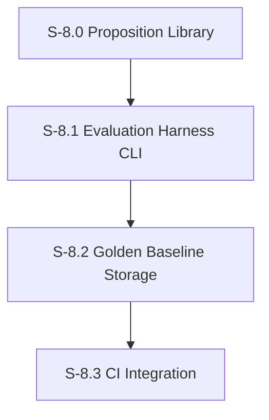

# Milestone 8: Evaluation Harness

**Goal**: CI-integrated test harness that regression-tests personas on every PR, captures golden baselines, and prevents persona degradation.

**Dependencies**: M6 (need proposition system), M5 (need personas)



---

## [S-8.0] Proposition Library

As a developer, I want a curated set of propositions for all 16 characters covering key personality traits, relationships, and speech patterns so that persona regression can be detected automatically.

### Description

This story creates the full proposition library — the "persona unit tests." Each character gets a YAML file with propositions covering:
- **Speech patterns**: Catchphrases, vocabulary, sentence structure
- **Relationship dynamics**: How they talk to/about specific other characters
- **Behavioral traits**: Core personality behaviors in specific situations
- **Anti-patterns**: Things the character would NEVER do or say (scored inversely)

Each proposition has a `weight` (0–1) indicating how important it is for that character. High-weight propositions represent defining traits.

### Files to create

| File | Purpose |
|------|---------|
| `src/features/evaluation/propositions/adherence/michael.yaml` | Michael: self-centered, humor, conflict avoidance, needs to be liked (8–10 propositions) |
| `src/features/evaluation/propositions/adherence/dwight.yaml` | Dwight: authority, loyalty to Michael, beet farm, survival skills (8–10 propositions) |
| `src/features/evaluation/propositions/adherence/jim.yaml` | Jim: sarcasm, pranks on Dwight, Pam references, laid-back (8–10 propositions) |
| `src/features/evaluation/propositions/adherence/pam.yaml` | Pam: supportive, artistic, quiet strength, Jim connection (6–8 propositions) |
| `src/features/evaluation/propositions/adherence/ryan.yaml` | Ryan: tech-bro language, startup references, condescension (6–8 propositions) |
| `src/features/evaluation/propositions/adherence/stanley.yaml` | Stanley: disinterest, crossword puzzles, pretzel day, minimal engagement (6–8 propositions) |
| `src/features/evaluation/propositions/adherence/kevin.yaml` | Kevin: food references, simple language, accounting struggles (6–8 propositions) |
| `src/features/evaluation/propositions/adherence/angela.yaml` | Angela: cats, moral judgments, Dwight/Senator, disapproval (6–8 propositions) |
| `src/features/evaluation/propositions/adherence/oscar.yaml` | Oscar: intellectual, corrects others, patience, financial knowledge (6–8 propositions) |
| `src/features/evaluation/propositions/adherence/andy.yaml` | Andy: Cornell, a cappella, anger management, trying too hard (6–8 propositions) |
| `src/features/evaluation/propositions/adherence/toby.yaml` | Toby: meek, HR references, Michael's hatred, sad resignation (6–8 propositions) |
| `src/features/evaluation/propositions/adherence/creed.yaml` | Creed: bizarre non-sequiturs, questionable past, detachment from reality (6–8 propositions) |
| `src/features/evaluation/propositions/adherence/kelly.yaml` | Kelly: pop culture, drama, relationship obsession, rapid speech (6–8 propositions) |
| `src/features/evaluation/propositions/adherence/phyllis.yaml` | Phyllis: sweet but passive-aggressive, Bob Vance references, maternal (6–8 propositions) |
| `src/features/evaluation/propositions/adherence/meredith.yaml` | Meredith: inappropriate, party references, casual attitude (6–8 propositions) |
| `src/features/evaluation/propositions/adherence/darryl.yaml` | Darryl: cool demeanor, warehouse wisdom, music, exasperation with Michael (6–8 propositions) |

### Acceptance Criteria
- [ ] [AC-8.0.1] All 16 characters have individual adherence proposition YAML files
- [ ] [AC-8.0.2] Each character has 6–10 weighted propositions covering speech, relationships, and behavior
- [ ] [AC-8.0.3] Each proposition has a unique `id`, a natural language `claim`, and a `weight` (0–1)
- [ ] [AC-8.0.4] `_default.yaml` contains universal propositions applied to all agents
- [ ] [AC-8.0.5] All YAML files validate against the Zod schema from S-6.0
- [ ] [AC-8.0.6] Each character has at least 1 "anti-pattern" proposition (something they would never do, scored inversely)
- [ ] [AC-8.0.7] Proposition loader correctly loads and merges agent-specific + default propositions
- [ ] [AC-8.0.8] Unit tests verify all YAML files load without errors and pass schema validation

### Demo
1. Run the proposition loader for each of the 16 agents
2. Show the merged proposition set for Michael (agent-specific + default)
3. Show the total proposition count across all characters
4. Manually evaluate 2–3 propositions against a sample message to verify they produce sensible scores

---

## [S-8.1] Evaluation Harness CLI

As a developer, I want a CLI tool that runs propositions against sample conversations and produces a structured evaluation report so I can verify persona quality from the command line.

### Description

The evaluation harness is a Node.js script that:
1. Accepts a list of agents to evaluate (or "all")
2. Loads their propositions
3. Either uses existing `run_messages` data or generates synthetic conversations from canned prompts
4. Runs all four dimension scorers from M6
5. Produces a structured JSON report with pass/fail per character based on configurable thresholds
6. Exits with code 0 (all pass) or 1 (any fail) for CI integration

For cost control, the harness supports a `--mock-judge` flag that uses pre-recorded LLM responses instead of live calls. This is critical for CI where you want fast, deterministic, free tests.

**CLI interface:**
```
npx tsx src/features/evaluation/harness/cli.ts [options]

Options:
  --agents <list>        Comma-separated agent IDs (default: all)
  --dimensions <list>    Comma-separated dimensions (default: all)
  --window <duration>    Time window for message sampling (default: 7d)
  --threshold <n>        Minimum score to pass (default: 5.0)
  --mock-judge           Use pre-recorded scores (for CI)
  --synthetic            Generate synthetic conversations instead of using real data
  --output <path>        Write JSON report to file (default: stdout)
```

**Report format:**
```json
{
  "timestamp": "2026-02-10T12:00:00Z",
  "agents": {
    "michael": {
      "overall": 7.2,
      "pass": true,
      "dimensions": {
        "adherence": { "score": 7.5, "pass": true },
        "consistency": { "score": 7.0, "pass": true },
        "fluency": { "score": 6.8, "pass": true },
        "convergence": { "score": 7.5, "pass": true }
      },
      "baselineDelta": { "adherence": -0.3, "consistency": +0.1 }
    }
  },
  "summary": { "total": 16, "passed": 14, "failed": 2, "failedAgents": ["kevin", "creed"] }
}
```

### Files to create

| File | Purpose |
|------|---------|
| `src/features/evaluation/harness/cli.ts` | Entry point: `npx tsx src/features/evaluation/harness/cli.ts` |
| `src/features/evaluation/harness/runner.ts` | `runEvaluation(options)` — orchestrates the full evaluation pipeline |
| `src/features/evaluation/harness/report.ts` | `generateReport(results)` — produces JSON and human-readable summary |
| `src/features/evaluation/harness/synthetic.ts` | `generateSyntheticConversations(agentId, prompts)` — runs canned prompts through the orchestrator |
| `src/features/evaluation/harness/mock-judge.ts` | `MockJudge` class that returns pre-recorded scores for deterministic CI testing |
| `src/features/evaluation/harness/prompts/` | Directory of canned prompts per character for synthetic conversations |

### Files to modify

| File | Change |
|------|--------|
| `package.json` | Add `"eval:run": "npx tsx src/features/evaluation/harness/cli.ts"` |

### Acceptance Criteria
- [ ] [AC-8.1.1] CLI accepts `--agents`, `--dimensions`, `--threshold`, `--mock-judge`, `--synthetic`, `--output` flags
- [ ] [AC-8.1.2] Runs all four dimension scorers for specified agents
- [ ] [AC-8.1.3] Produces structured JSON report with per-agent, per-dimension scores and pass/fail
- [ ] [AC-8.1.4] Exit code 0 when all agents pass, exit code 1 when any fail
- [ ] [AC-8.1.5] `--mock-judge` mode returns pre-recorded scores without LLM calls (fast, free, deterministic)
- [ ] [AC-8.1.6] `--synthetic` mode generates conversations from canned prompts before evaluating
- [ ] [AC-8.1.7] Report includes baseline delta when baselines exist (from S-6.5)
- [ ] [AC-8.1.8] Human-readable summary printed to stderr alongside JSON to stdout
- [ ] [AC-8.1.9] Unit tests for report generation, CLI argument parsing, mock judge behavior
- [ ] [AC-8.1.10] Full integration test: run harness with mock judge, verify report structure and exit code

### Demo
1. Run `npm run eval:run -- --agents michael,dwight --mock-judge`
2. Show the JSON report with scores and pass/fail
3. Run with `--threshold 9.0` to force failures
4. Show exit code 1 and the failed agents in the summary

---

## [S-8.2] Golden Baseline Storage & Comparison

As a developer, I want golden baseline scores stored in the repository so that evaluation results can be compared to a known-good state.

### Description

Golden baselines are the "expected" persona quality scores, committed to the repository as JSON files. When the evaluation harness runs, it compares current scores against the golden baseline and flags regressions.

**Storage**: One JSON file per agent in `src/features/evaluation/baselines/`. Committed to git, updated via `--update-baseline` flag.

**Regression detection / source of truth**: During CI and normal harness runs, regression detection and `baselineDelta` are always computed against the repo-committed JSON golden baseline (the file in `src/features/evaluation/baselines/` for that agent). A score is a regression if it drops more than a configurable delta (default 1.0 point) below the baseline. Small fluctuations within the delta are acceptable due to LLM non-determinism. DB-backed baselines created in S-6.5 (`evaluation_runs.is_baseline`) may be used to seed or update these JSON files via the `--update-baseline` CLI flag, but are not read directly by regression checks.

**Baseline format:**
```json
{
  "agentId": "michael",
  "capturedAt": "2026-02-10T12:00:00Z",
  "dimensions": {
    "adherence": 7.5,
    "consistency": 7.0,
    "fluency": 6.8,
    "convergence": 7.5
  },
  "propositionScores": {
    "michael-self-centered": 8.0,
    "michael-wants-to-be-liked": 8.5
  }
}
```

### Files to create

| File | Purpose |
|------|---------|
| `src/features/evaluation/baselines/` | Directory for golden baseline JSON files (one per character, 16 total) |
| `src/features/evaluation/harness/baseline-manager.ts` | `loadGoldenBaseline(agentId)`, `saveGoldenBaseline(agentId, scores)`, `detectRegressions(agentId, current, baseline, delta)` |

### Files to modify

| File | Change |
|------|--------|
| `src/features/evaluation/harness/cli.ts` | Add `--update-baseline` and `--regression-delta` flags |
| `src/features/evaluation/harness/report.ts` | Include regression detection in the report: `regressions` field per agent |

### Acceptance Criteria
- [ ] [AC-8.2.1] Golden baselines stored as JSON files in `src/features/evaluation/baselines/` (one per agent)
- [ ] [AC-8.2.2] `loadGoldenBaseline()` reads from committed JSON files
- [ ] [AC-8.2.3] `saveGoldenBaseline()` writes JSON files (used with `--update-baseline` flag)
- [ ] [AC-8.2.4] `detectRegressions()` compares current scores to baseline, returns list of regressions exceeding delta
- [ ] [AC-8.2.5] Default regression delta is 1.0 point (configurable via `--regression-delta`)
- [ ] [AC-8.2.6] Report includes a `regressions` field listing which dimensions regressed and by how much
- [ ] [AC-8.2.7] Exit code 1 if any regressions detected (in addition to threshold failures)
- [ ] [AC-8.2.8] `--update-baseline` generates golden baselines from current evaluation run
- [ ] [AC-8.2.9] Unit tests for regression detection logic with various delta values
- [ ] [AC-8.2.10] Baselines for at least 3 characters (Michael, Dwight, Jim) committed to repository as initial golden baselines

### Demo
1. Run `npm run eval:run -- --agents michael --mock-judge --update-baseline` to capture golden baseline
2. Show the JSON file created in `src/features/evaluation/baselines/michael.json`
3. Modify Michael's persona to introduce drift
4. Run the evaluation again without `--update-baseline`
5. Show the regression detected in the report

---

## [S-8.3] CI Integration

As a developer, I want the evaluation harness to run automatically on PRs that touch persona-related files so that persona regressions are caught before merge.

### Description

Add a GitHub Actions workflow that:
1. Triggers on PRs that modify persona-related files
2. Runs the evaluation harness in `--mock-judge` mode (fast, free, deterministic)
3. Posts a summary comment on the PR with scores and any regressions
4. Fails the check if regressions are detected

**Trigger scope** — the workflow runs when PRs modify files matching:
- `src/features/evaluation/**`
- `src/agents/prompt-builder.ts`
- `src/agents/orchestrator.ts`
- `src/tools/send-message.ts`
- `src/db/seed.ts`
- `.skills/**`

For PRs that do NOT touch these files, the check is skipped (not blocked).

**PR comment format:**
```markdown
## Persona Evaluation Report

| Agent | Adherence | Consistency | Fluency | Convergence | Overall | Status |
|-------|-----------|-------------|---------|-------------|---------|--------|
| Michael | 7.5 (=) | 7.0 (-0.2) | 6.8 (+0.1) | 7.5 (=) | 7.2 | PASS |
| Dwight | 7.8 (=) | 6.5 (-1.5) | 7.0 (=) | 7.2 (=) | 7.1 | FAIL |

**Result**: 1 regression detected. Dwight's consistency dropped 1.5 points (threshold: 1.0).
```

### Files to create

| File | Purpose |
|------|---------|
| `.github/workflows/persona-evaluation.yml` | GitHub Actions workflow for persona regression testing |
| `src/features/evaluation/harness/ci-reporter.ts` | Formats evaluation report as GitHub PR comment markdown |

### Acceptance Criteria
- [ ] [AC-8.3.1] GitHub Actions workflow triggers on PRs modifying persona-related files
- [ ] [AC-8.3.2] Workflow runs `npm run eval:run -- --mock-judge` in CI in baseline-regression mode (the `--threshold` flag is ignored when baselines exist)
- [ ] [AC-8.3.3] Workflow posts a PR comment with evaluation summary (scores table, regressions, pass/fail)
- [ ] [AC-8.3.4] PR check fails if any regressions exceed the regression delta
- [ ] [AC-8.3.5] PR check passes if no regressions are detected; in CI, pass/fail is determined solely by regression against baselines when they exist (absolute thresholds do not cause CI failures)
- [ ] [AC-8.3.6] Workflow skips cleanly (pass) for PRs that don't touch persona-related files
- [ ] [AC-8.3.7] CI reporter formats markdown table with per-agent, per-dimension scores and delta from baseline
- [ ] [AC-8.3.8] Workflow completes in under 60 seconds (mock-judge mode, no LLM calls)
- [ ] [AC-8.3.9] Unit tests for CI reporter markdown generation

### Demo
1. Create a branch that modifies Michael's system prompt
2. Push the branch and open a PR
3. Show the GitHub Actions workflow triggering
4. Show the PR comment with evaluation results
5. Show the check passing or failing based on regression detection
