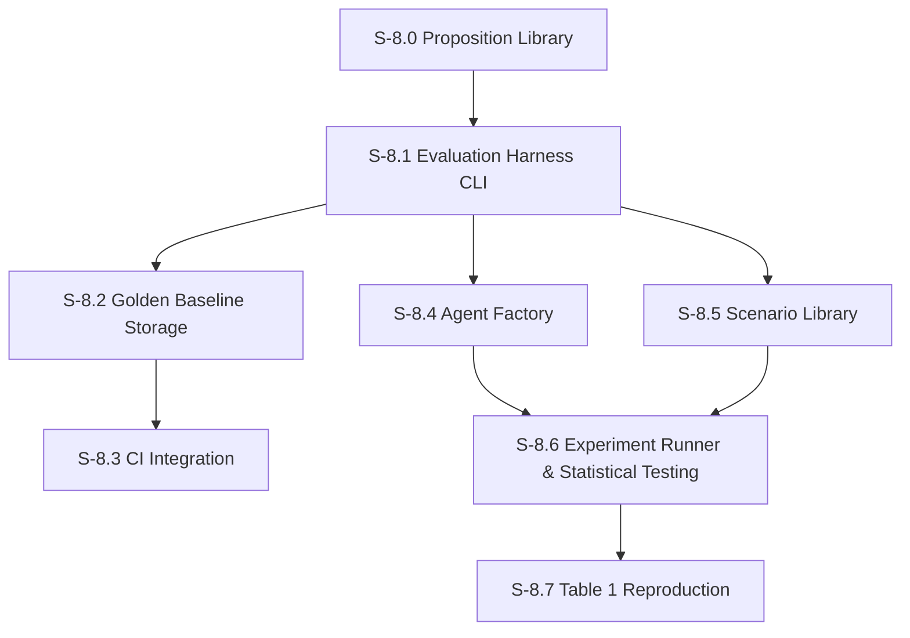

# Milestone 8: Evaluation Harness

**Goal**: CI-integrated test harness that regression-tests personas on every PR, captures golden baselines, and prevents persona degradation. Additionally provides the experiment infrastructure needed to reproduce TinyTroupe Table 1: agent factory, scenario library, experiment runner with treatment/control groups, and statistical testing.

**Dependencies**: M6 (need proposition system), M5 (need personas), M7 (need correction mechanisms for experiments)



---

## [S-8.0] Proposition Library

As a developer, I want a curated set of propositions for all 16 characters covering key personality traits, relationships, and speech patterns so that persona regression can be detected automatically.

### Description

This story creates the full proposition library — the "persona unit tests." Each character gets a YAML file with propositions covering:
- **Speech patterns**: Catchphrases, vocabulary, sentence structure
- **Relationship dynamics**: How they talk to/about specific other characters
- **Behavioral traits**: Core personality behaviors in specific situations
- **Anti-patterns**: Things the character would NEVER do or say (scored inversely)

Each proposition has a `weight` (0–1) indicating how important it is for that character. High-weight propositions represent defining traits.

### Files to create

| File | Purpose |
|------|---------|
| `src/features/evaluation/propositions/adherence/michael.yaml` | Michael: self-centered, humor, conflict avoidance, needs to be liked (8–10 propositions) |
| `src/features/evaluation/propositions/adherence/dwight.yaml` | Dwight: authority, loyalty to Michael, beet farm, survival skills (8–10 propositions) |
| `src/features/evaluation/propositions/adherence/jim.yaml` | Jim: sarcasm, pranks on Dwight, Pam references, laid-back (8–10 propositions) |
| `src/features/evaluation/propositions/adherence/pam.yaml` | Pam: supportive, artistic, quiet strength, Jim connection (6–8 propositions) |
| `src/features/evaluation/propositions/adherence/ryan.yaml` | Ryan: tech-bro language, startup references, condescension (6–8 propositions) |
| `src/features/evaluation/propositions/adherence/stanley.yaml` | Stanley: disinterest, crossword puzzles, pretzel day, minimal engagement (6–8 propositions) |
| `src/features/evaluation/propositions/adherence/kevin.yaml` | Kevin: food references, simple language, accounting struggles (6–8 propositions) |
| `src/features/evaluation/propositions/adherence/angela.yaml` | Angela: cats, moral judgments, Dwight/Senator, disapproval (6–8 propositions) |
| `src/features/evaluation/propositions/adherence/oscar.yaml` | Oscar: intellectual, corrects others, patience, financial knowledge (6–8 propositions) |
| `src/features/evaluation/propositions/adherence/andy.yaml` | Andy: Cornell, a cappella, anger management, trying too hard (6–8 propositions) |
| `src/features/evaluation/propositions/adherence/toby.yaml` | Toby: meek, HR references, Michael's hatred, sad resignation (6–8 propositions) |
| `src/features/evaluation/propositions/adherence/creed.yaml` | Creed: bizarre non-sequiturs, questionable past, detachment from reality (6–8 propositions) |
| `src/features/evaluation/propositions/adherence/kelly.yaml` | Kelly: pop culture, drama, relationship obsession, rapid speech (6–8 propositions) |
| `src/features/evaluation/propositions/adherence/phyllis.yaml` | Phyllis: sweet but passive-aggressive, Bob Vance references, maternal (6–8 propositions) |
| `src/features/evaluation/propositions/adherence/meredith.yaml` | Meredith: inappropriate, party references, casual attitude (6–8 propositions) |
| `src/features/evaluation/propositions/adherence/darryl.yaml` | Darryl: cool demeanor, warehouse wisdom, music, exasperation with Michael (6–8 propositions) |

### Acceptance Criteria
- [ ] [AC-8.0.1] All 16 characters have individual adherence proposition YAML files
- [ ] [AC-8.0.2] Each character has 6–10 weighted propositions covering speech, relationships, and behavior
- [ ] [AC-8.0.3] Each proposition has a unique `id`, a natural language `claim`, and a `weight` (0–1)
- [ ] [AC-8.0.4] `_default.yaml` contains universal propositions applied to all agents
- [ ] [AC-8.0.5] All YAML files validate against the Zod schema from S-6.0
- [ ] [AC-8.0.6] Each character has at least 1 "anti-pattern" proposition (something they would never do, scored inversely)
- [ ] [AC-8.0.7] Proposition loader correctly loads and merges agent-specific + default propositions
- [ ] [AC-8.0.8] Unit tests verify all YAML files load without errors and pass schema validation

### Demo
1. Run the proposition loader for each of the 16 agents
2. Show the merged proposition set for Michael (agent-specific + default)
3. Show the total proposition count across all characters
4. Manually evaluate 2–3 propositions against a sample message to verify they produce sensible scores

---

## [S-8.1] Evaluation Harness CLI

As a developer, I want a CLI tool that runs propositions against sample conversations and produces a structured evaluation report so I can verify persona quality from the command line.

### Description

The evaluation harness is a Node.js script that:
1. Accepts a list of agents to evaluate (or "all")
2. Loads their propositions
3. Either uses existing `run_messages` data or generates synthetic conversations from canned prompts
4. Runs all five dimension scorers from M6
5. Produces a structured JSON report with pass/fail per character based on configurable thresholds
6. Exits with code 0 (all pass) or 1 (any fail) for CI integration

For cost control, the harness supports a `--mock-judge` flag that uses pre-recorded LLM responses instead of live calls. This is critical for CI where you want fast, deterministic, free tests.

**CLI interface:**
```
npx tsx src/features/evaluation/harness/cli.ts [options]

Options:
  --agents <list>        Comma-separated agent IDs (default: all)
  --dimensions <list>    Comma-separated dimensions (default: all)
  --window <duration>    Time window for message sampling (default: 7d)
  --threshold <n>        Minimum score to pass for 0–9 dimensions (default: 5.0); does not apply to ideas_quantity (count-based, informational only)
  --mock-judge           Use pre-recorded scores (for CI)
  --synthetic            Generate synthetic conversations instead of using real data
  --output <path>        Write JSON report to file (default: stdout)
```

**Report format:**
```json
{
  "timestamp": "2026-02-10T12:00:00Z",
  "agents": {
    "michael": {
      "overall": 7.2,
      "pass": true,
      "dimensions": {
        "adherence": { "score": 7.5, "pass": true },
        "consistency": { "score": 7.0, "pass": true },
        "fluency": { "score": 6.8, "pass": true },
        "convergence": { "score": 7.5, "pass": true },
        "ideas_quantity": { "count": 5 }
      },
      "baselineDelta": { "adherence": -0.3, "consistency": +0.1 }
    }
  },
  "summary": { "total": 16, "passed": 14, "failed": 2, "failedAgents": ["kevin", "creed"] }
}
```

### Files to create

| File | Purpose |
|------|---------|
| `src/features/evaluation/harness/cli.ts` | Entry point: `npx tsx src/features/evaluation/harness/cli.ts` |
| `src/features/evaluation/harness/runner.ts` | `runEvaluation(options)` — orchestrates the full evaluation pipeline |
| `src/features/evaluation/harness/report.ts` | `generateReport(results)` — produces JSON and human-readable summary |
| `src/features/evaluation/harness/synthetic.ts` | `generateSyntheticConversations(agentId, prompts)` — runs canned prompts through the orchestrator |
| `src/features/evaluation/harness/mock-judge.ts` | `MockJudge` class that returns pre-recorded scores for deterministic CI testing |
| `src/features/evaluation/harness/prompts/` | Directory of canned prompts per character for synthetic conversations |

### Files to modify

| File | Change |
|------|--------|
| `package.json` | Add `"eval:run": "npx tsx src/features/evaluation/harness/cli.ts"` |

### Acceptance Criteria
- [ ] [AC-8.1.1] CLI accepts `--agents`, `--dimensions`, `--threshold`, `--mock-judge`, `--window`, `--output` flags (`--synthetic` deferred to follow-up)
- [ ] [AC-8.1.2] Runs all five dimension scorers for specified agents
- [ ] [AC-8.1.3] Produces structured JSON report with per-agent, per-dimension scores and pass/fail
- [ ] [AC-8.1.4] Exit code 0 when all agents pass, exit code 1 when any fail
- [ ] [AC-8.1.5] `--mock-judge` mode returns pre-recorded scores without LLM calls (fast, free, deterministic)
- [ ] [AC-8.1.6] `--synthetic` mode generates conversations from canned prompts before evaluating (**deferred** — requires `synthetic.ts` + `prompts/` directory; will be a follow-up story)
- [ ] [AC-8.1.7] Report includes baseline delta when baselines exist (from S-6.5) (**deferred** to S-8.2 — requires golden baseline storage)
- [ ] [AC-8.1.8] Human-readable summary printed to stderr alongside JSON to stdout
- [ ] [AC-8.1.9] Unit tests for report generation, CLI argument parsing, mock judge behavior
- [ ] [AC-8.1.10] Full integration test: run harness with mock judge, verify report structure and exit code

### Demo
1. Run `npm run eval:run -- --agents michael,dwight --mock-judge`
2. Show the JSON report with scores and pass/fail
3. Run with `--threshold 9.0` to force failures
4. Show exit code 1 and the failed agents in the summary

---

## [S-8.2] Golden Baseline Storage & Comparison

As a developer, I want golden baseline scores stored in the repository so that evaluation results can be compared to a known-good state.

### Description

Golden baselines are the "expected" persona quality scores, committed to the repository as JSON files. When the evaluation harness runs, it compares current scores against the golden baseline and flags regressions.

**Storage**: One JSON file per agent in `src/features/evaluation/baselines/`. Committed to git, updated via `--update-baseline` flag.

**Regression detection / source of truth**: During CI and normal harness runs, regression detection and `baselineDelta` are always computed against the repo-committed JSON golden baseline (the file in `src/features/evaluation/baselines/` for that agent). A score is a regression if it drops more than a configurable delta (default 1.0 point) below the baseline. Small fluctuations within the delta are acceptable due to LLM non-determinism. DB-backed baselines created in S-6.5 (`evaluation_runs.is_baseline`) may be used to seed or update these JSON files via the `--update-baseline` CLI flag, but are not read directly by regression checks.

**Baseline format:**
```json
{
  "agentId": "michael",
  "capturedAt": "2026-02-10T12:00:00Z",
  "dimensions": {
    "adherence": 7.5,
    "consistency": 7.0,
    "fluency": 6.8,
    "convergence": 7.5
  },
  "propositionScores": {
    "michael-self-centered": 8.0,
    "michael-wants-to-be-liked": 8.5
  }
}
```

### Files to create

| File | Purpose |
|------|---------|
| `src/features/evaluation/baselines/` | Directory for golden baseline JSON files (one per character, 16 total) |
| `src/features/evaluation/harness/baseline-manager.ts` | `loadGoldenBaseline(agentId)`, `saveGoldenBaseline(agentId, scores)`, `detectRegressions(agentId, current, baseline, delta)` |
| `src/app/api/evaluations/golden-baselines/route.ts` | `GET` — list all golden baselines |
| `src/app/api/evaluations/golden-baselines/[agentId]/route.ts` | `GET` — get golden baseline for one agent |

### Files to modify

| File | Change |
|------|--------|
| `src/features/evaluation/harness/cli.ts` | Add `--update-baseline` and `--regression-delta` flags |
| `src/features/evaluation/harness/report.ts` | Include regression detection in the report: `regressions` field per agent |

### API Routes

#### `GET /api/evaluations/golden-baselines`

List all golden baseline JSON files committed to the repository.

**Response 200:**
```json
[
  {
    "agentId": "michael",
    "capturedAt": "2026-02-13T00:00:00Z",
    "dimensions": { "adherence": 7.23 },
    "propositionScores": { "michael-self-centered-humor": 8 }
  }
]
```

#### `GET /api/evaluations/golden-baselines/[agentId]`

Get the golden baseline for a single agent.

**Response 200:** Single golden baseline object.

**Response 404:** `{ "error": "No golden baseline found for agent 'kevin'" }`

### Acceptance Criteria
- [ ] [AC-8.2.1] Golden baselines stored as JSON files in `src/features/evaluation/baselines/` (one per agent)
- [ ] [AC-8.2.2] `loadGoldenBaseline()` reads from committed JSON files
- [ ] [AC-8.2.3] `saveGoldenBaseline()` writes JSON files (used with `--update-baseline` flag)
- [ ] [AC-8.2.4] `detectRegressions()` compares current scores to baseline, returns list of regressions exceeding delta
- [ ] [AC-8.2.5] Default regression delta is 1.0 point (configurable via `--regression-delta`)
- [ ] [AC-8.2.6] Report includes a `regressions` field listing which dimensions regressed and by how much
- [ ] [AC-8.2.7] Exit code 1 if any regressions detected (in addition to threshold failures)
- [ ] [AC-8.2.8] `--update-baseline` generates golden baselines from current evaluation run
- [ ] [AC-8.2.9] Unit tests for regression detection logic with various delta values
- [ ] [AC-8.2.10] Baselines for at least 3 characters (Michael, Dwight, Jim) committed to repository as initial golden baselines
- [ ] [AC-8.2.11] `GET /api/evaluations/golden-baselines` returns all committed golden baselines
- [ ] [AC-8.2.12] `GET /api/evaluations/golden-baselines/[agentId]` returns a single golden baseline or 404

### Demo
1. `GET /api/evaluations/golden-baselines` — show all committed baselines
2. `GET /api/evaluations/golden-baselines/michael` — show Michael's baseline
3. `POST /api/evaluations/harness` with `{ "agents": ["michael"], "mockJudge": false }` — run live evaluation
4. Show `baselineDelta` and `regressions` in the response
5. `POST /api/evaluations/harness` with `{ "agents": ["michael"], "mockJudge": false, "regressionDelta": 0.01 }` — force regression detection

---

## [S-8.3] CI Integration

As a developer, I want the evaluation harness to run automatically on PRs that touch persona-related files so that persona regressions are caught before merge.

### Description

Add a GitHub Actions workflow that:
1. Triggers on PRs that modify persona-related files
2. Runs the evaluation harness in `--mock-judge` mode (fast, free, deterministic)
3. Posts a summary comment on the PR with scores and any regressions
4. Fails the check if regressions are detected

**Trigger scope** — the workflow runs when PRs modify files matching:
- `src/features/evaluation/**`
- `src/agents/prompt-builder.ts`
- `src/agents/orchestrator.ts`
- `src/tools/send-message.ts`
- `src/db/seed.ts`
- `.skills/**`

For PRs that do NOT touch these files, the check is skipped (not blocked).

**PR comment format:**
```markdown
## Persona Evaluation Report

| Agent | Adherence | Consistency | Fluency | Convergence | Overall | Status |
|-------|-----------|-------------|---------|-------------|---------|--------|
| Michael | 7.5 (=) | 7.0 (-0.2) | 6.8 (+0.1) | 7.5 (=) | 7.2 | PASS |
| Dwight | 7.8 (=) | 6.5 (-1.5) | 7.0 (=) | 7.2 (=) | 7.1 | FAIL |

**Result**: 1 regression detected. Dwight's consistency dropped 1.5 points (threshold: 1.0).
```

### Files to create

| File | Purpose |
|------|---------|
| `.github/workflows/persona-evaluation.yml` | GitHub Actions workflow for persona regression testing |
| `src/features/evaluation/harness/ci-reporter.ts` | Formats evaluation report as GitHub PR comment markdown |
| `src/app/api/evaluations/harness/report/route.ts` | `POST` — format a HarnessResult as PR comment markdown |

### API Routes

#### `POST /api/evaluations/harness/report`

Format a HarnessResult as a GitHub PR comment markdown table. Useful for previewing CI output and integrating with external tools.

**Request body:** A `HarnessResult` object (same shape as the response from `POST /api/evaluations/harness`).

**Response 200:**
```json
{
  "markdown": "<!-- persona-evaluation-report -->\n## Persona Evaluation Report\n\n| Agent | Adherence | Overall | Status |\n..."
}
```

### Acceptance Criteria
- [ ] [AC-8.3.1] GitHub Actions workflow triggers on PRs modifying persona-related files
- [ ] [AC-8.3.2] Workflow runs `npm run eval:run -- --mock-judge` in CI in baseline-regression mode (the `--threshold` flag is ignored when baselines exist)
- [ ] [AC-8.3.3] Workflow posts a PR comment with evaluation summary (scores table, regressions, pass/fail)
- [ ] [AC-8.3.4] PR check fails if any regressions exceed the regression delta
- [ ] [AC-8.3.5] PR check passes if no regressions are detected; in CI, pass/fail is determined solely by regression against baselines when they exist (absolute thresholds do not cause CI failures)
- [ ] [AC-8.3.6] Workflow skips cleanly (pass) for PRs that don't touch persona-related files
- [ ] [AC-8.3.7] CI reporter formats markdown table with per-agent, per-dimension scores and delta from baseline
- [ ] [AC-8.3.8] Workflow completes in under 60 seconds (mock-judge mode, no LLM calls)
- [ ] [AC-8.3.9] Unit tests for CI reporter markdown generation
- [ ] [AC-8.3.10] `POST /api/evaluations/harness/report` formats HarnessResult as PR comment markdown

### Demo
1. `POST /api/evaluations/harness` with `{ "agents": ["michael","dwight"], "mockJudge": false }` — run live evaluation
2. `POST /api/evaluations/harness/report` with the result — show formatted PR comment markdown
3. Show the GitHub Actions workflow file and explain trigger conditions

---

## [S-8.4] Agent Factory

As a developer, I want to programmatically generate large populations of diverse agent personas so that I can run experiments with 96–200 agents as required by TinyTroupe's Table 1 methodology.

### Description

TinyTroupe's experiments use `TinyPersonFactory` to generate agent populations from demographic parameters. This story builds an equivalent for our system: a factory that produces agent persona specifications (system prompts + memory blocks) from configurable demographic distributions.

**Population profiles** (matching TinyTroupe's experimental populations):
1. **Average customers**: Random US-based personas with varied demographics — diverse ages, occupations, education levels, personality traits (Big Five). Used in Exp. 1.
2. **Difficult customers**: Less cooperative personas with traits like skepticism, confrontational style, contrarian tendencies, low agreeableness. Used in Exp. 2.1 and 2.2.
3. **Political compass**: Personas positioned on political axes (left/right, libertarian/authoritarian) with corresponding beliefs, values, and debate styles. Used in Exp. 3.

**Persona specification** (matching TinyTroupe's agent JSON format, adapted to our system):
```typescript
type GeneratedPersona = {
  name: string;
  age: number;
  gender: string;
  nationality: string;
  residence: string;
  education: string;
  occupation: { title: string; organization: string; description: string };
  personality: {
    traits: string[];
    big_five: { openness: string; conscientiousness: string; extraversion: string; agreeableness: string; neuroticism: string };
  };
  style: string;
  long_term_goals: string[];
  preferences: { interests: string[]; likes: string[]; dislikes: string[] };
  system_prompt: string;      // Generated from the above fields
  memory_blocks: {            // Initial core memory blocks
    personality: string;
    relationships: string;
    current_state: string;
  };
};
```

**Generation pipeline** (matching TinyTroupe's `TinyPersonFactory` three-stage approach):
1. **Compute sampling dimensions**: Given a population description (e.g., "average US customers for a travel service"), the LLM identifies relevant demographic dimensions: age range, profession list, country distribution, personality traits (Big Five), political beliefs, economic beliefs, cultural background, preferences. Each dimension has either a range, a list of values, or a value-to-proportion mapping. This step is cached and reused.
2. **Compute sampling plan**: Given N agents needed, the LLM creates subpopulation directives — groups of characteristics with quantities that cover the full demographic space. This ensures representative coverage rather than random sampling.
3. **Flatten to characteristics**: Each sampling directive is expanded into concrete characteristic sets (one per agent). The list is shuffled with a fixed seed for deterministic reproducibility.
4. **Generate personas**: Each characteristic set is sent to the LLM with 2 example agent specifications to produce a full `GeneratedPersona`. Names are globally unique (tracked across all factory instances).

The factory supports both **LLM-based generation** (default, richer personas) and **deterministic template-based generation** (faster, for quick validation). The LLM-based approach uses a fixed `seed` for the sampling shuffle, making the population composition deterministic even though individual persona details vary. For experiment reproduction, LLM-based generation with a fixed seed is preferred (matching TinyTroupe's default).

### Files to create

| File | Purpose |
|------|---------|
| `src/features/evaluation/experiment/agent-factory.ts` | `AgentFactory` class with `generate(count, profile, options)` method |
| `src/features/evaluation/experiment/population-profiles.ts` | Profile definitions: `averageCustomer`, `difficultCustomer`, `politicalCompass` |
| `src/features/evaluation/experiment/persona-templates.ts` | System prompt templates for generated personas |
| `src/features/evaluation/experiment/types.ts` | Types: `GeneratedPersona`, `PopulationProfile`, `FactoryOptions`, `DemographicDistribution` |

### Acceptance Criteria
- [ ] [AC-8.4.1] `AgentFactory.generate(count, profile)` produces `count` unique `GeneratedPersona` objects matching the population profile
- [ ] [AC-8.4.2] Three population profiles: `averageCustomer` (diverse US demographics), `difficultCustomer` (low agreeableness, confrontational), `politicalCompass` (positioned on political axes)
- [ ] [AC-8.4.3] Each generated persona includes all fields: name, age, gender, nationality, occupation, personality (Big Five traits), style, goals, preferences
- [ ] [AC-8.4.4] Three-stage LLM pipeline: (1) compute sampling dimensions from population description, (2) compute sampling plan with subpopulation directives, (3) flatten and generate. Steps 1-2 cached.
- [ ] [AC-8.4.5] Sampling dimensions include: age, profession, country, personality traits (Big Five), political beliefs, economic beliefs, cultural background, preferences. Value-to-proportion mappings for categorical dimensions.
- [ ] [AC-8.4.6] `system_prompt` auto-generated from persona fields following the same structure as the 16 Office character system prompts
- [ ] [AC-8.4.7] `memory_blocks` auto-generated with personality, relationships, and current_state blocks
- [ ] [AC-8.4.8] Deterministic sampling: `options.seed` produces identical population composition (same demographic distribution) across runs; individual LLM-generated persona details may vary but names are globally unique
- [ ] [AC-8.4.9] Template-based mode: `options.templateOnly = true` generates personas from templates without LLM calls (faster, for quick validation)
- [ ] [AC-8.4.10] Generated personas can be loaded into the agent system as temporary agents (not persisted to the main agents table — stored in experiment-specific tables or in-memory)
- [ ] [AC-8.4.11] Parallel generation supported: multiple personas generated concurrently (matching TinyTroupe's `ThreadPoolExecutor` approach)
- [ ] [AC-8.4.12] Unit tests: deterministic sampling produces same population composition with same seed, profile distributions match specs, all required fields present, parallel generation produces correct count
- [ ] [AC-8.4.13] Sentry spans for persona generation

### Demo
1. Generate 10 "average customer" personas with a fixed seed
2. Show the diversity: different ages, occupations, personality traits
3. Re-run with the same seed — show identical output
4. Generate 5 "difficult customer" personas — show low agreeableness traits
5. Generate 5 "political compass" personas — show left/right/libertarian/authoritarian positions

---

## [S-8.5] Scenario Library

As a developer, I want pre-defined experiment scenarios (brainstorming, debates) so that I can configure and run the same experimental setups used in TinyTroupe's Table 1.

### Description

Each scenario defines the structure of an experiment: what agents do, how they interact, what prompts they receive, and how many agents/environments are involved. Scenarios are declarative configurations, not executable code — the Experiment Runner (S-8.6) consumes them.

**Scenario definitions** (matching TinyTroupe's four experiments):

1. **Brainstorming (Exp. 1 & 2)**: Agents participate in a market research focus group discussing new product/service ideas (e.g., "WanderLux" travel service). The facilitator (system) broadcasts a topic and asks agents to brainstorm ideas. Agents take turns responding, building on or diverging from each other's ideas.

2. **Debate (Exp. 3)**: Agents with different political orientations debate a controversial topic. The facilitator introduces a polarizing question and agents argue their positions.

**Environment execution model** (matching TinyTroupe's `TinyWorld`):
Each environment runs in discrete **steps**. On each step:
1. All active interventions are evaluated sequentially (preconditions checked, effects fired if true)
2. All agents act: either in parallel or sequential with randomized order (configurable)
3. The facilitator may broadcast additional prompts at specific step numbers
4. Actions are handled: messages delivered to targets, broadcasts go to all agents

This step-based model means interventions fire BEFORE agents act on each step, matching TinyTroupe's `_step()` method.

**Scenario configuration schema:**
```typescript
type ScenarioConfig = {
  id: string;                           // e.g., 'brainstorming-average'
  name: string;
  description: string;
  type: 'brainstorming' | 'debate';
  population_profile: string;           // References AgentFactory profile
  agents_per_environment: number;       // e.g., 5 for brainstorming, 5 for debates
  total_environments: number;           // e.g., 40 for Exp. 1
  steps_per_environment: number;        // How many simulation steps (replaces rounds)
  facilitator_prompts: {                // Step-indexed facilitator messages
    step: number;
    message: string;
  }[];
  agent_order: 'parallel' | 'sequential_random';  // How agents act within a step
  treatment: {
    action_correction: boolean;         // Enable action correction gate
    variety_intervention: boolean;      // Enable variety intervention
    correction_dimensions: string[];    // Which dimensions to check in the gate
    correction_threshold: number;       // Quality threshold (default 7)
  };
  evaluation_dimensions: string[];      // Which metrics to measure
};
```

### Files to create

| File | Purpose |
|------|---------|
| `src/features/evaluation/experiment/scenario-library.ts` | `getScenario(id)`, `listScenarios()`, scenario registry |
| `src/features/evaluation/experiment/scenarios/brainstorming-average.ts` | Exp. 1: brainstorming, average customers, N_a=200, N_e=40, T=action correction + variety |
| `src/features/evaluation/experiment/scenarios/brainstorming-difficult-full.ts` | Exp. 2.1: brainstorming, difficult customers, N_a=96, N_e=24, T=action correction + variety |
| `src/features/evaluation/experiment/scenarios/brainstorming-difficult-variety.ts` | Exp. 2.2: brainstorming, difficult customers, N_a=96, N_e=24, T=variety only |
| `src/features/evaluation/experiment/scenarios/debate-controversial.ts` | Exp. 3: debate, political compass, N_a=120, N_e=24, T=action correction only |
| `src/features/evaluation/experiment/facilitator.ts` | `Facilitator` class: broadcasts prompts at specified steps, manages agent turn order |
| `src/features/evaluation/experiment/environment.ts` | `ExperimentEnvironment` class: step-based execution matching TinyTroupe's `TinyWorld` — interventions before agents, parallel/sequential agent execution |

### Acceptance Criteria
- [ ] [AC-8.5.1] Four scenario configs matching TinyTroupe Experiments 1, 2.1, 2.2, and 3
- [ ] [AC-8.5.2] Each scenario specifies: population profile, agents per environment, total environments, steps, step-indexed facilitator prompts, agent execution order, treatment config, evaluation dimensions
- [ ] [AC-8.5.3] Brainstorming scenarios include facilitator prompts for introducing topics and encouraging idea generation
- [ ] [AC-8.5.4] Debate scenarios include facilitator prompts for introducing controversial topics and managing turns
- [ ] [AC-8.5.5] Treatment config specifies which correction mechanisms are active (action correction, variety intervention, or both)
- [ ] [AC-8.5.6] `getScenario(id)` returns a fully resolved scenario config; `listScenarios()` returns all available scenarios
- [ ] [AC-8.5.7] `Facilitator` class broadcasts prompts at step-indexed points, matching TinyTroupe's `TinyWorld.broadcast()`
- [ ] [AC-8.5.8] `ExperimentEnvironment` class implements step-based execution: on each step, (1) evaluate interventions sequentially, (2) execute facilitator prompts for this step, (3) agents act in configured order (parallel or sequential_random)
- [ ] [AC-8.5.9] Sequential_random agent order: agents act one at a time in a randomized order each step (matching TinyTroupe's `randomize_agents_order` option)
- [ ] [AC-8.5.10] Unit tests: all scenarios load, config validation, facilitator prompt sequencing, environment step execution order
- [ ] [AC-8.5.11] Sentry spans for scenario loading and environment step execution

### Demo
1. List all available scenarios
2. Load the "brainstorming-average" scenario — show the full config including population, environments, treatments
3. Load the "debate-controversial" scenario — show the different population profile and treatment config
4. Show the facilitator prompt sequence for a brainstorming session

---

## [S-8.6] Experiment Runner & Statistical Testing

As a developer, I want an experiment runner that executes treatment vs. control groups and computes statistical significance so I can reproduce and validate TinyTroupe's Table 1 findings.

### Description

The experiment runner executes a full experiment: generates agents, creates environments, runs conversations with and without treatments, evaluates all dimensions, and computes statistical results.

**Experiment execution flow:**
1. Load scenario config
2. Generate agent population via AgentFactory (deterministic seed for reproducibility)
3. Create environments (one per `total_environments`) and assign agents (round-robin or shuffle with seed)
4. For each environment, create TWO copies with identical agents:
   - **Treatment (T)**: Correction mechanisms enabled as specified by scenario (action correction gate, variety intervention, etc.)
   - **Control (C)**: No correction mechanisms (all disabled)
5. Run each environment for `steps_per_environment` steps using the step-based execution model from S-8.5. T and C environments run independently.
6. After all conversations complete, run M6 scorers on every agent in every environment (both T and C)
7. Aggregate results: mean and standard deviation per metric, per group (T vs C)
8. Run statistical tests: Welch's t-test comparing T vs C for each metric
9. Generate Table 1-format report

**Statistical testing:**
- **Welch's t-test** (unequal variance t-test) for each metric: compares T group mean vs C group mean
- Outputs: t-statistic, p-value, effect size (Cohen's d)
- Significance threshold: p <= 0.05 (marked with asterisk)
- All statistics computed in TypeScript — no external stats library required (t-distribution approximation via Welch-Satterthwaite formula)

**CLI interface:**
```
npx tsx src/features/evaluation/experiment/cli.ts [options]

Options:
  --scenario <id>        Scenario to run (required)
  --seed <n>             Random seed for reproducibility (default: 42)
  --runs <n>             Number of experiment runs to average (default: 1)
  --output <path>        JSON report file (default: stdout)
  --dry-run              Show config without running
```

**Report format** (matching Table 1 structure):
```json
{
  "scenario": "brainstorming-average",
  "seed": 42,
  "agents_count": 200,
  "environments_count": 40,
  "metrics": {
    "adherence": {
      "treatment": { "mean": 5.81, "sd": 1.66 },
      "control": { "mean": 6.72, "sd": 1.50 },
      "delta": -0.92,
      "p_value": 0.001,
      "significant": true
    },
    "consistency": { ... },
    "fluency": { ... },
    "convergence": { ... },
    "ideas_quantity": { ... }
  },
  "display_labels": {
    "adherence": "persona_adherence",
    "consistency": "self_consistency",
    "fluency": "fluency",
    "convergence": "divergence",
    "ideas_quantity": "ideas_qty"
  }
}
```

### Files to create

| File | Purpose |
|------|---------|
| `src/features/evaluation/experiment/cli.ts` | Experiment CLI entry point |
| `src/features/evaluation/experiment/runner.ts` | `ExperimentRunner` class: orchestrates full experiment lifecycle |
| `src/features/evaluation/experiment/environment-manager.ts` | Creates T/C environment pairs, assigns agents, manages experiment sessions using `ExperimentEnvironment` from S-8.5 |
| `src/features/evaluation/experiment/statistical-testing.ts` | `welchTTest(groupA, groupB)`, `cohensD(groupA, groupB)`, `tDistributionCDF(t, df)` |
| `src/features/evaluation/experiment/experiment-report.ts` | `generateExperimentReport(results)` — Table 1-format JSON + human-readable. Contains `DISPLAY_LABELS` mapping from canonical internal IDs (`adherence`, `consistency`, `convergence`) to paper display labels (`persona_adherence`, `self_consistency`, `divergence`) |

### Files to modify

| File | Change |
|------|--------|
| `package.json` | Add `"experiment:run": "npx tsx src/features/evaluation/experiment/cli.ts"` |

### Acceptance Criteria
- [ ] [AC-8.6.1] `ExperimentRunner` loads scenario, generates agents, creates T/C environments, runs conversations, evaluates, and computes statistics
- [ ] [AC-8.6.2] Treatment group has correction mechanisms enabled per scenario config; control group has all mechanisms disabled
- [ ] [AC-8.6.3] Each agent in each environment evaluated on all scenario-specified dimensions after conversations complete
- [ ] [AC-8.6.4] Results aggregated per group: mean, standard deviation for each metric
- [ ] [AC-8.6.5] Welch's t-test computed for each metric comparing T vs C groups, returning t-statistic, degrees of freedom, and p-value
- [ ] [AC-8.6.6] Cohen's d effect size computed for each metric
- [ ] [AC-8.6.7] `--seed` option produces identical experiment results across runs (deterministic agent generation + deterministic environment assignment)
- [ ] [AC-8.6.8] `--runs N` executes N independent runs and averages the statistical results
- [ ] [AC-8.6.9] JSON report matches Table 1 structure: per-metric T mean(sd), C mean(sd), delta, p-value, significance
- [ ] [AC-8.6.10] Human-readable Table 1 printed to stderr (formatted as a text table)
- [ ] [AC-8.6.11] `--dry-run` shows full configuration without executing
- [ ] [AC-8.6.12] Unit tests for: Welch's t-test against known values, Cohen's d, result aggregation, deterministic seeding
- [ ] [AC-8.6.13] Sentry traces wrapping full experiment execution

### Demo
1. Run `npm run experiment:run -- --scenario brainstorming-average --dry-run` — show the full config
2. Run a small-scale experiment (e.g., 10 agents, 2 environments) to validate the pipeline
3. Show the Table 1-format report with T vs C means, deltas, and p-values
4. Re-run with the same seed — show identical results

---

## [S-8.7] Table 1 Reproduction

As a developer, I want to run all four TinyTroupe experiments and generate a comparison report against the paper's published values so I can validate that our system reproduces the key findings.

### Description

This story ties everything together: run all four experiments from TinyTroupe Table 1 at full scale, compare results against the paper's published values, and produce a validation report.

**Reference values from TinyTroupe Table 1:**

| Exp. | Treatment | N_a | N_e | Metric | T mean(sd) | C mean(sd) | Delta | p |
|------|-----------|-----|-----|--------|------------|------------|-------|---|
| 1 | AC+VI | 200 | 40 | Adherence | 5.81(1.66) | 6.72(1.50) | -0.92 | <.001* |
| 1 | AC+VI | 200 | 40 | Consistency | 5.00(1.79) | 7.16(1.15) | -2.16 | <.001* |
| 1 | AC+VI | 200 | 40 | Fluency | 6.75(1.02) | 7.27(0.65) | -0.52 | <.001* |
| 1 | AC+VI | 200 | 40 | Divergence | 6.15(1.08) | 6.63(1.05) | -0.47 | .050* |
| 1 | AC+VI | 200 | 40 | Ideas Qty. | 8.28(2.34) | 3.85(2.01) | +4.43 | <.001* |
| 2.1 | AC+VI | 96 | 24 | Adherence | 4.95(1.09) | 4.15(1.39) | +0.80 | <.001* |
| 2.1 | AC+VI | 96 | 24 | Consistency | 3.54(1.44) | 5.60(1.51) | -2.06 | <.001* |
| 2.1 | AC+VI | 96 | 24 | Fluency | 3.22(1.45) | 6.34(1.35) | -3.13 | <.001* |
| 2.1 | AC+VI | 96 | 24 | Divergence | 4.88(1.94) | 6.29(1.12) | -1.42 | .004* |
| 2.1 | AC+VI | 96 | 24 | Ideas Qty. | 2.45(1.54) | 4.17(2.50) | -1.72 | .008* |
| 2.2 | VI only | 96 | 24 | Adherence | 4.74(1.55) | 5.34(1.48) | -0.60 | .006* |
| 2.2 | VI only | 96 | 24 | Consistency | 4.55(1.63) | 5.47(1.67) | -0.92 | <.001* |
| 2.2 | VI only | 96 | 24 | Fluency | 6.11(1.56) | 6.45(1.51) | -0.33 | .134 |
| 2.2 | VI only | 96 | 24 | Divergence | 6.42(1.10) | 5.88(1.33) | +0.54 | .131 |
| 2.2 | VI only | 96 | 24 | Ideas Qty. | 9.29(3.33) | 3.96(2.27) | +5.33 | <.001* |
| 3 | AC only | 120 | 24 | Adherence | 6.63(1.34) | 6.16(1.59) | +0.47 | .015* |
| 3 | AC only | 120 | 24 | Consistency | 6.79(1.63) | 5.81(2.37) | +0.98 | <.001* |
| 3 | AC only | 120 | 24 | Fluency | 6.38(1.20) | 6.48(1.04) | -0.11 | .454 |
| 3 | AC only | 120 | 24 | Divergence | 4.92(2.24) | 5.04(2.29) | -0.13 | .849 |

**Validation criteria**: Exact reproduction is NOT expected (different LLM, different agents, different prompts). Instead, we validate that the **directional trends** match:
1. Action correction + variety intervention increases ideas quantity significantly
2. Action correction improves adherence for difficult personas but costs self-consistency
3. Variety intervention alone increases ideas quantity with minimal adherence cost
4. Action correction alone (debates) improves both adherence and self-consistency
5. The delta directions (positive/negative) match for significant results

**CLI interface:**
```
npx tsx src/features/evaluation/experiment/reproduce-table1.ts [options]

Options:
  --experiments <list>   Comma-separated experiment IDs: 1,2.1,2.2,3 (default: all)
  --scale <factor>       Scale factor for agent/environment counts (default: 1.0, use 0.1 for quick validation)
  --seed <n>             Random seed (default: 42)
  --output <path>        Comparison report file (default: stdout)
```

### Files to create

| File | Purpose |
|------|---------|
| `src/features/evaluation/experiment/reproduce-table1.ts` | CLI entry point for full Table 1 reproduction |
| `src/features/evaluation/experiment/table1-reference.ts` | Hard-coded reference values from the paper |
| `src/features/evaluation/experiment/comparison-report.ts` | `generateComparisonReport(ours, theirs)` — side-by-side table with trend validation |

### Files to modify

| File | Change |
|------|--------|
| `package.json` | Add `"experiment:table1": "npx tsx src/features/evaluation/experiment/reproduce-table1.ts"` |

### Acceptance Criteria
- [ ] [AC-8.7.1] Reference values from TinyTroupe Table 1 hard-coded as a structured constant
- [ ] [AC-8.7.2] Runs all four experiments sequentially (or subset via `--experiments`)
- [ ] [AC-8.7.3] `--scale` factor allows quick validation at reduced scale (e.g., `--scale 0.1` uses 10% of agents/environments)
- [ ] [AC-8.7.4] Comparison report shows side-by-side: our T/C means vs. paper's T/C means, delta direction match (checkmark/cross), p-value significance match
- [ ] [AC-8.7.5] Trend validation: for each significant result in the paper, check if our delta has the same sign (positive/negative)
- [ ] [AC-8.7.6] Summary statistics: number of trends matched / total significant results, overall reproduction score
- [ ] [AC-8.7.7] Human-readable comparison table printed to stderr matching Table 1 format with an additional "Match" column
- [ ] [AC-8.7.8] `--seed` ensures reproducibility across runs
- [ ] [AC-8.7.9] Unit tests for: reference value loading, comparison logic, trend matching
- [ ] [AC-8.7.10] Sentry trace wrapping full reproduction run

### Demo
1. Run `npm run experiment:table1 -- --scale 0.1` for a quick 10%-scale validation
2. Show the comparison report with our results vs. paper results side by side
3. Show which trends match and which diverge
4. Explain any differences (different LLM, different agent populations)
5. Run at full scale (if budget allows) and show the comprehensive Table 1 comparison
